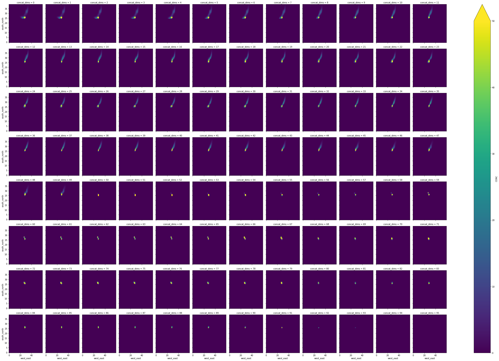

```python
from useful_scit.imps import *
```


```python
path = '../data_out/bac_chc_1/'
```


```python

```


```python
files = glob.glob(path+'flxout_d01*')
files.sort()
files = files
```


```python

```


```python
ds = [xr.open_dataset(f1).isel(Time=0) for f1 in files]
```


```python
dc = xr.concat(ds)
```

    /Users/diego/miniconda3/envs/b36/lib/python3.6/site-packages/ipykernel_launcher.py:1: FutureWarning: the `dim` argument to `concat` will be required in a future version of xarray; for now, setting it to the old default of 'concat_dim'
      """Entry point for launching an IPython kernel.


```python
dc.CONC.sum()
```


    <xarray.DataArray 'CONC' ()>
    array(68957.51, dtype=float32)


```python
d11 = d1.CONC.sum(dim=['Time','bottom_top'])
```


```python
d11.plot(x='west_east',y='south_north',col='ageclass')
```


    <xarray.plot.facetgrid.FacetGrid at 0x1c3e8e4550>


```python
_t = d11.isel(west_east=slice(170,230),south_north=slice(110,150))
_t.plot(x='west_east',y='south_north',col='ageclass',vmin=0,vmax=50)
```


    <xarray.plot.facetgrid.FacetGrid at 0x1c48ada6d8>


```python


```


```python
d11 = d1.CONC.sum(dim=['Time','west_east'])
```


```python
d11.plot(x='south_north',y='bottom_top',col='ageclass')
```


    <xarray.plot.facetgrid.FacetGrid at 0x1c49f43ba8>


```python
_t = d11.isel(south_north=slice(110,150))
_t.plot(x='south_north',y='bottom_top',col='ageclass',vmin=0,vmax=50)
```


    <xarray.plot.facetgrid.FacetGrid at 0x1c3965f4a8>


```python
h1 = xr.open_dataset('../data_out/bac_chc_1/header_d01.nc')

```


```python
d1.CONC.sum()

```


    <xarray.DataArray 'CONC' ()>
    array(1237.4081, dtype=float32)


```python


```


```python
dc1 = dc.isel(ageclass=1).CONC.sum(dim=['bottom_top']).isel(west_east=slice(170,230),south_north=slice(110,150))

```


```python
dc1
```


    <xarray.DataArray 'CONC' (concat_dims: 96, releases: 1, south_north: 40, west_east: 60)>
    array([[[[0., ..., 0.],
             ...,
             [0., ..., 0.]]],
    
    
           ...,
    
    
           [[[0., ..., 0.],
             ...,
             [0., ..., 0.]]]], dtype=float32)
    Dimensions without coordinates: concat_dims, releases, south_north, west_east


```python
dc1.plot(x='west_east',y='south_north',col='concat_dims',vmin=0,vmax=50,col_wrap=12)

```


    <xarray.plot.facetgrid.FacetGrid at 0x1c4d79ec18>





```python
dc.CONC.sum(dim=['ageclass', 'releases', 'bottom_top', 'south_north', 'west_east']).plot()

```


    [<matplotlib.lines.Line2D at 0x1c5573e0b8>]


```python
dc.Times

```


    <xarray.DataArray 'Times' (concat_dims: 96)>
    array([b'20171206_000000', b'20171206_010000', b'20171206_020000',
           b'20171206_030000', b'20171206_040000', b'20171206_050000',
           b'20171206_060000', b'20171206_070000', b'20171206_080000',
           b'20171206_090000', b'20171206_100000', b'20171206_110000',
           b'20171206_120000', b'20171206_130000', b'20171206_140000',
           b'20171206_150000', b'20171206_160000', b'20171206_170000',
           b'20171206_180000', b'20171206_190000', b'20171206_200000',
           b'20171206_210000', b'20171206_220000', b'20171206_230000',
           b'20171207_000000', b'20171207_010000', b'20171207_020000',
           b'20171207_030000', b'20171207_040000', b'20171207_050000',
           b'20171207_060000', b'20171207_070000', b'20171207_080000',
           b'20171207_090000', b'20171207_100000', b'20171207_110000',
           b'20171207_120000', b'20171207_130000', b'20171207_140000',
           b'20171207_150000', b'20171207_160000', b'20171207_170000',
           b'20171207_180000', b'20171207_190000', b'20171207_200000',
           b'20171207_210000', b'20171207_220000', b'20171207_230000',
           b'20171208_000000', b'20171208_010000', b'20171208_020000',
           b'20171208_030000', b'20171208_040000', b'20171208_050000',
           b'20171208_060000', b'20171208_070000', b'20171208_080000',
           b'20171208_090000', b'20171208_100000', b'20171208_110000',
           b'20171208_120000', b'20171208_130000', b'20171208_140000',
           b'20171208_150000', b'20171208_160000', b'20171208_170000',
           b'20171208_180000', b'20171208_190000', b'20171208_200000',
           b'20171208_210000', b'20171208_220000', b'20171208_230000',
           b'20171209_000000', b'20171209_010000', b'20171209_020000',
           b'20171209_030000', b'20171209_040000', b'20171209_050000',
           b'20171209_060000', b'20171209_070000', b'20171209_080000',
           b'20171209_090000', b'20171209_100000', b'20171209_110000',
           b'20171209_120000', b'20171209_130000', b'20171209_140000',
           b'20171209_150000', b'20171209_160000', b'20171209_170000',
           b'20171209_180000', b'20171209_190000', b'20171209_200000',
           b'20171209_210000', b'20171209_220000', b'20171209_230000'],
          dtype='|S15')
    Dimensions without coordinates: concat_dims
    Attributes:
        description:  TIME OF OUTPUT (END OF AVERAGING INTERVAL)


```python


```


```python


```


```python


```


```python


```


```python


```


```python


```


```python

```
