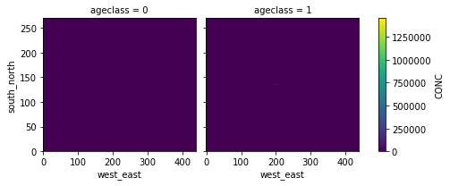
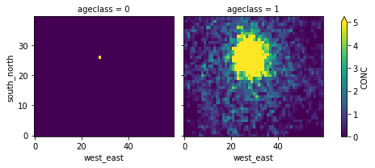
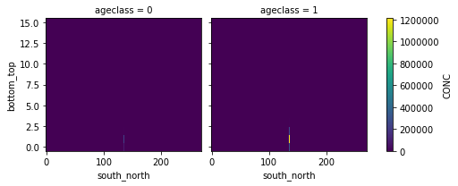
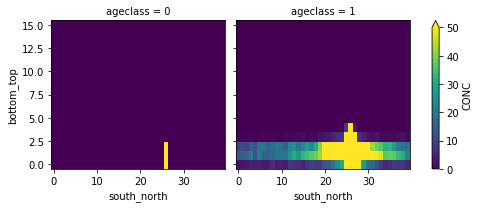
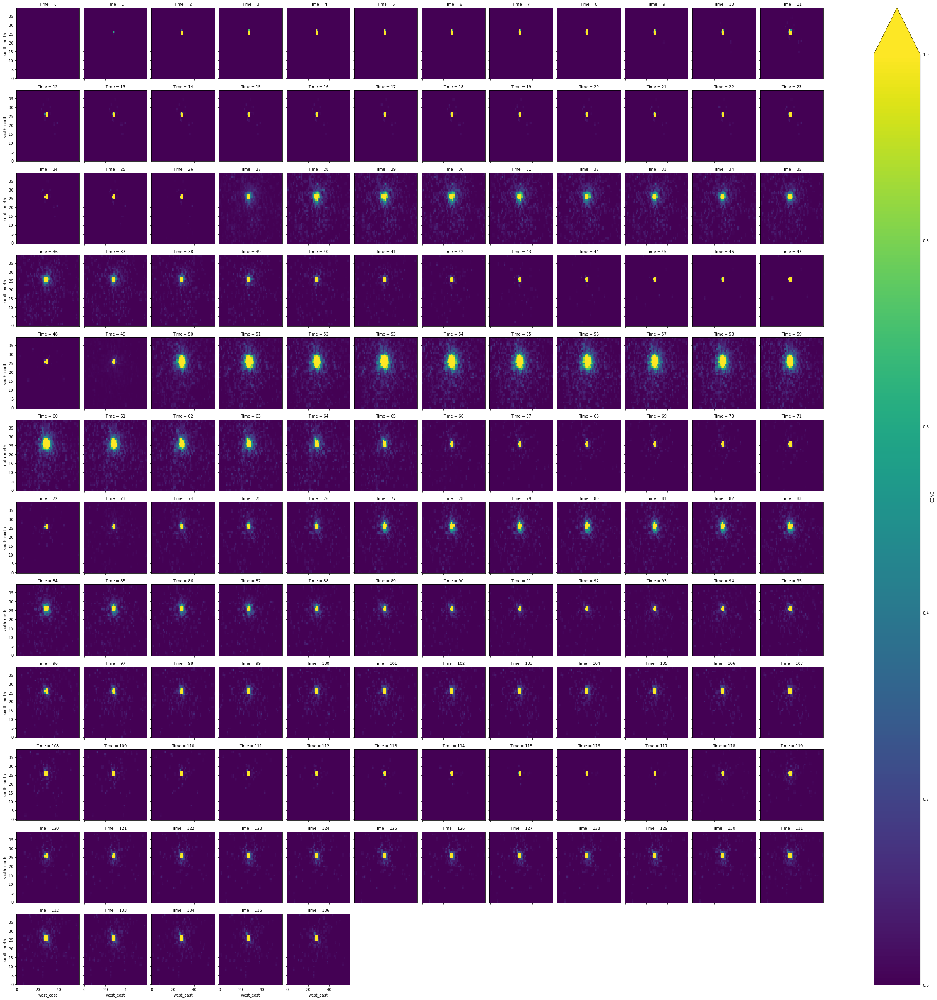
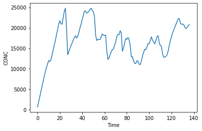

```python
from useful_scit.imps import *
```


```python
path = '../data_out/for_chc_1/'
path = '../data_out/for_chc_1_mpi/'
```


```python

```


```python
files = glob.glob(path+'flxout_d01*')
files.sort()
files = files
```


```python

```


```python
ds = [xr.open_dataset(f1) for f1 in files]
```


```python
dc = xr.concat(ds,dim='Time')
```


```python
d11 = dc.CONC.sum(dim=['Time','bottom_top'])

```


```python
d11.plot(x='west_east',y='south_north',col='ageclass')
```


    <xarray.plot.facetgrid.FacetGrid at 0x12ed4a828>





```python
_t = d11.isel(west_east=slice(170,230),south_north=slice(110,150))
_t.plot(x='west_east',y='south_north',col='ageclass',vmin=0,vmax=5)
```


    <xarray.plot.facetgrid.FacetGrid at 0x133417908>





```python


```


```python
d11 = dc.CONC.sum(dim=['Time','west_east'])
```


```python
d11.plot(x='south_north',y='bottom_top',col='ageclass')
```


    <xarray.plot.facetgrid.FacetGrid at 0x11f3c9a90>





```python
_t = d11.isel(south_north=slice(110,150))
_t.plot(x='south_north',y='bottom_top',col='ageclass',vmin=0,vmax=50)
```


    <xarray.plot.facetgrid.FacetGrid at 0x11f4a0748>





```python
h1 = xr.open_dataset('../data_out/bac_chc_1/header_d01.nc')
```


```python
dc.CONC.sum()
```


    <xarray.DataArray 'CONC' ()>
    array(2275581.8, dtype=float32)


```python


```


```python
dc1 = dc.isel(ageclass=1).CONC.sum(dim=['bottom_top']).isel(west_east=slice(170,230),south_north=slice(110,150))
```


```python
dc1.plot(x='west_east',y='south_north',col='Time',vmin=0,vmax=1,col_wrap=12)
```


    <xarray.plot.facetgrid.FacetGrid at 0x12261deb8>





```python
dc.CONC.sum(dim=['ageclass', 'bottom_top', 'south_north', 'west_east']).plot()
```


    [<matplotlib.lines.Line2D at 0x12261f588>]





```python
dc.Times
```


    <xarray.DataArray 'Times' (Time: 137)>
    array([b'20171203_010000', b'20171203_020000', b'20171203_030000',
           b'20171203_040000', b'20171203_050000', b'20171203_060000',
           b'20171203_070000', b'20171203_080000', b'20171203_090000',
           b'20171203_100000', b'20171203_110000', b'20171203_120000',
           b'20171203_130000', b'20171203_140000', b'20171203_150000',
           b'20171203_160000', b'20171203_170000', b'20171203_180000',
           b'20171203_190000', b'20171203_200000', b'20171203_210000',
           b'20171203_220000', b'20171203_230000', b'20171204_000000',
           b'20171204_010000', b'20171204_020000', b'20171204_030000',
           b'20171204_040000', b'20171204_050000', b'20171204_060000',
           b'20171204_070000', b'20171204_080000', b'20171204_090000',
           b'20171204_100000', b'20171204_110000', b'20171204_120000',
           b'20171204_130000', b'20171204_140000', b'20171204_150000',
           b'20171204_160000', b'20171204_170000', b'20171204_180000',
           b'20171204_190000', b'20171204_200000', b'20171204_210000',
           b'20171204_220000', b'20171204_230000', b'20171205_000000',
           b'20171205_010000', b'20171205_020000', b'20171205_030000',
           b'20171205_040000', b'20171205_050000', b'20171205_060000',
           b'20171205_070000', b'20171205_080000', b'20171205_090000',
           b'20171205_100000', b'20171205_110000', b'20171205_120000',
           b'20171205_130000', b'20171205_140000', b'20171205_150000',
           b'20171205_160000', b'20171205_170000', b'20171205_180000',
           b'20171205_190000', b'20171205_200000', b'20171205_210000',
           b'20171205_220000', b'20171205_230000', b'20171206_000000',
           b'20171206_010000', b'20171206_020000', b'20171206_030000',
           b'20171206_040000', b'20171206_050000', b'20171206_060000',
           b'20171206_070000', b'20171206_080000', b'20171206_090000',
           b'20171206_100000', b'20171206_110000', b'20171206_120000',
           b'20171206_130000', b'20171206_140000', b'20171206_150000',
           b'20171206_160000', b'20171206_170000', b'20171206_180000',
           b'20171206_190000', b'20171206_200000', b'20171206_210000',
           b'20171206_220000', b'20171206_230000', b'20171207_000000',
           b'20171207_010000', b'20171207_020000', b'20171207_030000',
           b'20171207_040000', b'20171207_050000', b'20171207_060000',
           b'20171207_070000', b'20171207_080000', b'20171207_090000',
           b'20171207_100000', b'20171207_110000', b'20171207_120000',
           b'20171207_130000', b'20171207_140000', b'20171207_150000',
           b'20171207_160000', b'20171207_170000', b'20171207_180000',
           b'20171207_190000', b'20171207_200000', b'20171207_210000',
           b'20171207_220000', b'20171207_230000', b'20171208_000000',
           b'20171208_010000', b'20171208_020000', b'20171208_030000',
           b'20171208_040000', b'20171208_050000', b'20171208_060000',
           b'20171208_070000', b'20171208_080000', b'20171208_090000',
           b'20171208_100000', b'20171208_110000', b'20171208_120000',
           b'20171208_130000', b'20171208_140000', b'20171208_150000',
           b'20171208_160000', b'20171208_170000'], dtype='|S15')
    Dimensions without coordinates: Time
    Attributes:
        description:  TIME OF OUTPUT (END OF AVERAGING INTERVAL)


```python


```


```python


```


```python


```


```python


```


```python


```


```python


```


```python


```


```python


```


```python


```


```python

```


```python

```


```python

```


```python

```


```python

```


```python

```
