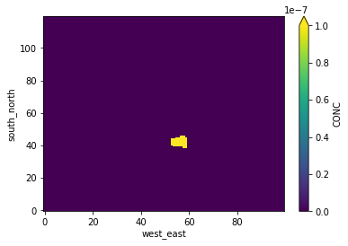
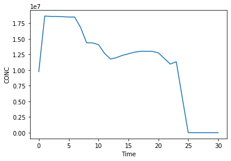

```python
from useful_scit.imps import *
```


```python
path = '/Volumes/mbProD/Downloads/flex_out/run_2019-05-24_17-45-51_/'
# path = '/Volumes/mbProD/Downloads/flex_out/run_2019-05-24_19-44-48_/'
path = '/Volumes/mbProD/Downloads/flex_out/run_2019-05-24_19-50-42_/'

```


```python

```


```python
files = glob.glob(path+'flxout_d02*')
files.sort()
files = files
```


```python
files
```


    ['/Volumes/mbProD/Downloads/flex_out/run_2019-05-24_19-50-42_/flxout_d02_20171203_010000.nc',
     '/Volumes/mbProD/Downloads/flex_out/run_2019-05-24_19-50-42_/flxout_d02_20171203_020000.nc',
     '/Volumes/mbProD/Downloads/flex_out/run_2019-05-24_19-50-42_/flxout_d02_20171203_030000.nc',
     '/Volumes/mbProD/Downloads/flex_out/run_2019-05-24_19-50-42_/flxout_d02_20171203_040000.nc',
     '/Volumes/mbProD/Downloads/flex_out/run_2019-05-24_19-50-42_/flxout_d02_20171203_050000.nc',
     '/Volumes/mbProD/Downloads/flex_out/run_2019-05-24_19-50-42_/flxout_d02_20171203_060000.nc',
     '/Volumes/mbProD/Downloads/flex_out/run_2019-05-24_19-50-42_/flxout_d02_20171203_070000.nc',
     '/Volumes/mbProD/Downloads/flex_out/run_2019-05-24_19-50-42_/flxout_d02_20171203_080000.nc',
     '/Volumes/mbProD/Downloads/flex_out/run_2019-05-24_19-50-42_/flxout_d02_20171203_090000.nc',
     '/Volumes/mbProD/Downloads/flex_out/run_2019-05-24_19-50-42_/flxout_d02_20171203_100000.nc',
     '/Volumes/mbProD/Downloads/flex_out/run_2019-05-24_19-50-42_/flxout_d02_20171203_110000.nc',
     '/Volumes/mbProD/Downloads/flex_out/run_2019-05-24_19-50-42_/flxout_d02_20171203_120000.nc',
     '/Volumes/mbProD/Downloads/flex_out/run_2019-05-24_19-50-42_/flxout_d02_20171203_130000.nc',
     '/Volumes/mbProD/Downloads/flex_out/run_2019-05-24_19-50-42_/flxout_d02_20171203_140000.nc',
     '/Volumes/mbProD/Downloads/flex_out/run_2019-05-24_19-50-42_/flxout_d02_20171203_150000.nc',
     '/Volumes/mbProD/Downloads/flex_out/run_2019-05-24_19-50-42_/flxout_d02_20171203_160000.nc',
     '/Volumes/mbProD/Downloads/flex_out/run_2019-05-24_19-50-42_/flxout_d02_20171203_170000.nc',
     '/Volumes/mbProD/Downloads/flex_out/run_2019-05-24_19-50-42_/flxout_d02_20171203_180000.nc',
     '/Volumes/mbProD/Downloads/flex_out/run_2019-05-24_19-50-42_/flxout_d02_20171203_190000.nc',
     '/Volumes/mbProD/Downloads/flex_out/run_2019-05-24_19-50-42_/flxout_d02_20171203_200000.nc',
     '/Volumes/mbProD/Downloads/flex_out/run_2019-05-24_19-50-42_/flxout_d02_20171203_210000.nc',
     '/Volumes/mbProD/Downloads/flex_out/run_2019-05-24_19-50-42_/flxout_d02_20171203_220000.nc',
     '/Volumes/mbProD/Downloads/flex_out/run_2019-05-24_19-50-42_/flxout_d02_20171203_230000.nc',
     '/Volumes/mbProD/Downloads/flex_out/run_2019-05-24_19-50-42_/flxout_d02_20171204_000000.nc',
     '/Volumes/mbProD/Downloads/flex_out/run_2019-05-24_19-50-42_/flxout_d02_20171204_010000.nc',
     '/Volumes/mbProD/Downloads/flex_out/run_2019-05-24_19-50-42_/flxout_d02_20171204_020000.nc',
     '/Volumes/mbProD/Downloads/flex_out/run_2019-05-24_19-50-42_/flxout_d02_20171204_030000.nc',
     '/Volumes/mbProD/Downloads/flex_out/run_2019-05-24_19-50-42_/flxout_d02_20171204_040000.nc',
     '/Volumes/mbProD/Downloads/flex_out/run_2019-05-24_19-50-42_/flxout_d02_20171204_050000.nc',
     '/Volumes/mbProD/Downloads/flex_out/run_2019-05-24_19-50-42_/flxout_d02_20171204_060000.nc',
     '/Volumes/mbProD/Downloads/flex_out/run_2019-05-24_19-50-42_/flxout_d02_20171204_070000.nc']


```python
ds = [xr.open_dataset(f1) for f1 in files]
```


```python
dc = xr.concat(ds,dim='Time')
```


```python
dc.CONC.sum(dim=['Time','bottom_top']).isel(ageclass=1,south_north=slice(360,480),west_east=slice(200,300)).plot(vmax=0.0000001)
```


    <matplotlib.collections.QuadMesh at 0x124cd0c50>





```python
dc.CONC.sum(dim = ['ageclass', 'species', 'bottom_top', 'south_north', 'west_east']).plot()
```


    [<matplotlib.lines.Line2D at 0x1272d14e0>]





```python

```
