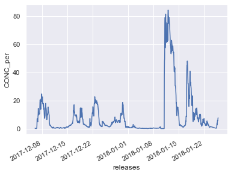

```python
%load_ext autoreload
%autoreload 2

```


```python
from useful_scit.imps import *
import flexpart_management.modules.FlexLogPol as FLP
import flexpart_management.modules.constants as co
import flexpart_management.modules.flx_array as fa
```


```python
path = '/Volumes/mbProD/Downloads/flx_log_coor/run_2019-06-05_18-42-11_'
# flp = FLP.FlexLogPol(path,concat=True)
self = FLP.FlexLogPol(path,concat=False,get_clusters=False)
```


```python
i = 0
ax = self.plot_cluster_influence_i(colors=FLP.COLORS,i=i)
```


```python
axfig=ax.figure.add_subplot(1,1,1)
```


```python
axfig.set_ylabel('sdfsdf')
axfig.set_xticks([])
axfig.set_yticks([])
ax.figure
```


```python
lab = '(# particles [%] * (residence time))'
fig = self.plot_clusters_inlfuence(ylab='')
fig.text(0.5, 0.1, 'release time (UTC)', ha='center', va='center');
fig.text(0.1, 0.5, lab, ha='center', va='center', rotation='vertical');
```


```python

```


    ---------------------------------------------------------------------------

    TypeError                                 Traceback (most recent call last)

    <ipython-input-66-f2cedf8c3998> in <module>
         15 topSubplot = pylab.subplot(2,1,1)
         16 position = topSubplot.get_position()
    ---> 17 position[0] = 0.15
         18 position[1] = position[1] + 0.01
         19 topSubplot.set_position(position)


    TypeError: 'Bbox' object does not support item assignment


```python
i = 0
ax = fa.get_ax_bolivia()
for i in range(len_clus):
    clus = self.cluster_flags[i]
    boo = self.merged_ds[co.ClusFlag]==clus
    #     fig,ax = plt.subplots()
    import warnings 
    warnings.simplefilter('ignore')
    ar = self.merged_ds.where(boo)[co.CPer].mean(dim=[co.RL])
    fa.logpolar_plot(ar,ax,name=co.CPer,perM=.15,quantile=False,colorbar=False,patch_args={'cmap':fa.get_custom_cmap(FLP.COLORS[i])})
```


```python
i = 0
ax = fa.get_ax_lapaz()
for i in range(len_clus):
    clus = self.cluster_flags[i]
    boo = self.merged_ds[co.ClusFlag]==clus
    #     fig,ax = plt.subplots()
    import warnings 
    warnings.simplefilter('ignore')
    ar = self.merged_ds.where(boo)[co.CCPer].mean(dim=[co.RL])
    fa.logpolar_plot(ar,ax,name=co.CCPer,perM=.05,quantile=False,colorbar=False,patch_args={'cmap':fa.get_custom_cmap(FLP.COLORS[i])})
    fa.add_chc_lpb(ax)
```


```python
# fig,axs = plt.subplots(3,4,sharex=True,sharey=True,figsize=(15,10))
axf = axs.flatten()
for i in range(len_clus):
    
#     if i==0:
#         ax = fig.add_subplot(3,4,i+1)
#         ax0 = ax
#     if i>0:
#         ax = fig.add_subplot(3,4,i+1,sharex=ax0,sharey=ax0)
#     ax = fa.get_ax_lapaz()
    ax = fa.get_ax_bolivia()

    clus = self.cluster_flags[i]
    boo = self.merged_ds[co.ClusFlag]==clus
#     fig,ax = plt.subplots()
    ar = self.merged_ds.where(boo)[co.CPer].mean(dim=[co.RL])
    fa.logpolar_plot(ar,ax,name=co.CPer,perM=.3,quantile=False)

```

    /Users/diego/miniconda3/envs/b36/lib/python3.6/site-packages/xarray/core/nanops.py:159: RuntimeWarning: Mean of empty slice
      return np.nanmean(a, axis=axis, dtype=dtype)
    /Users/diego/miniconda3/envs/b36/lib/python3.6/site-packages/xarray/core/nanops.py:159: RuntimeWarning: Mean of empty slice
      return np.nanmean(a, axis=axis, dtype=dtype)
    /Users/diego/miniconda3/envs/b36/lib/python3.6/site-packages/xarray/core/nanops.py:159: RuntimeWarning: Mean of empty slice
      return np.nanmean(a, axis=axis, dtype=dtype)
    /Users/diego/miniconda3/envs/b36/lib/python3.6/site-packages/xarray/core/nanops.py:159: RuntimeWarning: Mean of empty slice
      return np.nanmean(a, axis=axis, dtype=dtype)
    /Users/diego/miniconda3/envs/b36/lib/python3.6/site-packages/xarray/core/nanops.py:159: RuntimeWarning: Mean of empty slice
      return np.nanmean(a, axis=axis, dtype=dtype)
    /Users/diego/miniconda3/envs/b36/lib/python3.6/site-packages/xarray/core/nanops.py:159: RuntimeWarning: Mean of empty slice
      return np.nanmean(a, axis=axis, dtype=dtype)
    /Users/diego/miniconda3/envs/b36/lib/python3.6/site-packages/xarray/core/nanops.py:159: RuntimeWarning: Mean of empty slice
      return np.nanmean(a, axis=axis, dtype=dtype)
    /Users/diego/miniconda3/envs/b36/lib/python3.6/site-packages/xarray/core/nanops.py:159: RuntimeWarning: Mean of empty slice
      return np.nanmean(a, axis=axis, dtype=dtype)
    /Users/diego/miniconda3/envs/b36/lib/python3.6/site-packages/xarray/core/nanops.py:159: RuntimeWarning: Mean of empty slice
      return np.nanmean(a, axis=axis, dtype=dtype)
    /Users/diego/miniconda3/envs/b36/lib/python3.6/site-packages/xarray/core/nanops.py:159: RuntimeWarning: Mean of empty slice
      return np.nanmean(a, axis=axis, dtype=dtype)


```python
# fig,axs = plt.subplots(3,4,sharex=True,sharey=True,figsize=(15,10))
axf = axs.flatten()
for i in range(len_clus):
    
#     if i==0:
#         ax = fig.add_subplot(3,4,i+1)
#         ax0 = ax
#     if i>0:
#         ax = fig.add_subplot(3,4,i+1,sharex=ax0,sharey=ax0)
    ax = fa.get_ax_lapaz()
#     ax = fa.get_ax_bolivia()

    clus = self.cluster_flags[i]
    boo = self.merged_ds[co.ClusFlag]==clus
#     fig,ax = plt.subplots()
    ar = self.merged_ds.where(boo)[co.CPer].mean(dim=[co.RL])
    fa.logpolar_plot(ar,ax,name=co.CPer,perM=.3,quantile=False)
```

    /Users/diego/miniconda3/envs/b36/lib/python3.6/site-packages/xarray/core/nanops.py:159: RuntimeWarning: Mean of empty slice
      return np.nanmean(a, axis=axis, dtype=dtype)
    /Users/diego/miniconda3/envs/b36/lib/python3.6/site-packages/xarray/core/nanops.py:159: RuntimeWarning: Mean of empty slice
      return np.nanmean(a, axis=axis, dtype=dtype)
    /Users/diego/miniconda3/envs/b36/lib/python3.6/site-packages/xarray/core/nanops.py:159: RuntimeWarning: Mean of empty slice
      return np.nanmean(a, axis=axis, dtype=dtype)
    /Users/diego/miniconda3/envs/b36/lib/python3.6/site-packages/xarray/core/nanops.py:159: RuntimeWarning: Mean of empty slice
      return np.nanmean(a, axis=axis, dtype=dtype)
    /Users/diego/miniconda3/envs/b36/lib/python3.6/site-packages/xarray/core/nanops.py:159: RuntimeWarning: Mean of empty slice
      return np.nanmean(a, axis=axis, dtype=dtype)
    /Users/diego/miniconda3/envs/b36/lib/python3.6/site-packages/xarray/core/nanops.py:159: RuntimeWarning: Mean of empty slice
      return np.nanmean(a, axis=axis, dtype=dtype)
    /Users/diego/miniconda3/envs/b36/lib/python3.6/site-packages/xarray/core/nanops.py:159: RuntimeWarning: Mean of empty slice
      return np.nanmean(a, axis=axis, dtype=dtype)
    /Users/diego/miniconda3/envs/b36/lib/python3.6/site-packages/xarray/core/nanops.py:159: RuntimeWarning: Mean of empty slice
      return np.nanmean(a, axis=axis, dtype=dtype)
    /Users/diego/miniconda3/envs/b36/lib/python3.6/site-packages/xarray/core/nanops.py:159: RuntimeWarning: Mean of empty slice
      return np.nanmean(a, axis=axis, dtype=dtype)
    /Users/diego/miniconda3/envs/b36/lib/python3.6/site-packages/xarray/core/nanops.py:159: RuntimeWarning: Mean of empty slice
      return np.nanmean(a, axis=axis, dtype=dtype)


```python

# fig,axs = plt.subplots(3,4,sharex=True,sharey=True,figsize=(15,10))
axf = axs.flatten()
for i in range(len_clus):
    
#     if i==0:
#         ax = fig.add_subplot(3,4,i+1)
#         ax0 = ax
#     if i>0:
#         ax = fig.add_subplot(3,4,i+1,sharex=ax0,sharey=ax0)
#     ax = fa.get_ax_lapaz()
    ax = fa.get_ax_bolivia()

    clus = self.cluster_flags[i]
    boo = self.merged_ds[co.ClusFlag]==clus
#     fig,ax = plt.subplots()
    ar = self.merged_ds.where(boo)[co.CCPer].mean(dim=[co.RL])
    fa.logpolar_plot(ar,ax,name=co.CCPer,perM=.01,quantile=False)
```

    /Users/diego/miniconda3/envs/b36/lib/python3.6/site-packages/xarray/core/nanops.py:159: RuntimeWarning: Mean of empty slice
      return np.nanmean(a, axis=axis, dtype=dtype)
    /Users/diego/miniconda3/envs/b36/lib/python3.6/site-packages/xarray/core/nanops.py:159: RuntimeWarning: Mean of empty slice
      return np.nanmean(a, axis=axis, dtype=dtype)
    /Users/diego/miniconda3/envs/b36/lib/python3.6/site-packages/xarray/core/nanops.py:159: RuntimeWarning: Mean of empty slice
      return np.nanmean(a, axis=axis, dtype=dtype)
    /Users/diego/miniconda3/envs/b36/lib/python3.6/site-packages/xarray/core/nanops.py:159: RuntimeWarning: Mean of empty slice
      return np.nanmean(a, axis=axis, dtype=dtype)
    /Users/diego/miniconda3/envs/b36/lib/python3.6/site-packages/xarray/core/nanops.py:159: RuntimeWarning: Mean of empty slice
      return np.nanmean(a, axis=axis, dtype=dtype)
    /Users/diego/miniconda3/envs/b36/lib/python3.6/site-packages/xarray/core/nanops.py:159: RuntimeWarning: Mean of empty slice
      return np.nanmean(a, axis=axis, dtype=dtype)
    /Users/diego/miniconda3/envs/b36/lib/python3.6/site-packages/xarray/core/nanops.py:159: RuntimeWarning: Mean of empty slice
      return np.nanmean(a, axis=axis, dtype=dtype)
    /Users/diego/miniconda3/envs/b36/lib/python3.6/site-packages/xarray/core/nanops.py:159: RuntimeWarning: Mean of empty slice
      return np.nanmean(a, axis=axis, dtype=dtype)
    /Users/diego/miniconda3/envs/b36/lib/python3.6/site-packages/xarray/core/nanops.py:159: RuntimeWarning: Mean of empty slice
      return np.nanmean(a, axis=axis, dtype=dtype)
    /Users/diego/miniconda3/envs/b36/lib/python3.6/site-packages/xarray/core/nanops.py:159: RuntimeWarning: Mean of empty slice
      return np.nanmean(a, axis=axis, dtype=dtype)


```python
colors = [*sns.color_palette('Set1',n_colors=9,desat=.5),sns.color_palette('Dark2',n_colors=6,desat=.8)[-1]]
fig,axs = plt.subplots(3,4,sharex=True,sharey=True,figsize=(15,10))
axf = axs.flatten()
for i in range(len_clus):
    
#     if i==0:
#         ax = fig.add_subplot(3,4,i+1)
#         ax0 = ax
#     if i>0:
#         ax = fig.add_subplot(3,4,i+1,sharex=ax0,sharey=ax0)
    ax = axf[i]
    color = colors[i]
    clus = self.cluster_flags[i]
    boo = self.merged_ds[co.ClusFlag]==clus
#     fig,ax = plt.subplots()
    self.merged_ds.where(boo)[co.CCPer].sum(dim=[co.R_CENTER,co.TH_CENTER]).plot(color=color,ax =ax)
fig.autofmt_xdate()
```


```python
sns.choose_colorbrewer_palette('q')
```


    interactive(children=(Dropdown(description='name', options=('Set1', 'Set2', 'Set3', 'Paired', 'Accent', 'Paste…


    [(0.8941176470588235, 0.10196078431372557, 0.10980392156862737),
     (0.21568627450980393, 0.4941176470588236, 0.7215686274509804),
     (0.3019607843137256, 0.6862745098039216, 0.29019607843137263),
     (0.5960784313725492, 0.3058823529411765, 0.6392156862745098),
     (1.0, 0.4980392156862745, 0.0),
     (0.9999999999999998, 1.0, 0.19999999999999996),
     (0.6509803921568629, 0.33725490196078434, 0.1568627450980391),
     (0.9686274509803922, 0.5058823529411766, 0.7490196078431374),
     (0.6, 0.6, 0.6)]


```python
sns.choose_colorbrewer_palette('q')
```


    interactive(children=(Dropdown(description='name', options=('Set1', 'Set2', 'Set3', 'Paired', 'Accent', 'Paste…


    [(0.8941176470588235, 0.10196078431372557, 0.10980392156862737),
     (0.21568627450980393, 0.4941176470588236, 0.7215686274509804),
     (0.3019607843137256, 0.6862745098039216, 0.29019607843137263),
     (0.5960784313725492, 0.3058823529411765, 0.6392156862745098),
     (1.0, 0.4980392156862745, 0.0),
     (0.9999999999999998, 1.0, 0.19999999999999996),
     (0.6509803921568629, 0.33725490196078434, 0.1568627450980391),
     (0.9686274509803922, 0.5058823529411766, 0.7490196078431374),
     (0.6, 0.6, 0.6)]


```python

```


    [(0.7752941176470588, 0.22078431372549023, 0.2262745098039215),
     (0.29156862745098033, 0.48647058823529415, 0.645686274509804),
     (0.35784313725490197, 0.6268627450980393, 0.3496078431372549),
     (0.5590196078431375, 0.3558823529411764, 0.5892156862745098),
     (0.85, 0.4986274509803922, 0.15000000000000002),
     (0.8799999999999998, 0.8799999999999999, 0.32000000000000006),
     (0.5768627450980393, 0.35725490196078435, 0.23098039215686272),
     (0.89921568627451, 0.5752941176470587, 0.7454901960784315),
     (0.6, 0.6, 0.6),
     (0.7752941176470588, 0.22078431372549023, 0.2262745098039215),
     (0.8125490196078432, 0.6274509803921569, 0.09725490196078423)]


```python
i = 1 
clus = self.cluster_flags[i]
boo = self.merged_ds[co.ClusFlag]==clus
self.merged_ds.where(boo)[co.CPer].sum(dim=[co.R_CENTER,co.TH_CENTER]).plot()
```


    [<matplotlib.lines.Line2D at 0x17e8e9278>]





```python

```


    [<matplotlib.lines.Line2D at 0x168fbe160>]


```python
cp = self.merged_ds[CCPer][{co.RL:5}]
ax = fa.get_ax_bolivia()
fa.logpolar_plot(cp,ax=ax,name=CCPer,perM=.95)
```


    <cartopy.mpl.geoaxes.GeoAxesSubplot at 0x169ec37b8>


```python
cp = self.merged_ds[CPer][{co.RL:5}]
ax = fa.get_ax_bolivia()
fa.logpolar_plot(cp,ax=ax,name=CPer,perM=.95)
```


    <cartopy.mpl.geoaxes.GeoAxesSubplot at 0x16d0c14e0>


```python

```


```python


```


```python

```


```python

```


```python

```


```python


```


```python

```


```python

r,c
```


    (1217, 300)


```python
sns.distplot(trim_vals.flatten())
```


    <matplotlib.axes._subplots.AxesSubplot at 0x14f35b5c0>


```python

```


```python

```


```python

```


```python
nar = ar.where(ar['flags']==10).sum(dim=co.RL)
ax = fa.get_ax_bolivia()
fa.logpolar_plot(nar,ax=ax)
ax = fa.get_ax_lapaz()
fa.logpolar_plot(nar,ax=ax)
```


    <cartopy.mpl.geoaxes.GeoAxesSubplot at 0x16eafc4e0>


```python
nar = ar.sum(dim=co.RL)
ax = fa.get_ax_bolivia()
fa.logpolar_plot(nar,ax=ax)
```


    <cartopy.mpl.geoaxes.GeoAxesSubplot at 0x152afab00>


```python

```


```python
plt.plot(np.linalg.norm(dfn,axis=1))
```


    [<matplotlib.lines.Line2D at 0x14bc7be80>]


```python
df['norm'] = np.linalg.norm(df,axis=1)
```


```python
ax = fa.get_ax_bolivia()
ar2 = d2[co.CONC]
ar1 = d1[co.CONC][{co.R_CENTER:slice(l1m,l1M)}]
fa.logpolar_plot(ar2,ax=ax,quantile=False,perM = 1500)
fa.logpolar_plot(ar1,ax=ax,quantile=False,perM = 1500)
fa.add_chc_lpb(ax)
ax = fa.get_ax_lapaz()
ar2 = d2[co.CONC][{co.R_CENTER:slice(l2m,l2M)}]
ar1 = d1[co.CONC][{co.R_CENTER:slice(l1m,l1M)}]
fa.logpolar_plot(ar2,ax=ax,quantile=False,perM = 1500)
fa.logpolar_plot(ar1,ax=ax,quantile=False,perM = 1500)
fa.add_chc_lpb(ax)
```


```python
mer = xr.merge([ar1,ar2])
```


```python
mer[co.CONC].plot()
```


    <matplotlib.collections.QuadMesh at 0x12d031b38>


```python
ar2
```


    <xarray.DataArray 'CONC' (R_CENTER: 14, TH_CENTER: 36)>
    dask.array<shape=(14, 36), dtype=float32, chunksize=(14, 36)>
    Coordinates:
      * R_CENTER   (R_CENTER) float64 0.05613 0.06721 0.08046 ... 0.4868 0.5827
      * TH_CENTER  (TH_CENTER) float64 0.08727 0.2618 0.4363 ... 5.847 6.021 6.196
        LAT        (R_CENTER, TH_CENTER) float64 -16.29 -16.3 ... -15.79 -15.77
        LON        (R_CENTER, TH_CENTER) float64 -68.08 -68.08 ... -67.57 -67.55
        LAT_00     (R_CENTER, TH_CENTER) float64 -16.3 -16.3 -16.3 ... -15.85 -15.83
        LON_00     (R_CENTER, TH_CENTER) float64 -68.13 -68.12 ... -68.31 -68.22
        LAT_10     (R_CENTER, TH_CENTER) float64 -16.29 -16.29 ... -15.75 -15.72
        LON_10     (R_CENTER, TH_CENTER) float64 -68.13 -68.12 ... -68.35 -68.24
        LAT_11     (R_CENTER, TH_CENTER) float64 -16.29 -16.29 ... -15.72 -15.71
        LON_11     (R_CENTER, TH_CENTER) float64 -68.12 -68.11 ... -68.24 -68.13
        LAT_01     (R_CENTER, TH_CENTER) float64 -16.3 -16.3 ... -15.83 -15.82
        LON_01     (R_CENTER, TH_CENTER) float64 -68.12 -68.11 ... -68.22 -68.13
        GRIDAREA   (R_CENTER, TH_CENTER) float64 1.178e+06 1.178e+06 ... 1.273e+08
        releases   datetime64[ns] 2017-12-06T12:00:00


```python
i = 240 
dss = [xr.open_dataset(d) for d in ls[:i]]

```


```python
xr.concat(dss,dim=co.RL)
```


    <xarray.Dataset>
    Dimensions:    (R_CENTER: 35, TH_CENTER: 36, releases: 240)
    Coordinates:
      * R_CENTER   (R_CENTER) float64 0.03916 0.05613 0.09633 ... 21.33 25.53 30.57
      * TH_CENTER  (TH_CENTER) float64 0.08727 0.2618 0.4363 ... 5.847 6.021 6.196
        LAT        (R_CENTER, TH_CENTER) float64 -16.31 -16.31 -16.31 ... 13.18 14.1
        LON        (R_CENTER, TH_CENTER) float64 -68.09 -68.09 ... -38.6 -37.68
        LAT_00     (R_CENTER, TH_CENTER) float64 -16.31 -16.32 ... 9.903 11.16
        LON_00     (R_CENTER, TH_CENTER) float64 -68.13 -68.13 ... -77.69 -72.98
        LAT_10     (R_CENTER, TH_CENTER) float64 -16.31 -16.31 ... 15.08 16.59
        LON_10     (R_CENTER, TH_CENTER) float64 -68.13 -68.12 ... -79.57 -73.94
        LAT_11     (R_CENTER, TH_CENTER) float64 -16.31 -16.31 -16.31 ... 16.59 17.1
        LON_11     (R_CENTER, TH_CENTER) float64 -68.12 -68.12 ... -73.94 -68.13
        LAT_01     (R_CENTER, TH_CENTER) float64 -16.32 -16.32 ... 11.16 11.59
        LON_01     (R_CENTER, TH_CENTER) float64 -68.13 -68.12 ... -72.98 -68.13
        GRIDAREA   (R_CENTER, TH_CENTER) float64 5.733e+05 5.733e+05 ... 3.528e+11
      * releases   (releases) datetime64[ns] 2017-12-06 ... 2017-12-15T23:00:00
    Data variables:
        CONC       (R_CENTER, TH_CENTER, releases) float32 0.0 0.0 0.0 ... 0.0 0.0


```python
xr.open_mfdataset(ls[:],concat_dim=co.RL,chunks={co.RL:10},decode_cf=False)
```


    <xarray.Dataset>
    Dimensions:    (R_CENTER: 35, TH_CENTER: 36, releases: 1176)
    Coordinates:
      * R_CENTER   (R_CENTER) float64 0.03916 0.05613 0.09633 ... 21.33 25.53 30.57
      * TH_CENTER  (TH_CENTER) float64 0.08727 0.2618 0.4363 ... 5.847 6.021 6.196
      * releases   (releases) int64 0 0 0 0 0 0 0 0 0 0 0 ... 0 0 0 0 0 0 0 0 0 0 0
    Data variables:
        LAT        (releases, R_CENTER, TH_CENTER) float64 dask.array<shape=(1176, 35, 36), chunksize=(1, 35, 36)>
        LON        (releases, R_CENTER, TH_CENTER) float64 dask.array<shape=(1176, 35, 36), chunksize=(1, 35, 36)>
        LAT_00     (releases, R_CENTER, TH_CENTER) float64 dask.array<shape=(1176, 35, 36), chunksize=(1, 35, 36)>
        LON_00     (releases, R_CENTER, TH_CENTER) float64 dask.array<shape=(1176, 35, 36), chunksize=(1, 35, 36)>
        LAT_10     (releases, R_CENTER, TH_CENTER) float64 dask.array<shape=(1176, 35, 36), chunksize=(1, 35, 36)>
        LON_10     (releases, R_CENTER, TH_CENTER) float64 dask.array<shape=(1176, 35, 36), chunksize=(1, 35, 36)>
        LAT_11     (releases, R_CENTER, TH_CENTER) float64 dask.array<shape=(1176, 35, 36), chunksize=(1, 35, 36)>
        LON_11     (releases, R_CENTER, TH_CENTER) float64 dask.array<shape=(1176, 35, 36), chunksize=(1, 35, 36)>
        LAT_01     (releases, R_CENTER, TH_CENTER) float64 dask.array<shape=(1176, 35, 36), chunksize=(1, 35, 36)>
        LON_01     (releases, R_CENTER, TH_CENTER) float64 dask.array<shape=(1176, 35, 36), chunksize=(1, 35, 36)>
        GRIDAREA   (releases, R_CENTER, TH_CENTER) float64 dask.array<shape=(1176, 35, 36), chunksize=(1, 35, 36)>
        CONC       (R_CENTER, TH_CENTER, releases) float32 dask.array<shape=(35, 36, 1176), chunksize=(35, 36, 1)>


```python
dat = 'date'
flp.dask_ds_01[dat]=flp.dask_ds_01[co.RL].dt.round('D')
```


```python
fd = flp.dask_ds_01[[dat]]
```


```python
fd.swap_dims({co.RL:dat}).reset_coords(co.RL).groupby(dat).count()[co.RL].plot()
```


    [<matplotlib.lines.Line2D at 0x128fc8710>]


```python

```
