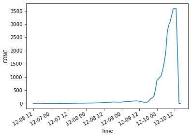

```python
%load_ext autoreload
%autoreload 2
```


```python
from useful_scit.imps import *
import flexpart_management.modules.FLEXOUT as FX
import flexpart_management.modules.constants as co
import flexpart_management.modules.flx_array as fa
```

    reload


```python
path = '/Volumes/mbProD/Downloads/flex_out/run_2019-06-02_20-42-05_/2017-12-10'
```


```python
fd1 = FX.FLEXOUT('d01',path,'/tmp/')
```

    /Volumes/mbProD/Downloads/flex_out/run_2019-06-02_20-42-05_/2017-12-10/*header_*d01*
    /Volumes/mbProD/Downloads/flex_out/run_2019-06-02_20-42-05_/2017-12-10/header_d01.nc
    /Volumes/mbProD/Downloads/flex_out/run_2019-06-02_20-42-05_/2017-12-10/*flxout_*d01*
    ['/Volumes/mbProD/Downloads/flex_out/run_2019-06-02_20-42-05_/2017-12-10/flxout_d01_20171206_000000.nc']


```python
rel = 14 
dh = 24
lh = 96
```


```python
ds = fd1.flexout_ds[{co.RL:rel}]
# ds.load();
```


```python
ds1 = ds[{co.TIME:slice(rel-2,rel+lh+3)}]
```


```python
lt = len(ds1[co.TIME])
```


```python
rl = [] 
for i in range(lt):
    res = fa.data_array_to_logpolar(
        ds1[co.CONC][i,0,:],
        r_round_log=co.ROUND_R_LOG,
        th_round_rad=co.ROUND_TH_RAD,
        dim2keep=[co.ZM,co.TIME]

    )
    print(i)
    rl.append(res)
```

    0
    1
    2
    3
    4
    5
    6
    7
    8
    9
    10
    11
    12
    13
    14
    15
    16
    17
    18
    19
    20
    21
    22
    23
    24
    25
    26
    27
    28
    29
    30
    31
    32
    33
    34
    35
    36
    37
    38
    39
    40
    41
    42
    43
    44
    45
    46
    47
    48
    49
    50
    51
    52
    53
    54
    55
    56
    57
    58
    59
    60
    61
    62
    63
    64
    65
    66
    67
    68
    69
    70
    71
    72
    73
    74
    75
    76
    77
    78
    79
    80
    81
    82
    83
    84
    85
    86
    87
    88
    89
    90
    91
    92
    93
    94
    95
    96
    97
    98
    99
    100


```python
dsL1 = xr.concat(rl[:],co.TIME)
```


```python
fd2 = FX.FLEXOUT('d02',path,'/tmp/')
```

    /Volumes/mbProD/Downloads/flex_out/run_2019-06-02_20-42-05_/2017-12-10/*header_*d02*
    /Volumes/mbProD/Downloads/flex_out/run_2019-06-02_20-42-05_/2017-12-10/header_d02.nc
    /Volumes/mbProD/Downloads/flex_out/run_2019-06-02_20-42-05_/2017-12-10/*flxout_*d02*
    ['/Volumes/mbProD/Downloads/flex_out/run_2019-06-02_20-42-05_/2017-12-10/flxout_d02_20171206_000000.nc']


```python
rel = 14 
dh = 24
lh = 96
```


```python
ds = fd2.flexout_ds[{co.RL:rel}]
# ds.load();
```


```python
ds1 = ds[{co.TIME:slice(rel-2,rel+lh+3)}]
```


```python
lt = len(ds1[co.TIME])
```


```python
rl = [] 
for i in range(lt):
    res = fa.data_array_to_logpolar(
        ds1[co.CONC][i,0,:],
        r_round_log=co.ROUND_R_LOG,
        th_round_rad=co.ROUND_TH_RAD,
        dim2keep=[co.ZM,co.TIME]

    )
    print(i)
    rl.append(res)
```

    0
    1
    2
    3
    4
    5
    6
    7
    8
    9
    10
    11
    12
    13
    14
    15
    16
    17
    18
    19
    20
    21
    22
    23
    24
    25
    26
    27
    28
    29
    30
    31
    32
    33
    34
    35
    36
    37
    38
    39
    40
    41
    42
    43
    44
    45
    46
    47
    48
    49
    50
    51
    52
    53
    54
    55
    56
    57
    58
    59
    60
    61
    62
    63
    64
    65
    66
    67
    68
    69
    70
    71
    72
    73
    74
    75
    76
    77
    78
    79
    80
    81
    82
    83
    84
    85
    86
    87
    88
    89
    90
    91
    92
    93
    94
    95
    96
    97
    98
    99
    100


```python
dsL2 = xr.concat(rl[:],co.TIME)
```


```python
dsL2.sum(fa.get_dims_complement(dsL1,co.TIME)).plot()
```


    [<matplotlib.lines.Line2D at 0x12057fda0>]





```python

def get_merged_ds(ds1,ds2):

    l2M = 24
    l2m = 10
    l1M = None
    l1m = 13
    d1 = ds1[{co.R_CENTER: slice(l1m, l1M)}]
    d2 = ds2[{co.R_CENTER: slice(l2m, l2M)}]
    mer = xr.merge([d1, d2])
    return mer

```


```python
dl = get_merged_ds(dsL1,dsL2)
```


```python
dp
```


    <xarray.Dataset>
    Dimensions:    (R_CENTER: 36, TH_CENTER: 36)
    Coordinates:
      * R_CENTER   (R_CENTER) float64 0.05613 0.06721 0.08046 ... 21.33 25.53 30.57
      * TH_CENTER  (TH_CENTER) float64 0.08727 0.2618 0.4363 ... 5.847 6.021 6.196
        LAT        (R_CENTER, TH_CENTER) float64 -16.29 -16.3 -16.3 ... 13.18 14.1
        LON        (R_CENTER, TH_CENTER) float64 -68.08 -68.08 ... -38.6 -37.68
        LAT_00     (R_CENTER, TH_CENTER) float64 -16.3 -16.3 -16.3 ... 9.903 11.16
        LON_00     (R_CENTER, TH_CENTER) float64 -68.13 -68.12 ... -77.69 -72.98
        LAT_10     (R_CENTER, TH_CENTER) float64 -16.29 -16.29 ... 15.08 16.59
        LON_10     (R_CENTER, TH_CENTER) float64 -68.13 -68.12 ... -79.57 -73.94
        LAT_11     (R_CENTER, TH_CENTER) float64 -16.29 -16.29 -16.3 ... 16.59 17.1
        LON_11     (R_CENTER, TH_CENTER) float64 -68.12 -68.11 ... -73.94 -68.13
        LAT_01     (R_CENTER, TH_CENTER) float64 -16.3 -16.3 -16.31 ... 11.16 11.59
        LON_01     (R_CENTER, TH_CENTER) float64 -68.12 -68.11 ... -72.98 -68.13
        GRIDAREA   (R_CENTER, TH_CENTER) float64 1.178e+06 1.178e+06 ... 3.528e+11
        Time       datetime64[ns] 2017-12-06T14:00:00
    Data variables:
        CONC       (R_CENTER, TH_CENTER) float32 0.0 0.0 0.0 0.0 ... 0.0 0.0 0.0 0.0


```python
i=2
mm = dl[co.CONC].sum(co.TH_CENTER).quantile(.985).values
def plot_for_offset(i):
    r = 2
    fig = plt.figure(figsize=(7,7))
    llm = dl[co.CONC].where(dl[co.CONC]>0).sum(co.ZM).quantile(.99)
    ax1 = fig.add_subplot(2,2,1,projection=co.PROJ)
    fa.get_ax_bolivia(ax=ax1)
    dp = dl[{co.TIME:i}].sum(co.ZM)
    fa.logpolar_plot(dp,ax=ax1,perM=llm,quantile=False,colorbar=False)
    fa.plot_lapaz_rect(ax=ax1)
    fa.add_chc_lpb(ax1)
    ax2 = fig.add_subplot(2,2,2,projection=co.PROJ)
    fa.get_ax_lapaz(ax=ax2)
    dp = dl[{co.TIME:i}].sum(co.ZM)
    fa.logpolar_plot(dp,ax=ax2,perM=llm,quantile=False,colorbar=True)
    fa.add_chc_lpb(ax2)
    ax = fig.add_subplot(r,1,r)
    fa.plot_clust_height(dl[{co.TIME:i}][co.CONC],ax=ax,perM=mm,quantile=False,par_to_plot=co.CONC)
    fig.canvas.draw()       # draw the canvas, cache the renderer
    image = np.frombuffer(fig.canvas.tostring_rgb(), dtype='uint8')
    image  = image.reshape(fig.canvas.get_width_height()[::-1] + (3,))
    plt.close(fig)

    return image


```


```python
import matplotlib
import matplotlib.pyplot as plt
import numpy as np
import imageio
kwargs_write = {'fps':1.0, 'quantizer':'nq'}
imageio.mimsave('./powers.gif', [plot_for_offset(i) for i in range(98,3,-1)], fps=2.5)
```


```python

```


    array(60.50542049)


```python

```


```python

```


```python

```


```python

```


```python

```


```python

```


```python

```


```python

```


```python

```
