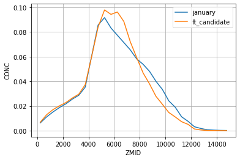

```python
import flexpart_management.notebooks.george_data_analysis.n02_compare_flx_lfc as lfc
#local functions and constants

from flexpart_management.modules import fa
from flexpart_management.modules import co
from useful_scit.imps import *
fa,co,plt;
```


<div class="bk-root">
    <a href="https://bokeh.org" target="_blank" class="bk-logo bk-logo-small bk-logo-notebook"></a>
    <span id="1001">Loading BokehJS ...</span>
</div>


    reload


    (<module 'flexpart_management.modules.flx_array' from '/Users/diego/flexpart_management/flexpart_management/modules/flx_array.py'>,
     <module 'flexpart_management.modules.constants' from '/Users/diego/flexpart_management/flexpart_management/modules/constants.py'>,
     <module 'matplotlib.pyplot' from '/Users/diego/miniconda3/envs/b36/lib/python3.6/site-packages/matplotlib/pyplot.py'>)


```python
from flexpart_management.notebooks.george_data_analysis.n02_compare_flx_lfc import \
    plot_for_time_stamp


# def main():
```


```python
data = lfc.import_george_data()
time_stamps = data['candidate_ft_timestamps']
```


```python
flx_ds = fa.open_temp_ds('ds_clustered_18.nc')
```


```python
flx_ds = lfc.add_is_it_ft_candidate(flx_ds, time_stamps)
```


```python
lfc.plot_z_above_sea_level_comparison(flx_ds)
```





```python
lfc.plot_above_ground_level(flx_ds)
```


```python
def boo(r):
    r0 = xr.DataArray(r.iloc[0])
    r1 = xr.DataArray(r.iloc[1])
    rl_ = flx_ds[co.RL]
    res = np.logical_and(rl_>=r0,rl_<=r1)
    return res

time_stamps['boo']=time_stamps.apply(boo,axis=1)
```


```python
clocks = {
    0:[[[10,4],[4,10]]],
    1:[[[6,10],[10,6]]],
    2:[[[0,7],[7,12]]],
    3:[[[9,4],[4,9]]],
    4:[[[0,12]]],
    5:[[[6,12],[0,6]]],
    6: [[[11, 5], [5, 11]]],
    7: [[[11, 5], [5, 11]]],
    8: [[[10, 3], [3, 10]]],
    9: [[[9, 3], [3, 9]]],
}
_df = pd.DataFrame(clocks).T
time_stamps['hs']=_df
```


```python


for l,r in time_stamps.iloc[:].iterrows():
    if np.isnan(r['hs']).all():
        hs = None
    else:
        hs = r['hs']
    lfc.plot_for_time_stamp(flx_ds, r, l,hs=hs)
```

    /Users/diego/flexpart_management/flexpart_management/notebooks/george_data_analysis/n02_compare_flx_lfc.py:173: SettingWithCopyWarning: 
    A value is trying to be set on a copy of a slice from a DataFrame
    
    See the caveats in the documentation: http://pandas.pydata.org/pandas-docs/stable/user_guide/indexing.html#returning-a-view-versus-a-copy
      df['fun'][~df['normal']] = np.logical_or
    /Users/diego/miniconda3/envs/b36/lib/python3.6/site-packages/IPython/core/pylabtools.py:128: UserWarning: constrained_layout not applied.  At least one axes collapsed to zero width or height.
      fig.canvas.print_figure(bytes_io, **kw)


    /Users/diego/flexpart_management/flexpart_management/notebooks/george_data_analysis/n02_compare_flx_lfc.py:173: SettingWithCopyWarning: 
    A value is trying to be set on a copy of a slice from a DataFrame
    
    See the caveats in the documentation: http://pandas.pydata.org/pandas-docs/stable/user_guide/indexing.html#returning-a-view-versus-a-copy
      df['fun'][~df['normal']] = np.logical_or
    /Users/diego/miniconda3/envs/b36/lib/python3.6/site-packages/IPython/core/pylabtools.py:128: UserWarning: constrained_layout not applied.  At least one axes collapsed to zero width or height.
      fig.canvas.print_figure(bytes_io, **kw)


    /Users/diego/flexpart_management/flexpart_management/notebooks/george_data_analysis/n02_compare_flx_lfc.py:173: SettingWithCopyWarning: 
    A value is trying to be set on a copy of a slice from a DataFrame
    
    See the caveats in the documentation: http://pandas.pydata.org/pandas-docs/stable/user_guide/indexing.html#returning-a-view-versus-a-copy
      df['fun'][~df['normal']] = np.logical_or
    /Users/diego/miniconda3/envs/b36/lib/python3.6/site-packages/IPython/core/pylabtools.py:128: UserWarning: constrained_layout not applied.  At least one axes collapsed to zero width or height.
      fig.canvas.print_figure(bytes_io, **kw)


    /Users/diego/flexpart_management/flexpart_management/notebooks/george_data_analysis/n02_compare_flx_lfc.py:173: SettingWithCopyWarning: 
    A value is trying to be set on a copy of a slice from a DataFrame
    
    See the caveats in the documentation: http://pandas.pydata.org/pandas-docs/stable/user_guide/indexing.html#returning-a-view-versus-a-copy
      df['fun'][~df['normal']] = np.logical_or
    /Users/diego/miniconda3/envs/b36/lib/python3.6/site-packages/IPython/core/pylabtools.py:128: UserWarning: constrained_layout not applied.  At least one axes collapsed to zero width or height.
      fig.canvas.print_figure(bytes_io, **kw)


    /Users/diego/flexpart_management/flexpart_management/notebooks/george_data_analysis/n02_compare_flx_lfc.py:173: SettingWithCopyWarning: 
    A value is trying to be set on a copy of a slice from a DataFrame
    
    See the caveats in the documentation: http://pandas.pydata.org/pandas-docs/stable/user_guide/indexing.html#returning-a-view-versus-a-copy
      df['fun'][~df['normal']] = np.logical_or
    /Users/diego/miniconda3/envs/b36/lib/python3.6/site-packages/IPython/core/pylabtools.py:128: UserWarning: constrained_layout not applied.  At least one axes collapsed to zero width or height.
      fig.canvas.print_figure(bytes_io, **kw)


    /Users/diego/flexpart_management/flexpart_management/notebooks/george_data_analysis/n02_compare_flx_lfc.py:173: SettingWithCopyWarning: 
    A value is trying to be set on a copy of a slice from a DataFrame
    
    See the caveats in the documentation: http://pandas.pydata.org/pandas-docs/stable/user_guide/indexing.html#returning-a-view-versus-a-copy
      df['fun'][~df['normal']] = np.logical_or
    /Users/diego/miniconda3/envs/b36/lib/python3.6/site-packages/IPython/core/pylabtools.py:128: UserWarning: constrained_layout not applied.  At least one axes collapsed to zero width or height.
      fig.canvas.print_figure(bytes_io, **kw)


    /Users/diego/flexpart_management/flexpart_management/notebooks/george_data_analysis/n02_compare_flx_lfc.py:173: SettingWithCopyWarning: 
    A value is trying to be set on a copy of a slice from a DataFrame
    
    See the caveats in the documentation: http://pandas.pydata.org/pandas-docs/stable/user_guide/indexing.html#returning-a-view-versus-a-copy
      df['fun'][~df['normal']] = np.logical_or
    /Users/diego/miniconda3/envs/b36/lib/python3.6/site-packages/IPython/core/pylabtools.py:128: UserWarning: constrained_layout not applied.  At least one axes collapsed to zero width or height.
      fig.canvas.print_figure(bytes_io, **kw)


    /Users/diego/flexpart_management/flexpart_management/notebooks/george_data_analysis/n02_compare_flx_lfc.py:173: SettingWithCopyWarning: 
    A value is trying to be set on a copy of a slice from a DataFrame
    
    See the caveats in the documentation: http://pandas.pydata.org/pandas-docs/stable/user_guide/indexing.html#returning-a-view-versus-a-copy
      df['fun'][~df['normal']] = np.logical_or
    /Users/diego/miniconda3/envs/b36/lib/python3.6/site-packages/IPython/core/pylabtools.py:128: UserWarning: constrained_layout not applied.  At least one axes collapsed to zero width or height.
      fig.canvas.print_figure(bytes_io, **kw)


    /Users/diego/flexpart_management/flexpart_management/notebooks/george_data_analysis/n02_compare_flx_lfc.py:173: SettingWithCopyWarning: 
    A value is trying to be set on a copy of a slice from a DataFrame
    
    See the caveats in the documentation: http://pandas.pydata.org/pandas-docs/stable/user_guide/indexing.html#returning-a-view-versus-a-copy
      df['fun'][~df['normal']] = np.logical_or
    /Users/diego/miniconda3/envs/b36/lib/python3.6/site-packages/IPython/core/pylabtools.py:128: UserWarning: constrained_layout not applied.  At least one axes collapsed to zero width or height.
      fig.canvas.print_figure(bytes_io, **kw)


    /Users/diego/flexpart_management/flexpart_management/notebooks/george_data_analysis/n02_compare_flx_lfc.py:173: SettingWithCopyWarning: 
    A value is trying to be set on a copy of a slice from a DataFrame
    
    See the caveats in the documentation: http://pandas.pydata.org/pandas-docs/stable/user_guide/indexing.html#returning-a-view-versus-a-copy
      df['fun'][~df['normal']] = np.logical_or
    /Users/diego/miniconda3/envs/b36/lib/python3.6/site-packages/IPython/core/pylabtools.py:128: UserWarning: constrained_layout not applied.  At least one axes collapsed to zero width or height.
      fig.canvas.print_figure(bytes_io, **kw)


```python

```


```python

```


```python

```


```python

```
