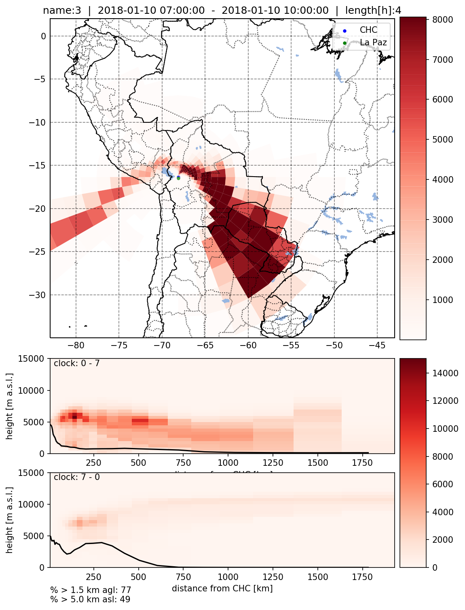
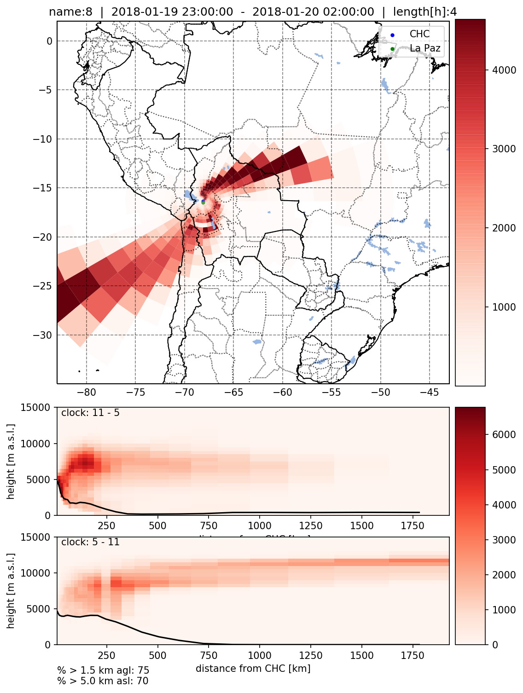

```python
import \
    flexpart_management.notebooks.george_data_analysisV02.n_01_ft_candidate_lfc as lfc
# local functions and constants
from flexpart_management.notebooks.george_data_analysisV02.n_01_ft_candidate_lfc import \
    get_per_above5sl, get_per_above_500, plot_plot
from useful_scit.imps import *
from flexpart_management.modules import constants as co, flx_array as fa

# noinspection PyStatementEffect
fa, lfc, plt, co;
```

    reload


<div class="bk-root">
    <a href="https://bokeh.org" target="_blank" class="bk-logo bk-logo-small bk-logo-notebook"></a>
    <span id="1001">Loading BokehJS ...</span>
</div>


```python
# def main():
```


```python

```


```python
df = pd.read_excel(
    '/Volumes/mbProD/flexpart_management_data/flexpart_management/tmp_data/data_george_ccV02.xlsx')
```


```python
# CONSTANTS
t0,      t1,      name,   h11,h12,    h21,h22, tlen = \
't0_utc','t1_utc','name','h11','h12','h21','h22','length[h]'
```


```python
ds = fa.open_temp_ds('ds_clustered_18.nc')
da = ds[co.CONC]
```


```python
r = df.iloc[0]
```


```python
log.ger.setLevel(log.log.INFO)
for l,r in df.iterrows():
    log.ger.info(f'doing {l}')
    lfc.plot_plot(da, h11, h12, h21, h22, name, r, t0, t1, tlen)
```

    2020-02-03 21:48:30,255 useful_scit  INFO     doing 0


    2020-02-03 21:48:30,255 useful_scit  INFO     doing 0


    2020-02-03 21:49:10,749 useful_scit  INFO     doing 1


    2020-02-03 21:49:10,749 useful_scit  INFO     doing 1


    2020-02-03 21:49:44,943 useful_scit  INFO     doing 2


    2020-02-03 21:49:44,943 useful_scit  INFO     doing 2





    2020-02-03 21:50:24,993 useful_scit  INFO     doing 3


    2020-02-03 21:50:24,993 useful_scit  INFO     doing 3


    2020-02-03 21:51:00,508 useful_scit  INFO     doing 4


    2020-02-03 21:51:00,508 useful_scit  INFO     doing 4


    /Users/diego/miniconda3/envs/b36/lib/python3.6/site-packages/dask/core.py:119: RuntimeWarning: invalid value encountered in true_divide
      return func(*args2)


    2020-02-03 21:51:23,141 useful_scit  INFO     doing 5


    2020-02-03 21:51:23,141 useful_scit  INFO     doing 5


    2020-02-03 21:51:57,603 useful_scit  INFO     doing 6


    2020-02-03 21:51:57,603 useful_scit  INFO     doing 6


    2020-02-03 21:52:34,703 useful_scit  INFO     doing 7


    2020-02-03 21:52:34,703 useful_scit  INFO     doing 7





    2020-02-03 21:53:08,964 useful_scit  INFO     doing 8


    2020-02-03 21:53:08,964 useful_scit  INFO     doing 8


    2020-02-03 21:53:42,895 useful_scit  INFO     doing 9


    2020-02-03 21:53:42,895 useful_scit  INFO     doing 9


    2020-02-03 21:54:16,549 useful_scit  INFO     doing 10


    2020-02-03 21:54:16,549 useful_scit  INFO     doing 10


    /Users/diego/miniconda3/envs/b36/lib/python3.6/site-packages/dask/core.py:119: RuntimeWarning: invalid value encountered in true_divide
      return func(*args2)


    2020-02-03 21:54:44,411 useful_scit  INFO     doing 11


    2020-02-03 21:54:44,411 useful_scit  INFO     doing 11


    /Users/diego/miniconda3/envs/b36/lib/python3.6/site-packages/dask/core.py:119: RuntimeWarning: invalid value encountered in true_divide
      return func(*args2)


```python

```


```python

```


```python

```


```python

```


```python

```


```python

```


```python

```


```python

```


```python

```
