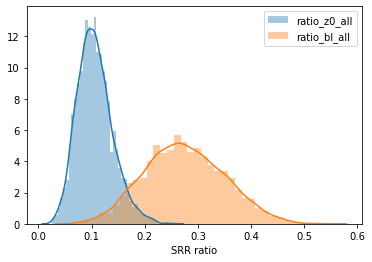
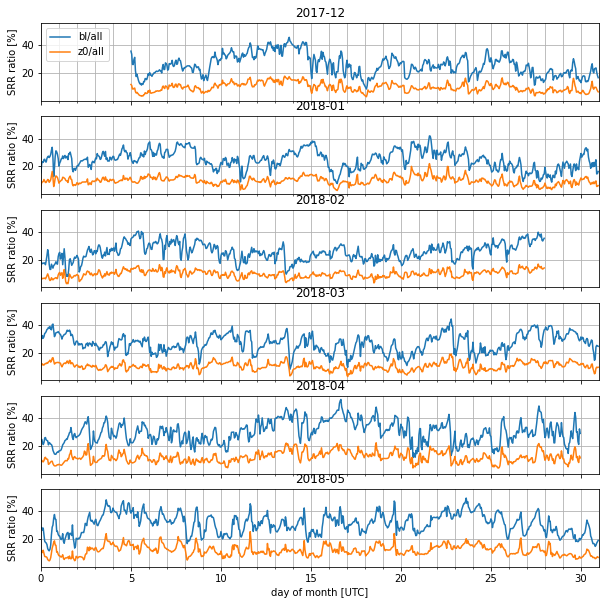

```python
import flexpart_management.notebooks.george_surface_ratio.george_surface_ratio_lfc as lfc
from flexpart_management.notebooks.george_surface_ratio.george_surface_ratio_lfc import *
```

    reload


```python

```


```python

ds = xr.open_dataset(
    pjoin(co.tmp_data_path,'cluster_series_v3.nc'))
```


```python
dall = ds['conc_all'].loc[{'normalized':0}]
zall = dall.loc[{'z_column':'ALL'}]
z0 = dall.loc[{'z_column':'LEV0'}]
zbl = dall.loc[{'z_column':'BL'}]
```


```python
ratio_z0_all = z0/zall
ratio_bl_all = zbl/zall
```


```python
sns.distplot(ratio_z0_all, label='ratio_z0_all')
sns.distplot(ratio_bl_all, label='ratio_bl_all')
plt.gca().legend()
plt.gca().set_xlabel('SRR ratio')
plt.show()
```





```python
df = pd.DataFrame()
df['ratio_z0_all'] = ratio_z0_all.to_dataframe()['conc_all'] * 100
df['ratio_bl_all'] = ratio_bl_all.to_dataframe()['conc_all'] * 100

df['ym'] = pd.to_datetime(df.index.strftime('%Y-%m'))
df['yms'] = df.index.strftime('%Y-%m')
df['d'] = (df.index - df['ym'])/np.timedelta64(1, 'D')
dg = df.groupby('yms')
```


```python
s = splot(6,1,sharex=True,sharey=True,figsize=(10,10))
for ax,(l,_df) in zip(s.axf,dg):
    ax.plot(_df['d'],_df['ratio_bl_all'],label='bl/all')
    ax.plot(_df['d'], _df['ratio_z0_all'],label='z0/all')
    ax.set_title(l)
    ax.grid()
    ax.set_xticks(np.arange(0,31),minor=True)
    ax.set_xlim(0,31)
    ax.grid(True,which='minor',axis='x')
    ax.set_ylabel('SRR ratio [%]')
s.axf[0].legend()
s.axf[-1].set_xlabel('day of month [UTC]')

plt.show()
```





```python
df_out = df[['ratio_bl_all','ratio_z0_all']]
df_out.index.name='date_utc'
path_out = pjoin(os.path.dirname(lfc.__file__),'ratios.csv')
df_out.to_csv(path_out)
```


```python

```


```python

```


```python


```


```python

```


```python

```


```python

```


```python

```


```python

```


```python

```


```python

```


```python

```


```python

```


```python

```
