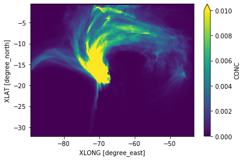
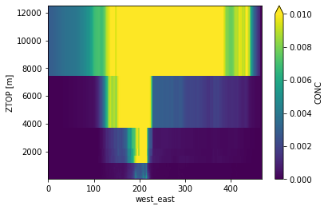
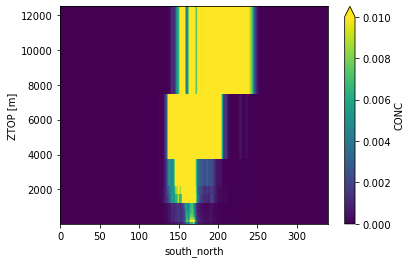
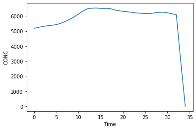

```python
from useful_scit.imps import *
```


```python
path = '/Volumes/mbProD/Downloads/flex_out/run_2019-05-25_23-19-34_'
```


```python
head = os.path.join(path,'header*d01*')
head = glob.glob(head)[0]
head = xr.open_dataset(head)
```


```python
files = os.path.join(path,'flxout_d01*')
files = glob.glob(files)
files.sort()
# files = [xr.open_dataset(f) for f in files[10:]]
ff = []
for f in files:
    try: ff.append(xr.open_dataset(f))
    except: pass
```


```python
ds = xr.concat(ff,dim='Time')
ds = ds.assign_coords(ZTOP=head.ZTOP)
ds = ds.assign_coords(XLAT=head.XLAT)
ds = ds.assign_coords(XLONG=head.XLONG)
```


```python
ds.CONC.isel(ageclass=1).mean(dim=['Time','bottom_top']).plot(x='XLONG',y='XLAT',vmax=.01)
```


    <matplotlib.collections.QuadMesh at 0x12849e898>





```python
ds['CONC'].isel(ageclass=1).mean(dim=['Time','south_north']).plot(x='west_east',y='ZTOP',vmax=.01)
```


    <matplotlib.collections.QuadMesh at 0x126b6ca20>





```python
ds['CONC'].isel(ageclass=1).mean(dim=['Time','west_east']).plot(x='south_north',y='ZTOP',vmax=.01)
```


    <matplotlib.collections.QuadMesh at 0x121094438>





```python
ds.CONC.isel(ageclass=1).sum(dim=['west_east','south_north','bottom_top']).plot()
```


    [<matplotlib.lines.Line2D at 0x121167dd8>]





```python

```
