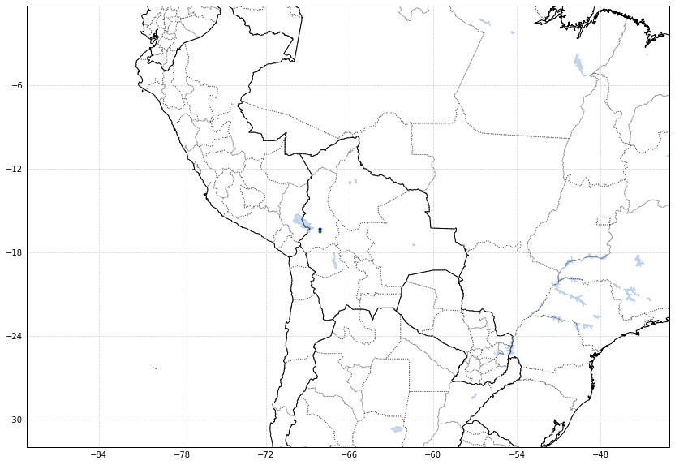

```python
%load_ext autoreload
%autoreload 2
```

    The autoreload extension is already loaded. To reload it, use:
      %reload_ext autoreload


```python
import flexpart_management.modules.flx_array as fa
import flexpart_management.modules.constants as cons
```


```python
ds1 = xr.open_dataset('/tmp/dd4.nc')
ds2 = xr.open_dataset('/tmp/dd02.nc')
```


```python
rel = slice(0,None)
tim = slice(0,None)
dic = {fa.RL:rel,fa.TIME:tim}
zc = 'ZMID*CONC'
dsn = ds2[[fa.CONC]][dic]
dsn[zc]=dsn[fa.CONC]*dsn[fa.ZM]
```


```python
val=np.array([.09,np.pi/36])*2
```


```python
dsn[zc]=dsn[zc].where(dsn[zc]>0)
```


```python
dim2keep = [fa.TIME,fa.RL]
```


```python
dsum = dsn.sum(dim=fa.ZM)
dsum = dsum.where(dsum[fa.CONC]>0)
```


```python
_a1 = fa.data_array_to_logpolar(dsum[zc],*val,dim2keep=dim2keep)
_a2 = fa.data_array_to_logpolar(dsum[fa.CONC],*val,dim2keep=dim2keep)

```


```python
z=(_a1/_a2)
zn='z'
z.name = zn
```


```python
z99 = z.quantile(.99).values
c99 = _a2.quantile(.99).values
```


```python
c99
```


    array(4.2930069)


```python

ax = fa.get_ax_bolivia()
fa.logpolar_plot(z,ax=ax,name=zn,patch_args={'cmap':'viridis'})
ax = fa.get_ax_bolivia()
fa.logpolar_plot(_a2,ax=ax,perM=.99)
```


    ---------------------------------------------------------------------------

    KeyboardInterrupt                         Traceback (most recent call last)

    <ipython-input-28-8f4ef6931180> in <module>
          1 z
          2 ax = fa.get_ax_bolivia()
    ----> 3 fa.logpolar_plot(z,ax=ax,name=zn,patch_args={'cmap':'viridis'})
          4 ax = fa.get_ax_bolivia()
          5 fa.logpolar_plot(_a2,ax=ax,perM=.99)


    ~/flexpart_management/flexpart_management/modules/flx_array.py in logpolar_plot(ds, ax, name, perM, perm, colorbar, patch_args, quantile)
        444     df = ds.to_dataframe()
        445     pol_key = 'pol'
    --> 446     df[pol_key] = df.apply(lambda r: polygon_from_row(r), axis=1)
        447     df = df.dropna()
        448     if quantile:


    ~/miniconda3/envs/b36/lib/python3.6/site-packages/pandas/core/frame.py in apply(self, func, axis, broadcast, raw, reduce, result_type, args, **kwds)
       6485                          args=args,
       6486                          kwds=kwds)
    -> 6487         return op.get_result()
       6488 
       6489     def applymap(self, func):


    ~/miniconda3/envs/b36/lib/python3.6/site-packages/pandas/core/apply.py in get_result(self)
        149             return self.apply_raw()
        150 
    --> 151         return self.apply_standard()
        152 
        153     def apply_empty_result(self):


    ~/miniconda3/envs/b36/lib/python3.6/site-packages/pandas/core/apply.py in apply_standard(self)
        255 
        256         # compute the result using the series generator
    --> 257         self.apply_series_generator()
        258 
        259         # wrap results


    ~/miniconda3/envs/b36/lib/python3.6/site-packages/pandas/core/apply.py in apply_series_generator(self)
        261 
        262     def apply_series_generator(self):
    --> 263         series_gen = self.series_generator
        264         res_index = self.result_index
        265 


    ~/miniconda3/envs/b36/lib/python3.6/site-packages/pandas/core/apply.py in series_generator(self)
        366         return (constructor(arr, index=self.columns, name=name)
        367                 for i, (arr, name) in enumerate(zip(self.values,
    --> 368                                                     self.index)))
        369 
        370     @property


    ~/miniconda3/envs/b36/lib/python3.6/site-packages/pandas/core/base.py in __iter__(self)
       1124         """
       1125         # We are explicity making element iterators.
    -> 1126         if is_datetimelike(self._values):
       1127             return map(com.maybe_box_datetimelike, self._values)
       1128         elif is_extension_array_dtype(self._values):


    ~/miniconda3/envs/b36/lib/python3.6/site-packages/pandas/core/indexes/multi.py in _values(self)
        520     def _values(self):
        521         # We override here, since our parent uses _data, which we dont' use.
    --> 522         return self.values
        523 
        524     @property


    ~/miniconda3/envs/b36/lib/python3.6/site-packages/pandas/core/indexes/multi.py in values(self)
       1172             if (isinstance(vals.dtype, (PandasExtensionDtype, ExtensionDtype))
       1173                     or hasattr(vals, '_box_values')):
    -> 1174                 vals = vals.astype(object)
       1175             vals = np.array(vals, copy=False)
       1176             values.append(vals)


    ~/miniconda3/envs/b36/lib/python3.6/site-packages/pandas/core/indexes/datetimelike.py in astype(self, dtype, copy)
        600             return self
        601 
    --> 602         new_values = self._data.astype(dtype, copy=copy)
        603 
        604         # pass copy=False because any copying will be done in the


    ~/miniconda3/envs/b36/lib/python3.6/site-packages/pandas/core/arrays/datetimes.py in astype(self, dtype, copy)
        640         elif is_period_dtype(dtype):
        641             return self.to_period(freq=dtype.freq)
    --> 642         return dtl.DatetimeLikeArrayMixin.astype(self, dtype, copy)
        643 
        644     # ----------------------------------------------------------------


    ~/miniconda3/envs/b36/lib/python3.6/site-packages/pandas/core/arrays/datetimelike.py in astype(self, dtype, copy)
        518 
        519         if is_object_dtype(dtype):
    --> 520             return self._box_values(self.asi8)
        521         elif is_string_dtype(dtype) and not is_categorical_dtype(dtype):
        522             return self._format_native_types()


    ~/miniconda3/envs/b36/lib/python3.6/site-packages/pandas/core/arrays/datetimelike.py in _box_values(self, values)
        344         apply box func to passed values
        345         """
    --> 346         return lib.map_infer(values, self._box_func)
        347 
        348     def __iter__(self):


    pandas/_libs/lib.pyx in pandas._libs.lib.map_infer()


    ~/miniconda3/envs/b36/lib/python3.6/site-packages/pandas/core/arrays/datetimes.py in <lambda>(x)
        511     @property
        512     def _box_func(self):
    --> 513         return lambda x: Timestamp(x, freq=self.freq, tz=self.tz)
        514 
        515     @property


    KeyboardInterrupt: 





```python

```


```python

```
