```python
%load_ext autoreload
%autoreload 2
```


```python
import flexpart_management.modules.flx_array as fa
import flexpart_management.modules.constants as cons
```


```python
ds1 = xr.open_dataset('/tmp/dd4.nc')
ds2 = xr.open_dataset('/tmp/dd02.nc')
```


```python
dc =ds1[fa.CONC][{fa.RL:20}].sum(dim=[fa.ZM,fa.TIME])
```


```python
val=np.array([.09,np.pi/36])*2
```


```python
nds= fa.data_array_to_logpolar(dc,*val)
```


```python
nds
```


    <xarray.DataArray 'CONC' (R_CENTER: 35, TH_CENTER: 36)>
    array([[   0.      ,    0.      ,    0.      , ...,    0.      ,    0.      ,
               0.      ],
           [1499.247631,    0.      ,    0.      , ...,    0.      ,    0.      ,
               0.      ],
           [   0.      ,    0.      ,    0.      , ...,    0.      ,    0.      ,
               0.      ],
           ...,
           [   0.      ,    0.      ,    0.      , ...,    0.      ,    0.      ,
               0.      ],
           [   0.      ,    0.      ,    0.      , ...,    0.      ,    0.      ,
               0.      ],
           [   0.      ,    0.      ,    0.      , ...,    0.      ,    0.      ,
               0.      ]])
    Coordinates:
      * R_CENTER   (R_CENTER) float64 0.03916 0.05613 0.09633 ... 21.33 25.53 30.57
      * TH_CENTER  (TH_CENTER) float64 0.08727 0.2618 0.4363 ... 5.847 6.021 6.196
        LAT        (R_CENTER, TH_CENTER) float64 -16.31 -16.31 -16.31 ... 13.18 14.1
        LON        (R_CENTER, TH_CENTER) float64 -68.09 -68.09 ... -38.6 -37.68
        LAT_00     (R_CENTER, TH_CENTER) float64 -16.31 -16.32 ... 9.903 11.16
        LON_00     (R_CENTER, TH_CENTER) float64 -68.13 -68.13 ... -77.69 -72.98
        LAT_10     (R_CENTER, TH_CENTER) float64 -16.31 -16.31 ... 15.08 16.59
        LON_10     (R_CENTER, TH_CENTER) float64 -68.13 -68.12 ... -79.57 -73.94
        LAT_11     (R_CENTER, TH_CENTER) float64 -16.31 -16.31 -16.31 ... 16.59 17.1
        LON_11     (R_CENTER, TH_CENTER) float64 -68.12 -68.12 ... -73.94 -68.13
        LAT_01     (R_CENTER, TH_CENTER) float64 -16.32 -16.32 ... 11.16 11.59
        LON_01     (R_CENTER, TH_CENTER) float64 -68.13 -68.12 ... -72.98 -68.13
        GRIDAREA   (R_CENTER, TH_CENTER) float64 5.733e+05 5.733e+05 ... 3.528e+11


```python
from matplotlib.patches import Circle, Wedge, Polygon
from matplotlib.collections import PatchCollection
```


```python
conc = nds/nds[fa.GA]
conc.name = 'conc'
```


```python

```


    <xarray.DataArray 'conc' (R_CENTER: 35, TH_CENTER: 36)>
    array([[     nan,      nan,      nan, ...,      nan,      nan,      nan],
           [0.001273,      nan,      nan, ...,      nan,      nan,      nan],
           [     nan,      nan,      nan, ...,      nan,      nan,      nan],
           ...,
           [     nan,      nan,      nan, ...,      nan,      nan,      nan],
           [     nan,      nan,      nan, ...,      nan,      nan,      nan],
           [     nan,      nan,      nan, ...,      nan,      nan,      nan]])
    Coordinates:
      * R_CENTER   (R_CENTER) float64 0.03916 0.05613 0.09633 ... 21.33 25.53 30.57
      * TH_CENTER  (TH_CENTER) float64 0.08727 0.2618 0.4363 ... 5.847 6.021 6.196
        LAT        (R_CENTER, TH_CENTER) float64 -16.31 -16.31 -16.31 ... 13.18 14.1
        LON        (R_CENTER, TH_CENTER) float64 -68.09 -68.09 ... -38.6 -37.68
        LAT_00     (R_CENTER, TH_CENTER) float64 -16.31 -16.32 ... 9.903 11.16
        LON_00     (R_CENTER, TH_CENTER) float64 -68.13 -68.13 ... -77.69 -72.98
        LAT_10     (R_CENTER, TH_CENTER) float64 -16.31 -16.31 ... 15.08 16.59
        LON_10     (R_CENTER, TH_CENTER) float64 -68.13 -68.12 ... -79.57 -73.94
        LAT_11     (R_CENTER, TH_CENTER) float64 -16.31 -16.31 -16.31 ... 16.59 17.1
        LON_11     (R_CENTER, TH_CENTER) float64 -68.12 -68.12 ... -73.94 -68.13
        LAT_01     (R_CENTER, TH_CENTER) float64 -16.32 -16.32 ... 11.16 11.59
        LON_01     (R_CENTER, TH_CENTER) float64 -68.13 -68.12 ... -72.98 -68.13
        GRIDAREA   (R_CENTER, TH_CENTER) float64 5.733e+05 5.733e+05 ... 3.528e+11


```python
ax = fa.get_ax_bolivia()
# fig, ax = plt.subplots()
ax = fa.logpolar_plot(conc.where(conc>0),ax,name='conc',perM=.8,perm=.1,
                 colorbar=True,
                 patch_args={'norm':matplotlib.colors.LogNorm(),'cmap':'viridis'}
                )
```


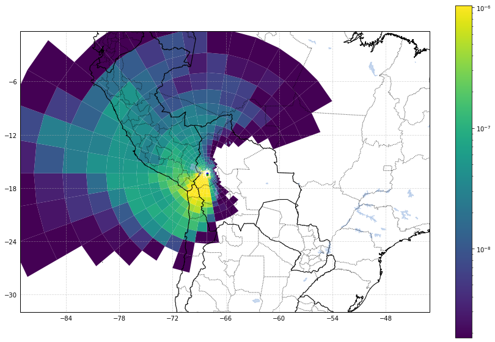


```python
ax = fa.get_ax_bolivia()
# fig, ax = plt.subplots()
ax = fa.logpolar_plot(conc.where(conc>0),ax,name='conc',perM=.8,perm=.1,
                 colorbar=True,
#                  patch_args={'norm':matplotlib.colors.LogNorm()}
                )
```


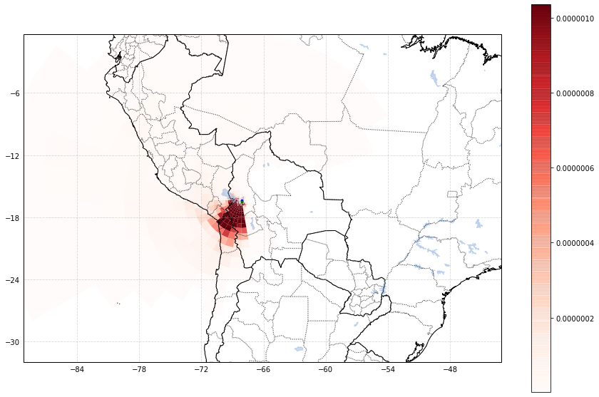


```python
ax = fa.get_ax_bolivia()
# fig, ax = plt.subplots()
ax = fa.logpolar_plot(nds,ax,perM=.99,perm=.1,
                 colorbar=True
                )
```


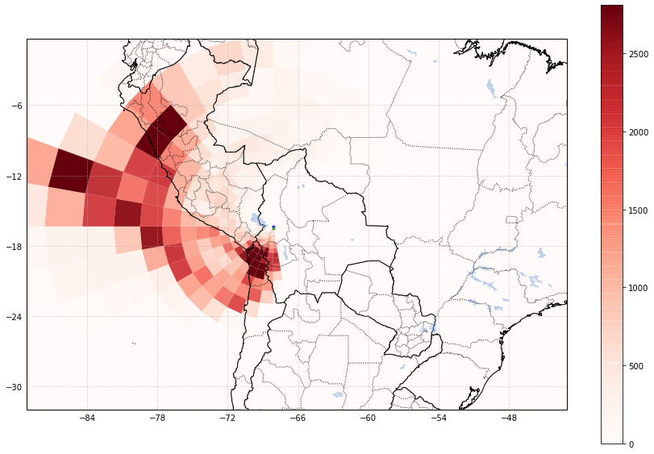


```python
ax = fa.get_ax_lapaz()
# fig, ax = plt.subplots()
ax = fa.logpolar_plot(nds,ax,perM=.95,perm=.1,
                 colorbar=True
                )
```


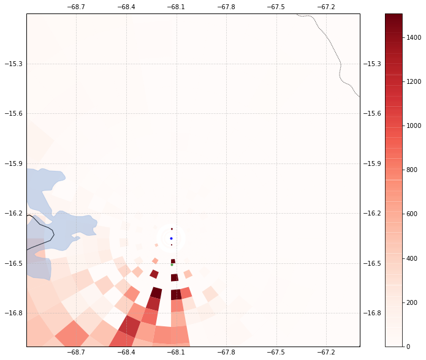


```python

res.plot()
```


    <matplotlib.collections.QuadMesh at 0x11929eef0>


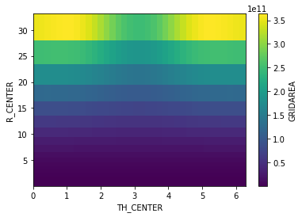


```python
ax =fa.get_ax_bolivia()
nds.plot(x=fa.LON,y=fa.LAT,ax=ax,transform=fa.PROJ)
```


    <matplotlib.collections.QuadMesh at 0x124a08898>


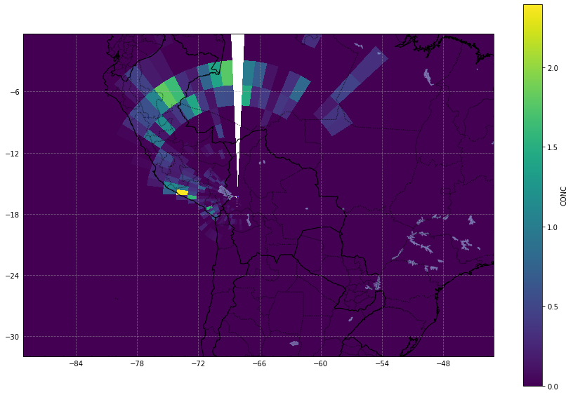


```python
r.max()
```


    <xarray.DataArray ()>
    array(29.747862, dtype=float32)


```python
r1=.05
r2=30
n=40
rlog_space = np.linspace(np.log(r1),np.log(r2),n)
r_space = np.e**rlog_space
```


```python
plt.figure()
plt.plot(rlog_space)
plt.figure()
plt.plot(r_space)
```


    [<matplotlib.lines.Line2D at 0x1191ac080>]


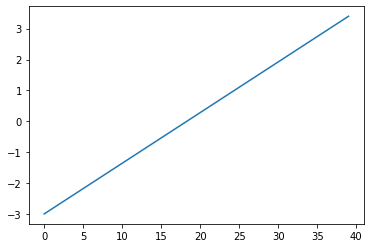


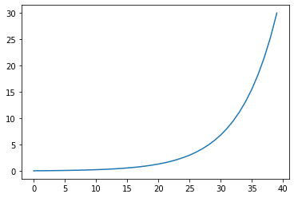


```python
RS = 'r_space'
RD = 'r_dis'
RC = 'r_center'
df_r = pd.DataFrame(r_space,columns=[RS])
df_r[RD] = df_r[RS] - df_r[RS].shift()
df_r = df_r
df_r[RC] = (df_r[RS] + df_r[RS].shift())/2
# df_r = df_r.dropna()
```


```python
df_r[RS]/df_r[RD]
```


    0          NaN
    1     6.610337
    2     6.610337
    3     6.610337
    4     6.610337
    5     6.610337
    6     6.610337
    7     6.610337
    8     6.610337
    9     6.610337
    10    6.610337
    11    6.610337
    12    6.610337
    13    6.610337
    14    6.610337
    15    6.610337
    16    6.610337
    17    6.610337
    18    6.610337
    19    6.610337
    20    6.610337
    21    6.610337
    22    6.610337
    23    6.610337
    24    6.610337
    25    6.610337
    26    6.610337
    27    6.610337
    28    6.610337
    29    6.610337
    30    6.610337
    31    6.610337
    32    6.610337
    33    6.610337
    34    6.610337
    35    6.610337
    36    6.610337
    37    6.610337
    38    6.610337
    39    6.610337
    dtype: float64


```python
ax = fa.get_ax_bolivia()
for r in df_r[RS]:
#     print(r)
    circle = plt.Circle((fa.CHC_LON,fa.CHC_LAT), r, color='k', fill=False, transform=fa.PROJ)
    ax.add_artist(circle)
ax = fa.get_ax_lapaz()
for r in df_r[RS]:
#     print(r)
    circle = plt.Circle((fa.CHC_LON,fa.CHC_LAT), r, color='k', fill=False, transform=fa.PROJ)
    ax.add_artist(circle)
```


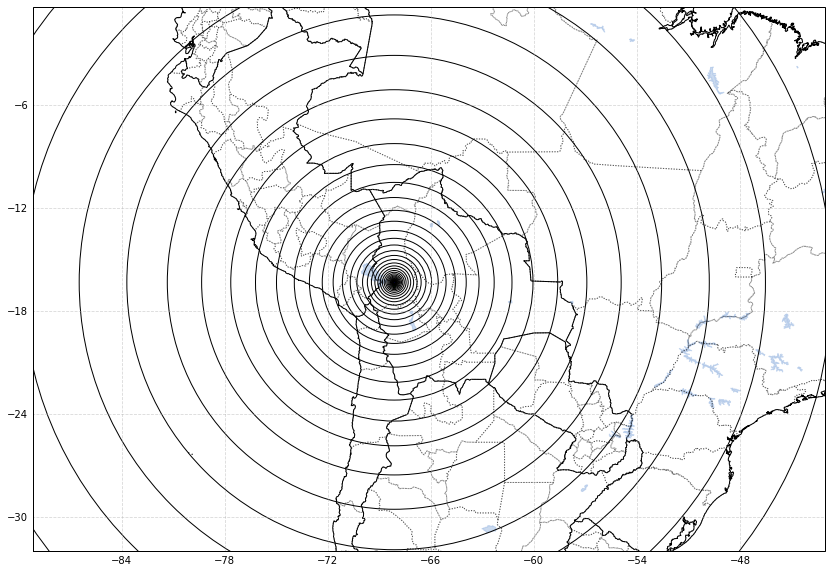


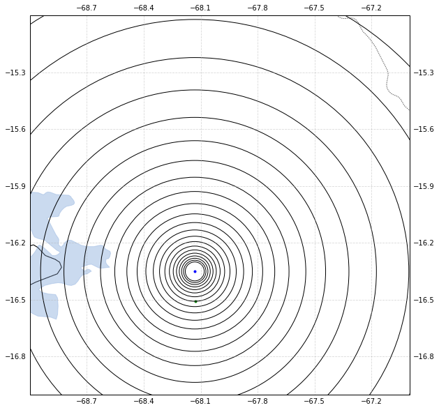


```python
import area
```


```python
obj = {'type':'Polygon','coordinates':[[[0,0],[1,0],[1,1],[0,1]]]}
```


```python
area.area(obj)
```


    ---------------------------------------------------------------------------

    NameError                                 Traceback (most recent call last)

    <ipython-input-134-a496ce98633b> in <module>
    ----> 1 area.area(obj)
    

    NameError: name 'obj' is not defined


```python
res  = nds.copy()
```


```python
res.reset_coords()
```


    <xarray.Dataset>
    Dimensions:    (R_CENTER: 35, TH_CENTER: 36)
    Coordinates:
      * R_CENTER   (R_CENTER) float64 0.03916 0.05613 0.09633 ... 21.33 25.53 30.57
      * TH_CENTER  (TH_CENTER) float64 0.08727 0.2618 0.4363 ... 5.847 6.021 6.196
    Data variables:
        LAT        (R_CENTER, TH_CENTER) float64 -16.31 -16.31 -16.31 ... 13.18 14.1
        LON        (R_CENTER, TH_CENTER) float64 -68.09 -68.09 ... -38.6 -37.68
        LAT_00     (R_CENTER, TH_CENTER) float64 -16.31 -16.32 ... 9.903 11.16
        LON_00     (R_CENTER, TH_CENTER) float64 -68.13 -68.13 ... -77.69 -72.98
        LAT_10     (R_CENTER, TH_CENTER) float64 -16.31 -16.31 ... 15.08 16.59
        LON_10     (R_CENTER, TH_CENTER) float64 -68.13 -68.12 ... -79.57 -73.94
        LAT_11     (R_CENTER, TH_CENTER) float64 -16.31 -16.31 -16.31 ... 16.59 17.1
        LON_11     (R_CENTER, TH_CENTER) float64 -68.12 -68.12 ... -73.94 -68.13
        LAT_01     (R_CENTER, TH_CENTER) float64 -16.32 -16.32 ... 11.16 11.59
        LON_01     (R_CENTER, TH_CENTER) float64 -68.13 -68.12 ... -72.98 -68.13
        CONC       (R_CENTER, TH_CENTER) float64 nan nan nan nan ... nan nan nan nan


```python
dc = ds[fa.CONC][:,0].sum(dim=[fa.TIME])
dc=dc/ds[fa.GA]

```


```python
dc.interp(**{fa.LAT:fa.CHC_LAT-1,fa.LON:fa.CHC_LON-1})
```


    <xarray.DataArray (ZMID: 22)>
    array([7.662138e-09, 7.682301e-09, 1.700163e-08, 1.532509e-08, 1.164844e-08,
           1.720661e-08, 8.754440e-08, 8.997785e-08, 8.196517e-08, 6.322942e-08,
           1.068889e-07, 1.032436e-07, 1.803712e-07, 1.207440e-07, 6.016351e-08,
           9.107006e-09, 0.000000e+00, 0.000000e+00, 0.000000e+00, 0.000000e+00,
           0.000000e+00, 0.000000e+00])
    Coordinates:
        XLONG       float64 -69.13
        XLAT        float64 -17.35
        TOPOGRAPHY  float64 4.227e+03
        GRIDAREA    float64 1.096e+08
        ZTOP        (ZMID) float32 50.0 100.0 200.0 ... 10000.0 20000.0 30000.0
        releases    datetime64[ns] 2017-12-10
      * ZMID        (ZMID) float32 25.0 75.0 150.0 250.0 ... 9500.0 15000.0 25000.0
        ZBOT        (ZMID) float32 0.0 50.0 100.0 200.0 ... 9000.0 10000.0 20000.0
        ZLEN_M      (ZMID) float32 50.0 50.0 100.0 100.0 ... 1000.0 10000.0 10000.0
        LAT         float64 -17.35
        LON         float64 -69.13


```python
dc[10].plot()
```


    <matplotlib.collections.QuadMesh at 0x11bb31630>


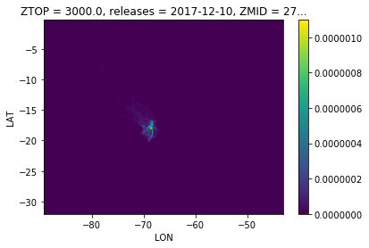


```python
ds=ds1
ang = -(np.mod(np.arctan2(ds[fa.LAT]-fa.CHC_LAT,ds[fa.LON]-fa.CHC_LON)+np.pi/2,2*np.pi)-np.pi)*180/np.pi
ang = np.floor(ang/10)*10+5
ds['ang']=ang
```


```python
res = ang.to_series().unique()
res.sort()
res
```


    array([-175., -165., -155., -145., -135., -125., -115., -105.,  -95.,
            -85.,  -75.,  -65.,  -55.,  -45.,  -35.,  -25.,  -15.,   -5.,
              5.,   15.,   25.,   35.,   45.,   55.,   65.,   75.,   85.,
             95.,  105.,  115.,  125.,  135.,  145.,  155.,  165.,  175.])


```python
ang.plot(x=fa.LON)
```


    <matplotlib.collections.QuadMesh at 0x1432ab8d0>


```python
_r = 2
r_log = np.round(np.log(ds[fa.LL_DIS])/_r,1)*_r
ds['r_log']=r_log
```


```python
ax = fa.get_ax_bolivia()
ds['r_log'].plot(ax=ax)
```


    <matplotlib.collections.QuadMesh at 0x14f518d68>


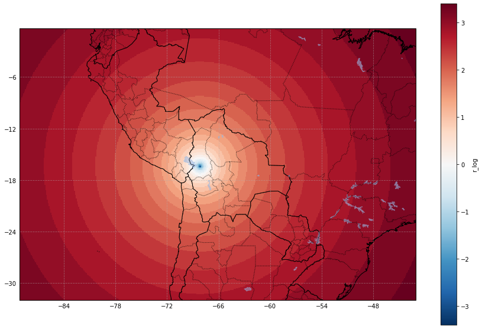


```python

```


```python
dsd = ds[[fa.CONC,'r_log','ang']][{fa.RL:1}].sum(dim=[fa.ZM,fa.TIME])
```


```python
df = dsd.to_dataframe()
```


```python
rlds = df.groupby(['r_log','ang'])['CONC'].count().to_xarray()
```


```python
rlds.plot(vmin=1,vmax=10)
```


    <matplotlib.collections.QuadMesh at 0x14fb23d68>


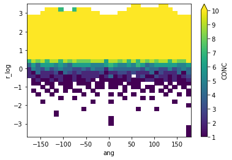


```python
dsum = df.groupby(['r_log','ang'])['CONC'].sum().to_xarray()
```


```python
dsum[:,-3:].plot()
```


    <matplotlib.collections.QuadMesh at 0x13ed1c908>


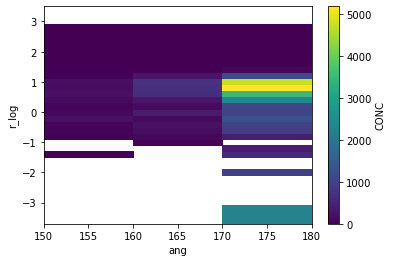


```python
dsum.ang
```


    <xarray.DataArray 'ang' (ang: 36)>
    array([-175., -165., -155., -145., -135., -125., -115., -105.,  -95.,  -85.,
            -75.,  -65.,  -55.,  -45.,  -35.,  -25.,  -15.,   -5.,    5.,   15.,
             25.,   35.,   45.,   55.,   65.,   75.,   85.,   95.,  105.,  115.,
            125.,  135.,  145.,  155.,  165.,  175.])
    Coordinates:
      * ang      (ang) float64 -175.0 -165.0 -155.0 -145.0 ... 155.0 165.0 175.0


```python
ll_dis = np.e**dsum['r_log']
lat = ll_dis*np.cos(dsum['ang']*np.pi/180)+fa.CHC_LAT
lon = ll_dis*np.sin(dsum['ang']*np.pi/180)+fa.CHC_LON
dsum = dsum.assign_coords(**{fa.LAT:lat,fa.LON:lon})
```


```python
ax =fa.get_ax_bolivia()
plt.scatter(lon,lat)
```


    <matplotlib.collections.PathCollection at 0x158f94dd8>


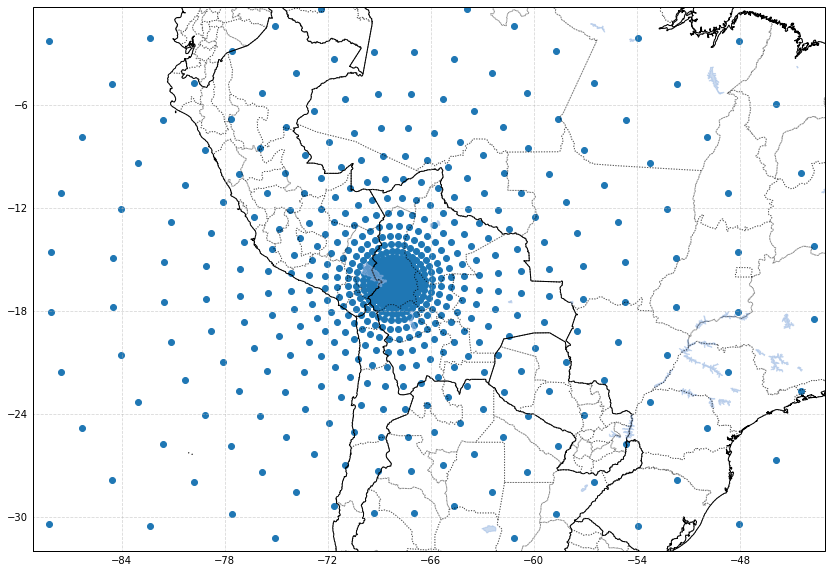


```python
dsum[:,-1].plot()
```


    [<matplotlib.lines.Line2D at 0x15a1f5898>]


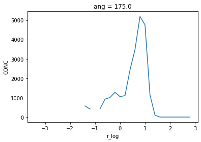


```python
from matplotlib import ticker, cm
ax = fa.get_ax_bolivia()
dsum1 =(dsum/(np.e**dsum['r_log'])**2)
dsum1.plot(x=fa.LON,y=fa.LAT,cmap=fa.red_cmap(),ax=ax,transform=fa.PROJ,vmin=10,vmax=1000,
           norm=matplotlib.colors.LogNorm()
          )
ax = fa.get_ax_lapaz()
dsum1.plot(x=fa.LON,y=fa.LAT,cmap=fa.red_cmap(),ax=ax,transform=fa.PROJ,vmin=10,vmax=1000,norm=matplotlib.colors.LogNorm())
```


    <matplotlib.collections.QuadMesh at 0x15dc2fc18>


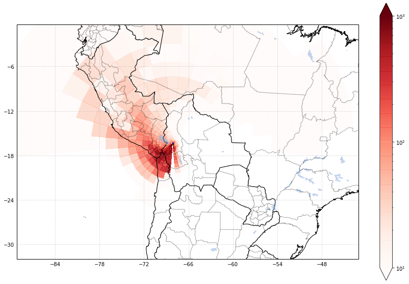


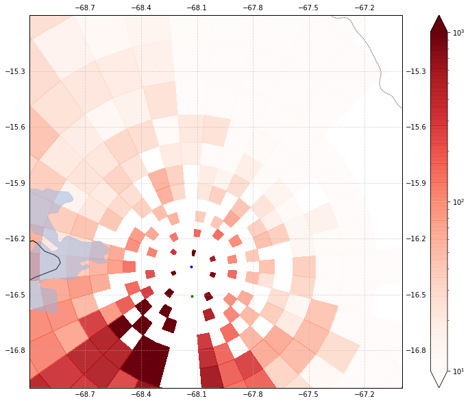


```python
dsum[:,0]
```


    <xarray.DataArray 'CONC' (r_log: 32)>
    array([        nan,         nan,         nan,         nan,         nan,
                   nan,         nan,         nan,         nan,         nan,
                   nan,         nan,  489.793541,  478.540052,  548.112099,
            835.206119, 1225.956493, 1455.947145, 2253.794448, 3695.242089,
           4469.171915,  302.682992,    6.92315 ,    0.      ,    0.      ,
              0.      ,    0.      ,    0.      ,    0.      ,         nan,
                   nan,         nan])
    Coordinates:
      * r_log    (r_log) float64 -3.4 -2.8 -2.4 -2.2 -2.0 ... 2.6 2.8 3.0 3.2 3.4
        ang      float64 -175.0
        LAT      (r_log) float64 -16.38 -16.41 -16.44 -16.46 ... -36.36 -40.79 -46.2
        LON      (r_log) float64 -68.13 -68.14 -68.14 ... -69.88 -70.27 -70.74


```python
lam = 'la_max'
laM = '_min'
lom = 'a_min'
loM = 'a_max'

bounds = [rM,rm,aM,aM]
```


```python
dsum
```


    <xarray.DataArray 'CONC' (r_log: 32, ang: 36)>
    array([[        nan,         nan,         nan, ...,         nan,         nan,
            2278.006964],
           [        nan,         nan,         nan, ...,         nan,         nan,
                    nan],
           [        nan,         nan,         nan, ...,         nan,         nan,
                    nan],
           ...,
           [        nan,         nan,         nan, ...,         nan,         nan,
                    nan],
           [        nan,         nan,         nan, ...,         nan,         nan,
                    nan],
           [        nan,         nan,         nan, ...,         nan,         nan,
                    nan]])
    Coordinates:
      * r_log    (r_log) float64 -3.4 -2.8 -2.4 -2.2 -2.0 ... 2.6 2.8 3.0 3.2 3.4
      * ang      (ang) float64 -175.0 -165.0 -155.0 -145.0 ... 155.0 165.0 175.0
        LAT      (r_log, ang) float64 -16.38 -16.38 -16.38 ... -43.51 -45.29 -46.2
        LON      (r_log, ang) float64 -68.13 -68.14 -68.15 ... -55.47 -60.38 -65.52


```python

```
