```python
from useful_scit.imps import *
```


```python
path = '/Volumes/mbProD/Downloads/flex_out/run_2019-06-02_20-42-05_/2017-12-10'
dom = 'd01'
header = 'header_'
flx = 'flxout'
```


```python
%load_ext autoreload
%autoreload 2
```

    The autoreload extension is already loaded. To reload it, use:
      %reload_ext autoreload


```python
import flexpart_management.modules.flx_array as fa
```


```python
head_ds = fa.import_head_ds(path,dom)
```

    /Volumes/mbProD/Downloads/flex_out/run_2019-06-02_20-42-05_/2017-12-10/header_d01.nc


```python
file_ds_list = fa.import_file_ds_list(path,dom)
```


```python
ds_con = fa.concat_file_ds_list(file_ds_list)
```


    ---------------------------------------------------------------------------

    KeyboardInterrupt                         Traceback (most recent call last)

    <ipython-input-181-3bdbd0361ecc> in <module>
    ----> 1 ds_con = fa.concat_file_ds_list(file_ds_list)
    

    ~/flexpart_management/flexpart_management/modules/flx_array.py in concat_file_ds_list(ds_list)
         53 
         54 def concat_file_ds_list(ds_list: List[xr.Dataset]):
    ---> 55     ds_con = xr.concat(ds_list, dim='Time')
         56     return ds_con
         57 


    ~/miniconda3/envs/b36/lib/python3.6/site-packages/xarray/core/combine.py in concat(objs, dim, data_vars, coords, compat, positions, indexers, mode, concat_over)
        118         raise TypeError('can only concatenate xarray Dataset and DataArray '
        119                         'objects, got %s' % type(first_obj))
    --> 120     return f(objs, dim, data_vars, coords, compat, positions)
        121 
        122 


    ~/miniconda3/envs/b36/lib/python3.6/site-packages/xarray/core/combine.py in _dataset_concat(datasets, dim, data_vars, coords, compat, positions)
        303         if k in concat_over:
        304             vars = ensure_common_dims([ds.variables[k] for ds in datasets])
    --> 305             combined = concat_vars(vars, dim, positions)
        306             insert_result_variable(k, combined)
        307 


    ~/miniconda3/envs/b36/lib/python3.6/site-packages/xarray/core/variable.py in concat(variables, dim, positions, shortcut)
       2087         return IndexVariable.concat(variables, dim, positions, shortcut)
       2088     else:
    -> 2089         return Variable.concat(variables, dim, positions, shortcut)
       2090 
       2091 


    ~/miniconda3/envs/b36/lib/python3.6/site-packages/xarray/core/variable.py in concat(cls, variables, dim, positions, shortcut)
       1427         first_var = variables[0]
       1428 
    -> 1429         arrays = [v.data for v in variables]
       1430 
       1431         if dim in first_var.dims:


    ~/miniconda3/envs/b36/lib/python3.6/site-packages/xarray/core/variable.py in <listcomp>(.0)
       1427         first_var = variables[0]
       1428 
    -> 1429         arrays = [v.data for v in variables]
       1430 
       1431         if dim in first_var.dims:


    ~/miniconda3/envs/b36/lib/python3.6/site-packages/xarray/core/variable.py in data(self)
        295             return self._data
        296         else:
    --> 297             return self.values
        298 
        299     @data.setter


    ~/miniconda3/envs/b36/lib/python3.6/site-packages/xarray/core/variable.py in values(self)
        390     def values(self):
        391         """The variable's data as a numpy.ndarray"""
    --> 392         return _as_array_or_item(self._data)
        393 
        394     @values.setter


    ~/miniconda3/envs/b36/lib/python3.6/site-packages/xarray/core/variable.py in _as_array_or_item(data)
        211     TODO: remove this (replace with np.asarray) once these issues are fixed
        212     """
    --> 213     data = np.asarray(data)
        214     if data.ndim == 0:
        215         if data.dtype.kind == 'M':


    ~/miniconda3/envs/b36/lib/python3.6/site-packages/numpy/core/numeric.py in asarray(a, dtype, order)
        536 
        537     """
    --> 538     return array(a, dtype, copy=False, order=order)
        539 
        540 


    ~/miniconda3/envs/b36/lib/python3.6/site-packages/xarray/core/indexing.py in __array__(self, dtype)
        624 
        625     def __array__(self, dtype=None):
    --> 626         self._ensure_cached()
        627         return np.asarray(self.array, dtype=dtype)
        628 


    ~/miniconda3/envs/b36/lib/python3.6/site-packages/xarray/core/indexing.py in _ensure_cached(self)
        621     def _ensure_cached(self):
        622         if not isinstance(self.array, NumpyIndexingAdapter):
    --> 623             self.array = NumpyIndexingAdapter(np.asarray(self.array))
        624 
        625     def __array__(self, dtype=None):


    ~/miniconda3/envs/b36/lib/python3.6/site-packages/numpy/core/numeric.py in asarray(a, dtype, order)
        536 
        537     """
    --> 538     return array(a, dtype, copy=False, order=order)
        539 
        540 


    ~/miniconda3/envs/b36/lib/python3.6/site-packages/xarray/core/indexing.py in __array__(self, dtype)
        602 
        603     def __array__(self, dtype=None):
    --> 604         return np.asarray(self.array, dtype=dtype)
        605 
        606     def __getitem__(self, key):


    ~/miniconda3/envs/b36/lib/python3.6/site-packages/numpy/core/numeric.py in asarray(a, dtype, order)
        536 
        537     """
    --> 538     return array(a, dtype, copy=False, order=order)
        539 
        540 


    ~/miniconda3/envs/b36/lib/python3.6/site-packages/xarray/core/indexing.py in __array__(self, dtype)
        508     def __array__(self, dtype=None):
        509         array = as_indexable(self.array)
    --> 510         return np.asarray(array[self.key], dtype=None)
        511 
        512     def transpose(self, order):


    ~/miniconda3/envs/b36/lib/python3.6/site-packages/xarray/backends/netCDF4_.py in __getitem__(self, key)
         62         return indexing.explicit_indexing_adapter(
         63             key, self.shape, indexing.IndexingSupport.OUTER,
    ---> 64             self._getitem)
         65 
         66     def _getitem(self, key):


    ~/miniconda3/envs/b36/lib/python3.6/site-packages/xarray/core/indexing.py in explicit_indexing_adapter(key, shape, indexing_support, raw_indexing_method)
        776     """
        777     raw_key, numpy_indices = decompose_indexer(key, shape, indexing_support)
    --> 778     result = raw_indexing_method(raw_key.tuple)
        779     if numpy_indices.tuple:
        780         # index the loaded np.ndarray


    ~/miniconda3/envs/b36/lib/python3.6/site-packages/xarray/backends/netCDF4_.py in _getitem(self, key)
         73             with self.datastore.lock:
         74                 original_array = self.get_array(needs_lock=False)
    ---> 75                 array = getitem(original_array, key)
         76         except IndexError:
         77             # Catch IndexError in netCDF4 and return a more informative


    KeyboardInterrupt: 


```python
ds_con1 = fa.convert_ds_time_format(ds_con)
```


```python
ds_join = fa.join_head(ds_con1,head_ds)
```


```python
ds1 = fa.add_release_time_dim(ds_join,head_ds)
```


```python
ds2 = fa.assign_vars_to_cords(ds1)
ds2 = fa.add_lat_lot(ds2)
ds2 = fa.add_zmid(ds2)
ds2 = fa.add_zbot(ds2)
ds2 = fa.add_zlength_m(ds2)
```


```python
ds2
```


```python
ds2_1 = ds2.copy()
ds2_1['CONC']=1/ds2_1.CONC.where(ds2_1.CONC>0.0000)
```


```python
dsV = ds2.GRIDAREA*ds2.ZLEN_M
```


```python
dsC = ds2.CONC.isel(Time=-5)
dsC = dsC.where(dsC>0.000)
```


```python
dcC_1 = (1/dsC)
```


```python
(dcC_1/dsV).sum()
```


    <xarray.DataArray ()>
    array(8.089301e-05)
    Coordinates:
        Time     datetime64[ns] 2017-12-05T20:00:00


```python
(dcC_1*dsV).sum()/3600/3600
```


    <xarray.DataArray ()>
    array(9.828812e+08)
    Coordinates:
        Time     datetime64[ns] 2017-12-05T20:00:00


```python
dsS = dsC / dsV
dsS_1 = 1/dsS
```


```python
V_res = (68.14-68.118)* 100000 * \
(16.355-16.335)*100000 * \
300*1000e-14
```


```python
V_res
```


    0.01320000000000306


```python
(dsC).sum()/3600
```


    <xarray.DataArray 'CONC' ()>
    array(1.441499)
    Coordinates:
        Time     datetime64[ns] 2017-12-05T20:00:00


```python
ds2.CONC.sum(dim=['bottom_top','south_north','west_east']).plot()
```


    [<matplotlib.lines.Line2D at 0x1266d25c0>]


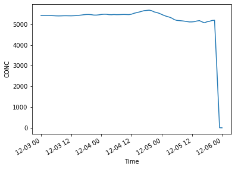


```python
ds2_1.CONC.sum(dim=['bottom_top','south_north','west_east']).plot()
```


    [<matplotlib.lines.Line2D at 0x12e8698d0>]


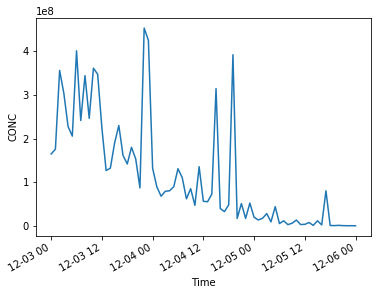


```python

```


```python

```


```python

```


```python

```


```python
head_ds.XLONG.isel(south_north=1)
```


    <xarray.DataArray 'XLONG' (west_east: 468)>
    array([-89.338974, -89.2403  , -89.14163 , ..., -43.45837 , -43.359703,
           -43.261036], dtype=float32)
    Coordinates:
        XLONG    (west_east) float32 ...
        XLAT     (west_east) float32 ...
    Dimensions without coordinates: west_east
    Attributes:
        description:  Longitude of center grid, west is negative
        units:        degree_east


```python

```


    [(0.9985236447520185, 0.9297808535178778, 0.8968858131487889),
     (0.9970472895040369, 0.8987773933102653, 0.8525951557093425),
     (0.9950634371395617, 0.8596539792387543, 0.7986620530565167),
     (0.9921107266435987, 0.8050288350634371, 0.726320645905421),
     (0.9891580161476355, 0.75040369088812, 0.6539792387543253),
     (0.9882352941176471, 0.6866743560169165, 0.5778854286812765),
     (0.9882352941176471, 0.6261437908496732, 0.5084967320261438),
     (0.9880661284121492, 0.5657823913879277, 0.44029219530949637),
     (0.9865897731641676, 0.5067281814686659, 0.38123798539023457),
     (0.985113417916186, 0.4476739715494041, 0.32218377547097277),
     (0.974717416378316, 0.37810073048827375, 0.26620530565167244),
     (0.9570011534025374, 0.3087120338331411, 0.22191464821222606),
     (0.9392848904267589, 0.23932333717800847, 0.17762399077277968),
     (0.8901960784313725, 0.18562091503267975, 0.15294117647058825),
     (0.8370472895040368, 0.13394848135332565, 0.13079584775086506),
     (0.7785467128027681, 0.08996539792387544, 0.11003460207612456),
     (0.7224452133794694, 0.07667820069204152, 0.0982237600922722),
     (0.6663437139561708, 0.06339100346020761, 0.08641291810841982),
     (0.5869896193771627, 0.044290657439446365, 0.07460207612456746),
     (0.4954555940023068, 0.022145328719723183, 0.06279123414071511)]


```python
cmap = mpl.colors.ListedColormap(sns.color_palette('Reds',20))
```


```python
import cartopy.crs as ccrs
import cartopy.feature as cfeature
import matplotlib.pyplot as plt


fig = plt.figure(figsize=(10,10))
ax = fig.add_subplot(1, 1, 1, projection=ccrs.PlateCarree())
ax.set_extent([-80, -50, -30, 0], crs=ccrs.PlateCarree())

# ax.add_feature(cfeature.LAND)
# ax.add_feature(cfeature.OCEAN)
ax.add_feature(cfeature.COASTLINE)
ax.add_feature(cfeature.BORDERS, linestyle=':')
# ax.add_feature(cfeature.LAKES, alpha=0.5)
# ax.add_feature(cfeature.RIVERS)


```


    <cartopy.mpl.feature_artist.FeatureArtist at 0x1228c0400>


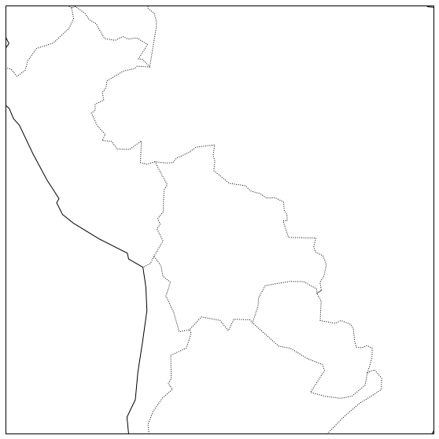


```python
ds2.CONC.mean(dim=['Time','bottom_top']).plot(vmax=.1,x='XLONG',y='XLAT',cmap=cmap,figsize=(10,10))
```


    <matplotlib.collections.QuadMesh at 0x1233529b0>


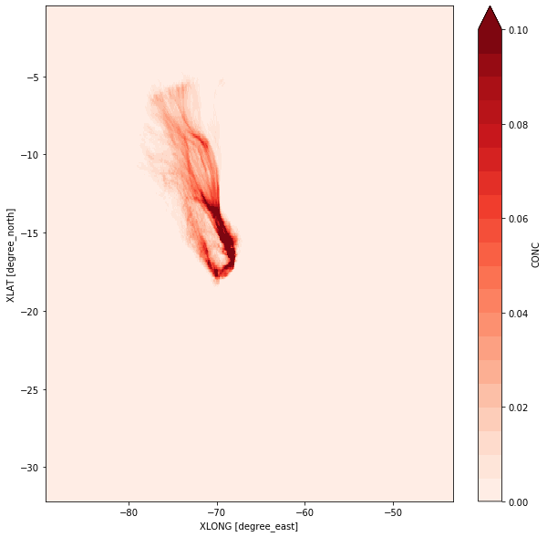


```python
ds2.CONC.mean(dim=['Time','south_north']).plot(x='lon',y='ZMID',vmax=.1,figsize=(10,10))
```


    <matplotlib.collections.QuadMesh at 0x11d3a8a58>


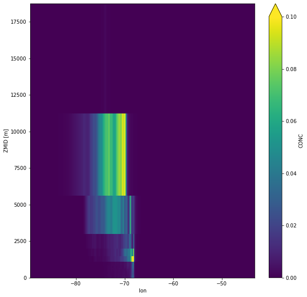


```python
ds2.TOPOGRAPHY.plot(x='lon',y='lat')
```


    <matplotlib.collections.QuadMesh at 0x11bb5fba8>


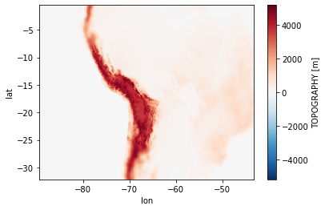


```python
ds2
```


    <xarray.Dataset>
    Dimensions:       (Time: 73, arrival_time: 1, bottom_top: 16, release_time: 1, south_north: 340, west_east: 468)
    Coordinates:
      * Time          (Time) datetime64[ns] 2017-12-03 ... 2017-12-06
        XLONG         (south_north, west_east) float32 -89.338974 ... -43.261036
        XLAT          (south_north, west_east) float32 -32.141644 ... -0.528141
        TOPOGRAPHY    (south_north, west_east) float32 ...
        GRIDAREA      (south_north, west_east) float32 ...
        ZTOP          (bottom_top) float32 100.0 200.0 300.0 ... 10000.0 20000.0
      * release_time  (release_time) datetime64[ns] 2017-12-06
        lat           (south_north) float32 -32.14164 -32.048393 ... -0.528141
        lon           (west_east) float32 -89.339325 -89.24025 ... -43.260952
        ZMID          (bottom_top) float64 50.0 150.0 250.0 ... 7.5e+03 1.5e+04
    Dimensions without coordinates: arrival_time, bottom_top, south_north, west_east
    Data variables:
        CONC          (arrival_time, Time, bottom_top, south_north, west_east) float32 0.0 ... 0.0
    Attributes:
        SIMULATION_START_DATE:       20171206
        SIMULATION_START_TIME:       10000
        SIMULATION_END_DATE:         20171203
        SIMULATION_END_TIME:         0
        MAP_PROJ:                    3
        OUTPUT_PROJECTION:           Regular Latit/Longit
        OUTPUT_INTERVAL:             -3600
        AVERAGING_TIME:              -3600
        AVERAGE_SAMPLING:            -180
        NSPEC:                       1
        NUMRECEPTOR:                 0
        NAGECLASS:                   2
        NUMRELEASES:                 1
        DISPERSION_METHOD:           1
        SUBGRID_TOPOGRAPHY:          0
        CONVECTION_PARAM:            0
        LU_OPTION:                   1
        WEST-EAST_GRID_DIMENSION:    468
        SOUTH-NORTH_GRID_DIMENSION:  340
        BOTTOM-TOP_GRID_DIMENSION:   16
        DX:                          0
        DY:                          0


```python
qa = xla.quantile([.2,.5,.8],'west_east')
```


    ---------------------------------------------------------------------------

    NameError                                 Traceback (most recent call last)

    <ipython-input-72-6da7c7353552> in <module>
    ----> 1 qa = xla.quantile([.2,.5,.8],'west_east')
    

    NameError: name 'xla' is not defined


```python
(qa.isel(quantile=0)-qa.isel(quantile=-1)).plot()
```


    [<matplotlib.lines.Line2D at 0x133e23160>]


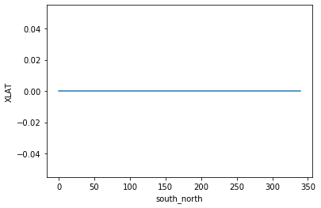


```python
ds2.CONC.isel(Time=-5).mean(dim='bottom_top').plot(vmax=.1,figsize=(10,10))
```


    <matplotlib.collections.QuadMesh at 0x12eb8d400>


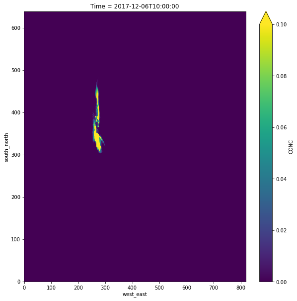


```python
ds2.CONC.isel(Time=-5).mean(dim='south_north').plot(vmax=0.1)
```


    <matplotlib.collections.QuadMesh at 0x12f667a58>


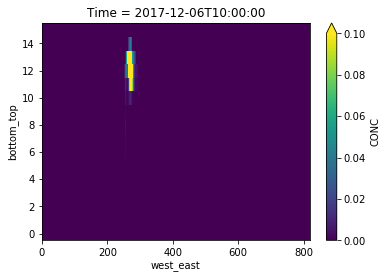


```python
ds2.CONC.isel(Time=-3).mean(dim='west_east').plot(vmax=0.1,x='south_north',y='ZTOP')
```


    <matplotlib.collections.QuadMesh at 0x12f7796d8>


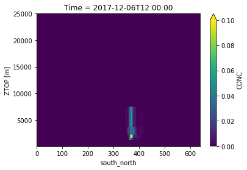


```python
fa.add_lat_lot(ds2)
```


    <xarray.Dataset>
    Dimensions:       (Time: 73, arrival_time: 1, bottom_top: 16, release_time: 1, south_north: 639, west_east: 819)
    Coordinates:
      * Time          (Time) datetime64[ns] 2017-12-03T14:00:00 ... 2017-12-06T14:00:00
        XLONG         (south_north, west_east) float32 -70.88807 ... 9.822319
        XLAT          (south_north, west_east) float32 -20.502567 ... 38.994232
        TOPOGRAPHY    (south_north, west_east) float32 ...
        GRIDAREA      (south_north, west_east) float32 ...
        ZTOP          (bottom_top) float32 ...
      * release_time  (release_time) datetime64[ns] 2017-12-06T14:00:00
        lat           (south_north) float32 -20.502565 -20.409315 ... 38.994232
        lon           (west_east) float32 -70.88786 -70.78914 ... 9.723635 9.822275
    Dimensions without coordinates: arrival_time, bottom_top, south_north, west_east
    Data variables:
        CONC          (arrival_time, Time, bottom_top, south_north, west_east) float32 0.0 ... 0.0
    Attributes:
        SIMULATION_START_DATE:       20171206
        SIMULATION_START_TIME:       150000
        SIMULATION_END_DATE:         20171203
        SIMULATION_END_TIME:         140000
        MAP_PROJ:                    3
        OUTPUT_PROJECTION:           Regular Latit/Longit
        OUTPUT_INTERVAL:             -3600
        AVERAGING_TIME:              -3600
        AVERAGE_SAMPLING:            -180
        NSPEC:                       1
        NUMRECEPTOR:                 0
        NAGECLASS:                   2
        NUMRELEASES:                 1
        DISPERSION_METHOD:           1
        SUBGRID_TOPOGRAPHY:          0
        CONVECTION_PARAM:            0
        LU_OPTION:                   1
        WEST-EAST_GRID_DIMENSION:    819
        SOUTH-NORTH_GRID_DIMENSION:  639
        BOTTOM-TOP_GRID_DIMENSION:   16
        DX:                          0
        DY:                          0


```python
ds2.GRIDAREA.plot()
```


    <matplotlib.collections.QuadMesh at 0x11bfd2898>


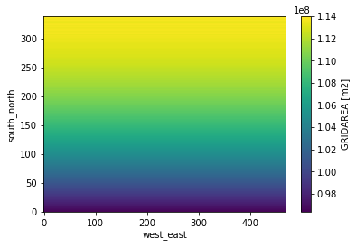


```python
res = ds2.lat - ds2.lat.shift(south_north=1)
res.plot()
```


    [<matplotlib.lines.Line2D at 0x11e91b278>]


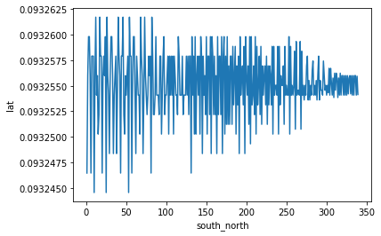


```python
res = ds2.lon - ds2.lon.shift(west_east=1)
res.plot()
```


    [<matplotlib.lines.Line2D at 0x11e37b320>]


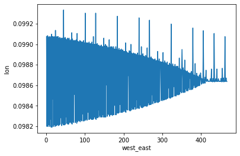


```python
ds2.lat.min()
ds2.lat.max()
```


    <xarray.DataArray 'lat' ()>
    array(-0.528141, dtype=float32)


```python
.099*100
```


    9.9


```python
ds2.CONC
```


    <xarray.DataArray 'CONC' (arrival_time: 1, Time: 73, bottom_top: 16, south_north: 340, west_east: 468)>
    array([[[[[0., ..., 0.],
              ...,
              [0., ..., 0.]],
    
             ...,
    
             [[0., ..., 0.],
              ...,
              [0., ..., 0.]]],
    
    
            ...,
    
    
            [[[0., ..., 0.],
              ...,
              [0., ..., 0.]],
    
             ...,
    
             [[0., ..., 0.],
              ...,
              [0., ..., 0.]]]]], dtype=float32)
    Coordinates:
      * Time        (Time) datetime64[ns] 2017-12-03 ... 2017-12-06
        XLONG       (south_north, west_east) float32 -89.338974 ... -43.261036
        XLAT        (south_north, west_east) float32 -32.141644 ... -0.528141
        TOPOGRAPHY  (south_north, west_east) float32 ...
        GRIDAREA    (south_north, west_east) float32 ...
        ZTOP        (bottom_top) float32 100.0 200.0 300.0 ... 10000.0 20000.0
        lat         (south_north) float32 -32.14164 -32.048393 ... -0.528141
        lon         (west_east) float32 -89.339325 -89.24025 ... -43.260952
        ZMID        (bottom_top) float64 50.0 150.0 250.0 ... 7.5e+03 1.5e+04
    Dimensions without coordinates: arrival_time, bottom_top, south_north, west_east
    Attributes:
        description:  CONCENTRATION OF AIRBORNE SPECIES
        coordinates:  XLONG XLAT
        units:        s m3 kg-1


```python
ds2
```


    <xarray.Dataset>
    Dimensions:       (Time: 73, arrival_time: 1, bottom_top: 16, release_time: 1, south_north: 340, west_east: 468)
    Coordinates:
      * Time          (Time) datetime64[ns] 2017-12-03 ... 2017-12-06
        XLONG         (south_north, west_east) float32 -89.338974 ... -43.261036
        XLAT          (south_north, west_east) float32 -32.141644 ... -0.528141
        TOPOGRAPHY    (south_north, west_east) float32 ...
        GRIDAREA      (south_north, west_east) float32 ...
        ZTOP          (bottom_top) float32 100.0 200.0 300.0 ... 10000.0 20000.0
      * release_time  (release_time) datetime64[ns] 2017-12-06
        lat           (south_north) float32 -32.14164 -32.048393 ... -0.528141
        lon           (west_east) float32 -89.339325 -89.24025 ... -43.260952
        ZMID          (bottom_top) float64 50.0 150.0 250.0 ... 7.5e+03 1.5e+04
    Dimensions without coordinates: arrival_time, bottom_top, south_north, west_east
    Data variables:
        CONC          (arrival_time, Time, bottom_top, south_north, west_east) float32 0.0 ... 0.0
    Attributes:
        SIMULATION_START_DATE:       20171206
        SIMULATION_START_TIME:       10000
        SIMULATION_END_DATE:         20171203
        SIMULATION_END_TIME:         0
        MAP_PROJ:                    3
        OUTPUT_PROJECTION:           Regular Latit/Longit
        OUTPUT_INTERVAL:             -3600
        AVERAGING_TIME:              -3600
        AVERAGE_SAMPLING:            -180
        NSPEC:                       1
        NUMRECEPTOR:                 0
        NAGECLASS:                   2
        NUMRELEASES:                 1
        DISPERSION_METHOD:           1
        SUBGRID_TOPOGRAPHY:          0
        CONVECTION_PARAM:            0
        LU_OPTION:                   1
        WEST-EAST_GRID_DIMENSION:    468
        SOUTH-NORTH_GRID_DIMENSION:  340
        BOTTOM-TOP_GRID_DIMENSION:   16
        DX:                          0
        DY:                          0


```python
path = '/Volumes/mbProD/Downloads/flexpart/runs/run_2019-05-31_16-01-17_1_1'
```


```python
file = '/Volumes/mbProD/Downloads/flexpart/runs/run_2019-05-31_16-01-17_1_1/flxout_d02_20171209_170000.nc'
ds11 = xr.open_dataset(file)
```


```python
file = '/Volumes/mbProD/Downloads/flexpart/runs/run_2019-05-31_16-01-17_2_1/flxout_d02_20171209_170000.nc'
ds21 = xr.open_dataset(file)

file = '/Volumes/mbProD/Downloads/flexpart/runs/run_2019-05-31_16-01-17_2_2/flxout_d02_20171209_170000.nc'
ds22 = xr.open_dataset(file)

file = '/Volumes/mbProD/Downloads/flexpart/runs/run_2019-05-31_16-01-17_1_2/flxout_d02_20171209_170000.nc'
ds12 = xr.open_dataset(file)
```


```python
(ds21.CONC/ds11.CONC).isel(releases=1).plot()
```


    (array([ 136.,  264., 1601., 2483., 3257., 3062., 3666., 7597., 5480.,
            1937.]),
     array([0.41649404, 0.45893356, 0.50137305, 0.5438126 , 0.5862521 ,
            0.6286916 , 0.67113113, 0.7135706 , 0.7560101 , 0.79844964,
            0.84088916], dtype=float32),
     <a list of 10 Patch objects>)


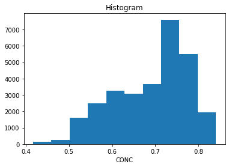


```python
(ds22.CONC/ds11.CONC).isel(releases=1).plot()
```


    (array([ 132.,  314., 1635., 2718., 3157., 3112., 4018., 8102., 4910.,
            1385.]),
     array([0.5943089 , 0.65564656, 0.7169842 , 0.77832186, 0.8396595 ,
            0.90099716, 0.96233475, 1.0236725 , 1.08501   , 1.1463478 ,
            1.2076854 ], dtype=float32),
     <a list of 10 Patch objects>)


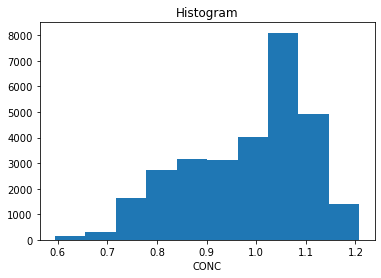


```python
(ds21.CONC/ds22.CONC).isel(releases=1).plot()
```


    (array([ 153.,  982., 3429., 7641., 8666., 5079., 2218.,  889.,  361.,
              65.]),
     array([0.6893061 , 0.6921672 , 0.69502836, 0.6978895 , 0.70075065,
            0.70361185, 0.706473  , 0.70933414, 0.7121953 , 0.7150564 ,
            0.71791756], dtype=float32),
     <a list of 10 Patch objects>)


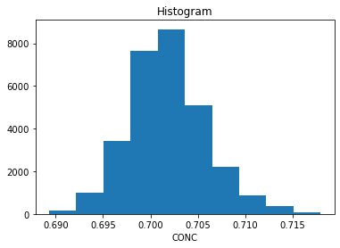


```python
(ds21.CONC/ds12.CONC).isel(releases=1).plot()
```


    (array([ 136.,  271., 1571., 2468., 3288., 3122., 3624., 7650., 5381.,
            1972.]),
     array([0.29188073, 0.3217175 , 0.35155427, 0.38139108, 0.41122785,
            0.44106463, 0.4709014 , 0.5007382 , 0.530575  , 0.56041175,
            0.5902485 ], dtype=float32),
     <a list of 10 Patch objects>)


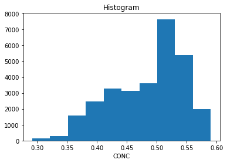


```python
(ds11.CONC/ds12.CONC).isel(releases=1).plot()
```


    (array([ 153.,  983., 3432., 7648., 8677., 5066., 2215.,  883.,  361.,
              65.]),
     array([0.68931055, 0.6921723 , 0.695034  , 0.6978957 , 0.70075744,
            0.7036192 , 0.7064809 , 0.70934266, 0.71220434, 0.7150661 ,
            0.7179278 ], dtype=float32),
     <a list of 10 Patch objects>)


```python
(ds22.CONC/ds12.CONC).isel(releases=1).plot()
```


    (array([ 136.,  264., 1601., 2482., 3256., 3064., 3666., 7597., 5480.,
            1937.]),
     array([0.4164941, 0.4589336, 0.5013731, 0.5438126, 0.5862521, 0.6286916,
            0.6711311, 0.7135706, 0.7560101, 0.7984496, 0.8408891],
           dtype=float32),
     <a list of 10 Patch objects>)


```python
(ds11.CONC/ds22.CONC).isel(releases=1).plot()
```


    (array([ 5280., 10739.,  4696.,  3166.,  2845.,  1793.,   654.,   170.,
               84.,    56.]),
     array([0.8280303 , 0.91348994, 0.9989496 , 1.0844092 , 1.1698688 ,
            1.2553285 , 1.3407881 , 1.4262478 , 1.5117074 , 1.5971671 ,
            1.6826267 ], dtype=float32),
     <a list of 10 Patch objects>)


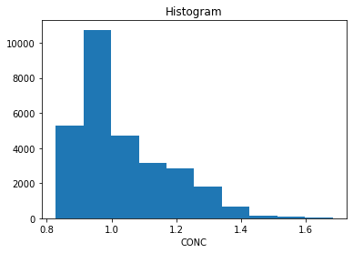


```python
ds11.CONC.isel(releases=0).sum()
```


    <xarray.DataArray 'CONC' ()>
    array(1154.4707, dtype=float32)


```python
ds22.CONC.isel(releases=0).sum()
```


    <xarray.DataArray 'CONC' ()>
    array(1061.919, dtype=float32)


```python
ds12.CONC.isel(releases=0).sum()
```


    <xarray.DataArray 'CONC' ()>
    array(1634.8218, dtype=float32)


```python
ds21.CONC.isel(releases=0).sum()
```


    <xarray.DataArray 'CONC' ()>
    array(749.88477, dtype=float32)


```python
ds22.CONC.isel(releases=0).sum(dim=['bottom_top']).plot()
```


    <matplotlib.collections.QuadMesh at 0x12fe94160>


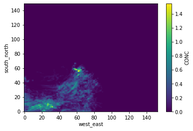


```python
ds22.CONC.isel(releases=0).sum(dim=['south_north']).plot(x='west_east')
```


    <matplotlib.collections.QuadMesh at 0x1303dca20>


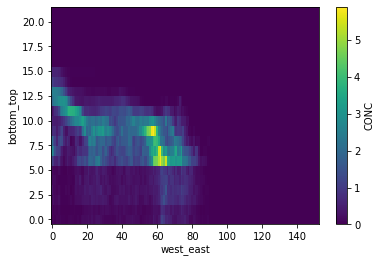


```python
hp = '/Volumes/mbProD/Downloads/flexpart/runs/run_2019-05-31_16-01-17_1_1/header_d01.nc'
```


```python
xr.open_dataset(hp).TOPOGRAPHY.plot(x='XLONG',y='XLAT')
```


    <matplotlib.collections.QuadMesh at 0x13ac7a1d0>


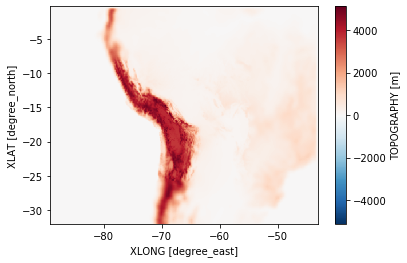


```python
hp = '/Volumes/mbProD/Downloads/flexpart/runs/run_2019-05-31_16-01-17_1_1/header_d02.nc'
xr.open_dataset(hp).TOPOGRAPHY.plot(x='XLONG',y='XLAT')
```


    <matplotlib.collections.QuadMesh at 0x13d92a550>


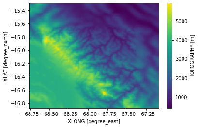


```python
path = '/Volumes/mbProD/Downloads/flexpart/runs/run_2019-05-31_16-01-17_2_2/'
dom = 'd02'
```


```python
head_ds = fa.import_head_ds(path,dom)
```

    /Volumes/mbProD/Downloads/flexpart/runs/run_2019-05-31_16-01-17_2_2/header_d02.nc


```python
file_ds_list = fa.import_file_ds_list(path,dom)
```


```python
ds_con = fa.concat_file_ds_list(file_ds_list)
```


```python
ds_con1 = fa.convert_ds_time_format(ds_con)
```


```python
ds_join = fa.join_head(ds_con1,head_ds,ageclass=0,releases=slice(0,None))
```


```python
ds2 = ds_join
# ds2 = fa.add_release_time_dim(ds2,head_ds)
ds2 = fa.assign_vars_to_cords(ds2)
ds2 = fa.add_lat_lot(ds2)
ds2 = fa.add_zmid(ds2)
ds2 = fa.add_zbot(ds2)
ds2 = fa.add_zlength_m(ds2)
ds2 = fa.add_alt_m(ds2)
ds2 = fa.add_volume(ds2)
```


```python
ds2.isel(releases=0).sum(dim=['south_north','bottom_top','west_east']).CONC.plot()
```


    [<matplotlib.lines.Line2D at 0x2a26092e8>]


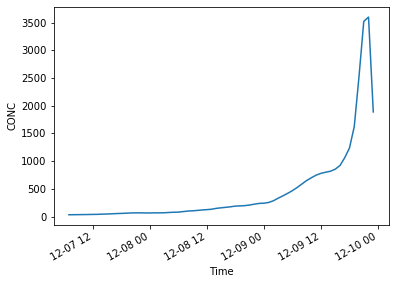


```python
ds_ = ds2.isel(releases=0)
(ds_.CONC/ds_.VOL).sum(dim=['south_north','bottom_top','west_east']).plot()
```


    [<matplotlib.lines.Line2D at 0x2a2325978>]


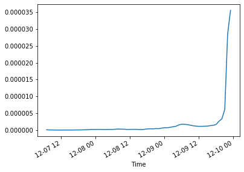


```python
ds2.isel(releases=1).sum(dim=['bottom_top','Time']).CONC.plot(x='lon',y='lat',vmax=90,figsize=(10,10))
```


    <matplotlib.collections.QuadMesh at 0x2a93a7828>


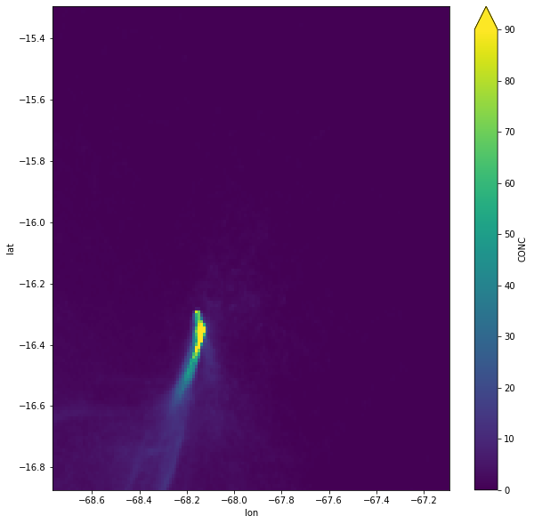


```python
ds2.isel(releases=1).sum(dim=['west_east','Time']).CONC.plot(x='lat',y='ZMID',vmax=500)
```


    <matplotlib.collections.QuadMesh at 0x12fadcf28>


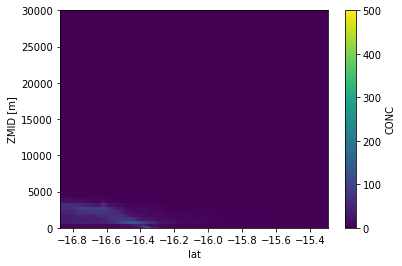


```python
ds2.isel(releases=0).sum(dim=['west_east','Time']).CONC.plot(x='lat',y='ZMID',vmax=500)
```


    <matplotlib.collections.QuadMesh at 0x13dd22f60>


```python
ds2['alt']=ds2.ALT
```


```python
import wrf
```


```python
ds22=ds2.copy()
dc = ds22.coords
ds22 = ds2.drop(dc).isel(Time=[-20,-1],releases=1)
ds22['con/vol'] = (ds22.CONC/ds2.VOL)
co = ds22.coords
ds22 = ds22.drop(co)
```


```python
ds22['alt']=ds22.alt.transpose('bottom_top','south_north','west_east')
```


```python
nds = wrf.interplevel(ds22['con/vol'],ds22.alt,desiredlev=np.arange(0,20000,100))
```


```python
nds.mean(dim=['west_east','Time']).plot(vmax = 1e-11,figsize=(10,10))
```


    <matplotlib.collections.QuadMesh at 0x2ab0cb8d0>


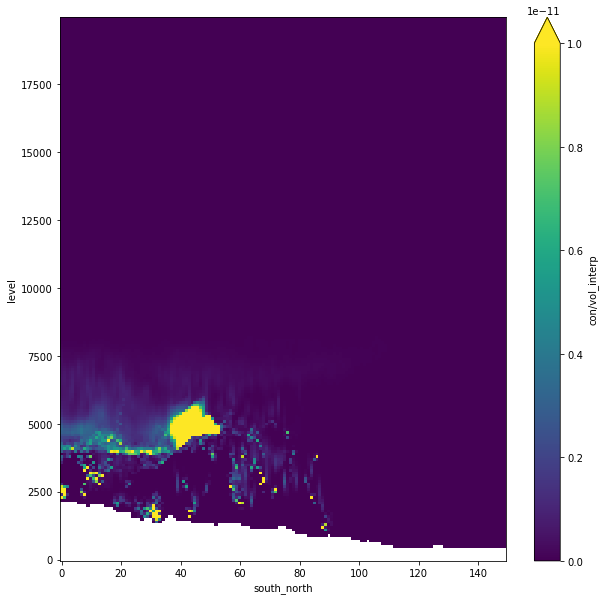


```python
la, lo = -16.355000,-68.140000
dis = np.sqrt((la-ds2.lat)**2+(lo-ds2.lon)**2)
mi =dis.min()
```


```python
min_loc = dis.where(dis==mi).dropna(fa.SN,'all').dropna(fa.WE,'all')
```


```python
dsll = ds2[fa.TOPO].swap_dims({fa.WE:'lon',fa.SN:'lat'})
```


```python
dsll.interp(lat=la,lon=lo)
```


    <xarray.DataArray 'TOPOGRAPHY' ()>
    array(4656.198893)
    Coordinates:
        XLONG       float64 -68.14
        XLAT        float64 -16.35
        TOPOGRAPHY  float64 4.656e+03
        GRIDAREA    float64 1.108e+08
        lat         float64 -16.36
        lon         float64 -68.14
    Attributes:
        description:  TERRAIN ELEVATION ABOVE SEA LEVEL
        units:        m


```python
import flexpart_management.modules.create_release_file as rf
```


```python
dtm = dt.datetime(2017,1,1,1,1,1)
```


```python
rf.format_dt_to_str(dtm)
```


    '20170101 010101'


```python
dc = dict(start_dt_rel=dtm, end_dt_rel=dtm)
```


```python
df =rf.create_dic_range(
    d_start = dt.datetime(2018,1,1,1,0,0),
    d_end   = dt.datetime(2018,1,1,10,0,0),
    base_dict = {}

)

st= df[rf.RELEASE_DIC_STR_KEY]
```


```python
st.iloc[0]
```


    '20180101 010000       ID1, IT1        beginning date and time of release\n  20180101 020000       ID2, IT2        ending date and time of release\n  -68.140000            XPOINT1 (real)  longitude [deg] of lower left corner\n  -16.355000            YPOINT1 (real)  latitude [deg] of lower left corner\n  -68.118000            XPOINT2 (real)  longitude [deg] of upper right corner\n  -16.335000            YPOINT2 (real)  latitude [DEG] of upper right corner\n  1                     KINDZ  (int)  1 for m above ground, 2 for m above sea level, 3 pressure\n  0.0                 ZPOINT1 (real)  lower z-level\n  10.0                ZPOINT2 (real)  upper z-level\n  10000                 NPART (int)     total number of particles to be released\n  1000.0                XMASS (real)    total mass emitted\n  dummy_test20180101_01    NAME OF RELEASE LOCATION'


```python
join(['s','b'])
```


    ---------------------------------------------------------------------------

    NameError                                 Traceback (most recent call last)

    <ipython-input-12-b4eb287208ba> in <module>
    ----> 1 join(['s','b'])
    

    NameError: name 'join' is not defined


```python
str_out = ''
for s in st.values:
    str_out = str_out+'\n'+s
str_out = str_out[1:]
```


```python
str_out
```


    '20180101 010000       ID1, IT1        beginning date and time of release\n  20180101 020000       ID2, IT2        ending date and time of release\n  -68.140000            XPOINT1 (real)  longitude [deg] of lower left corner\n  -16.355000            YPOINT1 (real)  latitude [deg] of lower left corner\n  -68.118000            XPOINT2 (real)  longitude [deg] of upper right corner\n  -16.335000            YPOINT2 (real)  latitude [DEG] of upper right corner\n  1                     KINDZ  (int)  1 for m above ground, 2 for m above sea level, 3 pressure\n  0.0                 ZPOINT1 (real)  lower z-level\n  10.0                ZPOINT2 (real)  upper z-level\n  10000                 NPART (int)     total number of particles to be released\n  1000.0                XMASS (real)    total mass emitted\n  dummy_test20180101_01    NAME OF RELEASE LOCATION\n20180101 020000       ID1, IT1        beginning date and time of release\n  20180101 030000       ID2, IT2        ending date and time of release\n  -68.140000            XPOINT1 (real)  longitude [deg] of lower left corner\n  -16.355000            YPOINT1 (real)  latitude [deg] of lower left corner\n  -68.118000            XPOINT2 (real)  longitude [deg] of upper right corner\n  -16.335000            YPOINT2 (real)  latitude [DEG] of upper right corner\n  1                     KINDZ  (int)  1 for m above ground, 2 for m above sea level, 3 pressure\n  0.0                 ZPOINT1 (real)  lower z-level\n  10.0                ZPOINT2 (real)  upper z-level\n  10000                 NPART (int)     total number of particles to be released\n  1000.0                XMASS (real)    total mass emitted\n  dummy_test20180101_02    NAME OF RELEASE LOCATION\n20180101 030000       ID1, IT1        beginning date and time of release\n  20180101 040000       ID2, IT2        ending date and time of release\n  -68.140000            XPOINT1 (real)  longitude [deg] of lower left corner\n  -16.355000            YPOINT1 (real)  latitude [deg] of lower left corner\n  -68.118000            XPOINT2 (real)  longitude [deg] of upper right corner\n  -16.335000            YPOINT2 (real)  latitude [DEG] of upper right corner\n  1                     KINDZ  (int)  1 for m above ground, 2 for m above sea level, 3 pressure\n  0.0                 ZPOINT1 (real)  lower z-level\n  10.0                ZPOINT2 (real)  upper z-level\n  10000                 NPART (int)     total number of particles to be released\n  1000.0                XMASS (real)    total mass emitted\n  dummy_test20180101_03    NAME OF RELEASE LOCATION\n20180101 040000       ID1, IT1        beginning date and time of release\n  20180101 050000       ID2, IT2        ending date and time of release\n  -68.140000            XPOINT1 (real)  longitude [deg] of lower left corner\n  -16.355000            YPOINT1 (real)  latitude [deg] of lower left corner\n  -68.118000            XPOINT2 (real)  longitude [deg] of upper right corner\n  -16.335000            YPOINT2 (real)  latitude [DEG] of upper right corner\n  1                     KINDZ  (int)  1 for m above ground, 2 for m above sea level, 3 pressure\n  0.0                 ZPOINT1 (real)  lower z-level\n  10.0                ZPOINT2 (real)  upper z-level\n  10000                 NPART (int)     total number of particles to be released\n  1000.0                XMASS (real)    total mass emitted\n  dummy_test20180101_04    NAME OF RELEASE LOCATION\n20180101 050000       ID1, IT1        beginning date and time of release\n  20180101 060000       ID2, IT2        ending date and time of release\n  -68.140000            XPOINT1 (real)  longitude [deg] of lower left corner\n  -16.355000            YPOINT1 (real)  latitude [deg] of lower left corner\n  -68.118000            XPOINT2 (real)  longitude [deg] of upper right corner\n  -16.335000            YPOINT2 (real)  latitude [DEG] of upper right corner\n  1                     KINDZ  (int)  1 for m above ground, 2 for m above sea level, 3 pressure\n  0.0                 ZPOINT1 (real)  lower z-level\n  10.0                ZPOINT2 (real)  upper z-level\n  10000                 NPART (int)     total number of particles to be released\n  1000.0                XMASS (real)    total mass emitted\n  dummy_test20180101_05    NAME OF RELEASE LOCATION\n20180101 060000       ID1, IT1        beginning date and time of release\n  20180101 070000       ID2, IT2        ending date and time of release\n  -68.140000            XPOINT1 (real)  longitude [deg] of lower left corner\n  -16.355000            YPOINT1 (real)  latitude [deg] of lower left corner\n  -68.118000            XPOINT2 (real)  longitude [deg] of upper right corner\n  -16.335000            YPOINT2 (real)  latitude [DEG] of upper right corner\n  1                     KINDZ  (int)  1 for m above ground, 2 for m above sea level, 3 pressure\n  0.0                 ZPOINT1 (real)  lower z-level\n  10.0                ZPOINT2 (real)  upper z-level\n  10000                 NPART (int)     total number of particles to be released\n  1000.0                XMASS (real)    total mass emitted\n  dummy_test20180101_06    NAME OF RELEASE LOCATION\n20180101 070000       ID1, IT1        beginning date and time of release\n  20180101 080000       ID2, IT2        ending date and time of release\n  -68.140000            XPOINT1 (real)  longitude [deg] of lower left corner\n  -16.355000            YPOINT1 (real)  latitude [deg] of lower left corner\n  -68.118000            XPOINT2 (real)  longitude [deg] of upper right corner\n  -16.335000            YPOINT2 (real)  latitude [DEG] of upper right corner\n  1                     KINDZ  (int)  1 for m above ground, 2 for m above sea level, 3 pressure\n  0.0                 ZPOINT1 (real)  lower z-level\n  10.0                ZPOINT2 (real)  upper z-level\n  10000                 NPART (int)     total number of particles to be released\n  1000.0                XMASS (real)    total mass emitted\n  dummy_test20180101_07    NAME OF RELEASE LOCATION\n20180101 080000       ID1, IT1        beginning date and time of release\n  20180101 090000       ID2, IT2        ending date and time of release\n  -68.140000            XPOINT1 (real)  longitude [deg] of lower left corner\n  -16.355000            YPOINT1 (real)  latitude [deg] of lower left corner\n  -68.118000            XPOINT2 (real)  longitude [deg] of upper right corner\n  -16.335000            YPOINT2 (real)  latitude [DEG] of upper right corner\n  1                     KINDZ  (int)  1 for m above ground, 2 for m above sea level, 3 pressure\n  0.0                 ZPOINT1 (real)  lower z-level\n  10.0                ZPOINT2 (real)  upper z-level\n  10000                 NPART (int)     total number of particles to be released\n  1000.0                XMASS (real)    total mass emitted\n  dummy_test20180101_08    NAME OF RELEASE LOCATION\n20180101 090000       ID1, IT1        beginning date and time of release\n  20180101 100000       ID2, IT2        ending date and time of release\n  -68.140000            XPOINT1 (real)  longitude [deg] of lower left corner\n  -16.355000            YPOINT1 (real)  latitude [deg] of lower left corner\n  -68.118000            XPOINT2 (real)  longitude [deg] of upper right corner\n  -16.335000            YPOINT2 (real)  latitude [DEG] of upper right corner\n  1                     KINDZ  (int)  1 for m above ground, 2 for m above sea level, 3 pressure\n  0.0                 ZPOINT1 (real)  lower z-level\n  10.0                ZPOINT2 (real)  upper z-level\n  10000                 NPART (int)     total number of particles to be released\n  1000.0                XMASS (real)    total mass emitted\n  dummy_test20180101_09    NAME OF RELEASE LOCATION\n20180101 100000       ID1, IT1        beginning date and time of release\n  20180101 110000       ID2, IT2        ending date and time of release\n  -68.140000            XPOINT1 (real)  longitude [deg] of lower left corner\n  -16.355000            YPOINT1 (real)  latitude [deg] of lower left corner\n  -68.118000            XPOINT2 (real)  longitude [deg] of upper right corner\n  -16.335000            YPOINT2 (real)  latitude [DEG] of upper right corner\n  1                     KINDZ  (int)  1 for m above ground, 2 for m above sea level, 3 pressure\n  0.0                 ZPOINT1 (real)  lower z-level\n  10.0                ZPOINT2 (real)  upper z-level\n  10000                 NPART (int)     total number of particles to be released\n  1000.0                XMASS (real)    total mass emitted\n  dummy_test20180101_10    NAME OF RELEASE LOCATION'


```python
print(df.release_dic_formatted.to_string())
```

    0    {'start_dt_rel': '20180101 010000', 'end_dt_re...
    1    {'start_dt_rel': '20180101 020000', 'end_dt_re...
    2    {'start_dt_rel': '20180101 030000', 'end_dt_re...
    3    {'start_dt_rel': '20180101 040000', 'end_dt_re...
    4    {'start_dt_rel': '20180101 050000', 'end_dt_re...
    5    {'start_dt_rel': '20180101 060000', 'end_dt_re...
    6    {'start_dt_rel': '20180101 070000', 'end_dt_re...
    7    {'start_dt_rel': '20180101 080000', 'end_dt_re...
    8    {'start_dt_rel': '20180101 090000', 'end_dt_re...
    9    {'start_dt_rel': '20180101 100000', 'end_dt_re...


```python
type(df.iloc[0].start_dt_rel) == (dt.datetime or pd.Timestamp )
```


    False


```python
type(df.iloc[0][rf.START_DT_REL_KEY])
```


    pandas._libs.tslibs.timestamps.Timestamp


```python
ss = df.start_dt_rel
```


```python
ss.dt.strftime('%Y%m%d_%H')
```


    0    20180101_01
    1    20180101_02
    2    20180101_03
    3    20180101_04
    4    20180101_05
    5    20180101_06
    6    20180101_07
    7    20180101_08
    8    20180101_09
    9    20180101_10
    Name: start_dt_rel, dtype: object


```python
pd.Series.dt.strptime
```


    ---------------------------------------------------------------------------

    AttributeError                            Traceback (most recent call last)

    <ipython-input-667-e135f8e1d2cc> in <module>
    ----> 1 pd.Series.dt.strptime
    

    AttributeError: type object 'CombinedDatetimelikeProperties' has no attribute 'strptime'


```python
df = rf.create_avail_file(d1='2018-01-01',d2='2018-01-10',dom00='01',frq_file=60, frq_sim=15)
```


```python
rf.create_all_avail_files(d1='2018-01-01',d2='2018-01-10',frq_file=60, frq_sim=15)
```


```python
df.floor('60min')[:8]
```


    DatetimeIndex(['2018-01-01 00:00:00', '2018-01-01 00:00:00',
                   '2018-01-01 00:00:00', '2018-01-01 00:00:00',
                   '2018-01-01 01:00:00', '2018-01-01 01:00:00',
                   '2018-01-01 01:00:00', '2018-01-01 01:00:00'],
                  dtype='datetime64[ns]', freq=None)


```python
df[:4]
```


    DatetimeIndex(['2018-01-01 00:00:00', '2018-01-01 00:15:00',
                   '2018-01-01 00:30:00', '2018-01-01 00:45:00'],
                  dtype='datetime64[ns]', freq='15T')


```python
import flexpart_management.modules.daily_back.config_file as cf
```


```python
cf.config_dic
```


    {'date_simulation': datetime.date(2017, 12, 10),
     'hours_back_in_time': 96,
     'run_base_name': '2019-06-02_20-42-05_',
     'run_base_path': '/tmp/',
     'wrfout_path': '/tmp',
     'flx_input_templ_path': './flex_input_templ',
     'run_templ_path': './run_flx_templ.sh'}


```python
import flexpart_management.modules.daily_back.daily_back as db
```


```python
cd1 = db.generate_run_path(cf.config_dic)
cd1 = db.generate_day_path(cd1)
cd1
```


    {'date_simulation': datetime.date(2017, 12, 10),
     'hours_back_in_time': 96,
     'run_base_name': '2019-06-02_20-42-05_',
     'run_base_path': '/tmp/',
     'wrfout_path': '/tmp',
     'flx_input_templ_path': './flex_input_templ',
     'run_templ_path': './run_flx_templ.sh',
     'run_path': '/tmp/2019-06-02_20-42-05_',
     'day_path': '/tmp/2019-06-02_20-42-05_/2017-12-10'}


```python
import flexpart_management.modules.daily_back.ConfigDayRun as CDR
```


```python
cdr = CDR.ConfigDayRun()
```


```python
import flexpart_management.modules.daily_back.config_file as DR
```


```python
dr = DR.DayRun()
```


```python
dr.generate_run_path()
dr.generate_day_path()
dr.get_dt_end_simulation()
dr.get_dt_start_simulation()
dr.get_dt_first_release()
dr.get_dt_last_release()
dr.get_release_str()
dr.create_day_path_dir()
dr.create_available_files()
dr.create_available_paths()
dr.get_input_templ_string()
dr.fill_out_templ_string()
dr.create_flx_input_path()
dr.create_flx_input_file()
```


```python
dr.FLX_INPUT_PATH
```


    '/tmp/run_2019-06-02_20-42-05_/2017-12-10/flx_input'


```python
os.path.join('/ts','')
```


    '/ts/'


```python

```
