```python
%load_ext autoreload
%autoreload 2
```

    The autoreload extension is already loaded. To reload it, use:
      %reload_ext autoreload


```python
from useful_scit.imps import *
import flexpart_management.modules.FlexLogPol as FLP
import flexpart_management.modules.constants as co
import flexpart_management.modules.flx_array as fa
```


```python
path = '/Volumes/mbProD/Downloads/flx_log_coor/run_2019-06-05_18-42-11_'
path = '/Volumes/mbProD/Downloads/flx_log_coor/run_2019-06-10_11-10-03_'
# flp = FLP.FlexLogPol(path,concat=True)
# self = FLP.FlexLogPol(path,concat=False)
self = FLP.FlexLogPol(
    path,
#     concat=True,
    concat=False,
    get_clusters=False,
    open_merged=True,
    clusters_avail=False
)
```

    'using vol for conc'


```python

```


```python
com=fa.get_dims_complement(self.merged_ds,[co.R_CENTER,co.TH_CENTER])
sds = self.merged_ds.sum(com)
ax = fa.get_ax_bolivia()
fa.logpolar_plot(sds[co.CONC],name=co.CONC,ax= ax, drop_zeros=False)
```


    <cartopy.mpl.geoaxes.GeoAxesSubplot at 0x1ca6e95c0>


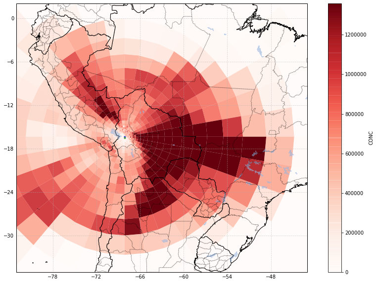


```python
ax = fa.get_ax_bolivia()
fa.logpolar_plot(self.merged_ds[co.TOPO],name=co.TOPO,ax= ax, drop_zeros=False)
```


    <cartopy.mpl.geoaxes.GeoAxesSubplot at 0x1ca174e10>


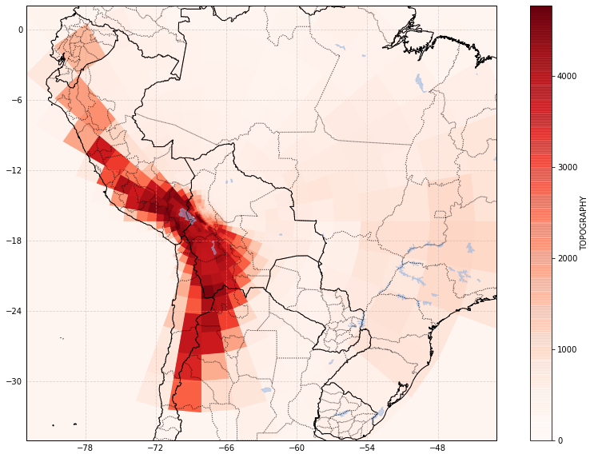


```python
self.reset_z_levels()
```

    'using vol for conc'


```python
com=fa.get_dims_complement(self.merged_ds,[co.R_CENTER,co.TH_CENTER])
sds = self.merged_ds.sum(com)
ax = fa.get_ax_bolivia()
fa.logpolar_plot(sds[co.CONC],name=co.CONC,ax= ax, drop_zeros=False)
```


    <cartopy.mpl.geoaxes.GeoAxesSubplot at 0x202a60cf8>


```python
self.python_cluster(n_cluster=15)
```


```python
com=fa.get_dims_complement(self.merged_ds,[co.R_CENTER,co.TH_CENTER])
sds = self.merged_ds.sum(com)
ax = fa.get_ax_bolivia()
fa.logpolar_plot(sds[co.CONC],name=co.CONC,ax= ax, drop_zeros=False)
```


    <cartopy.mpl.geoaxes.GeoAxesSubplot at 0x1cb2c8780>


```python
self.python_cluster(n_cluster=4)
```


```python

for i in range(len(self.cluster_flags)):
# for i in range(1):
    fig = self.plot_cluster_grid(i,co.CPer)

```


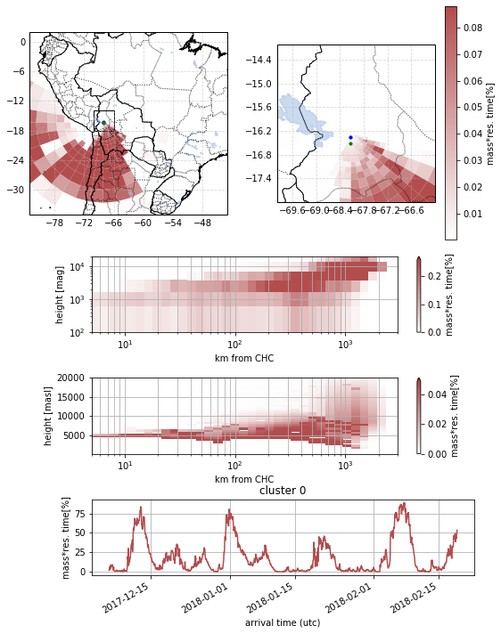


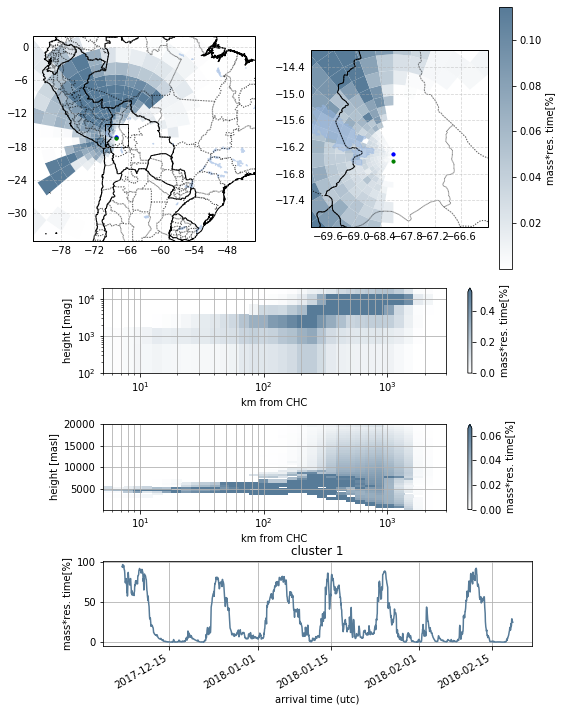


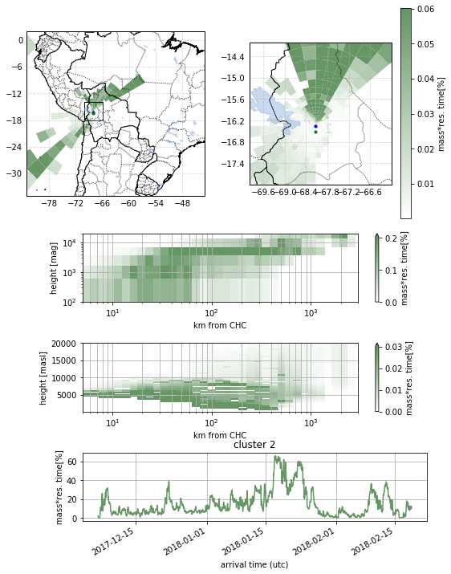


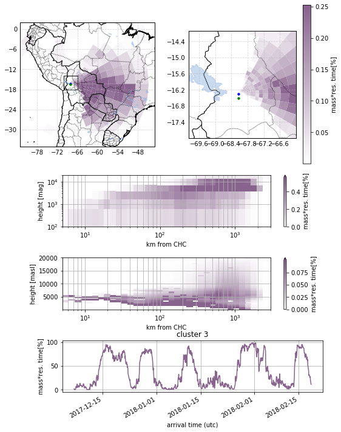


```python
self.plot_clusters_inlfuence(cols=1)
```


    <matplotlib.axes._subplots.AxesSubplot at 0x20e0581d0>


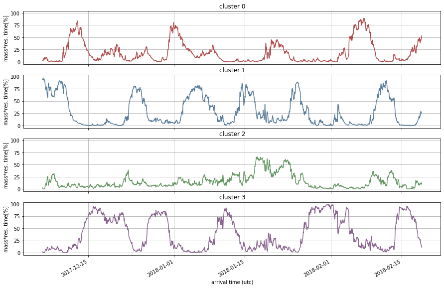


```python
self.python_cluster(n_cluster=15)
```


```python

for i in range(len(self.cluster_flags)):
# for i in range(1):
    fig = self.plot_cluster_grid(i,co.CPer)

```


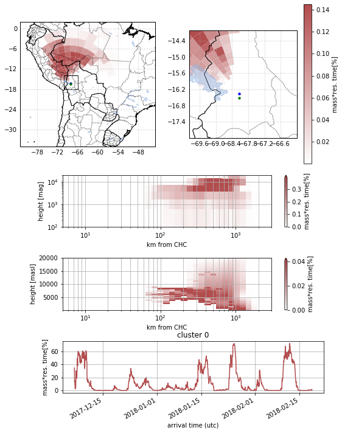


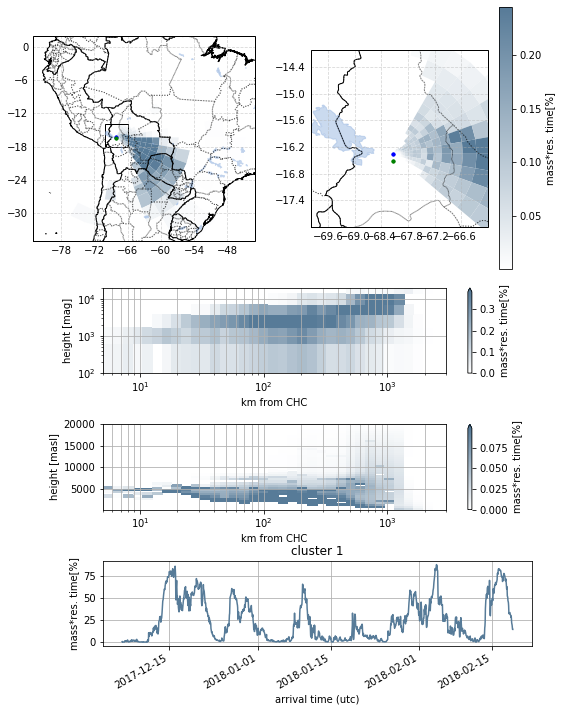


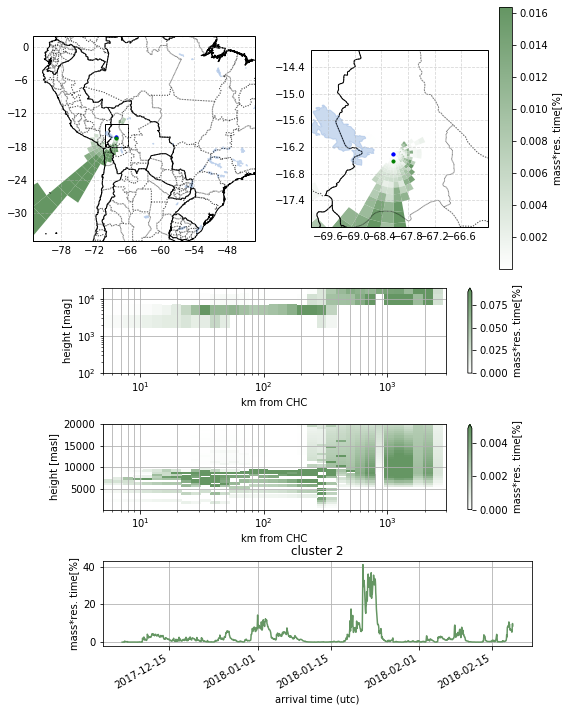


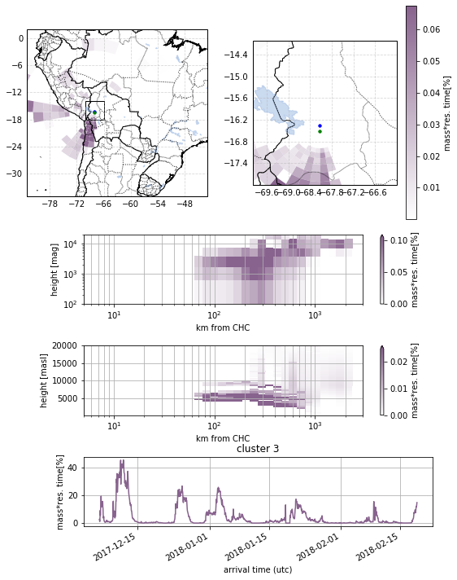


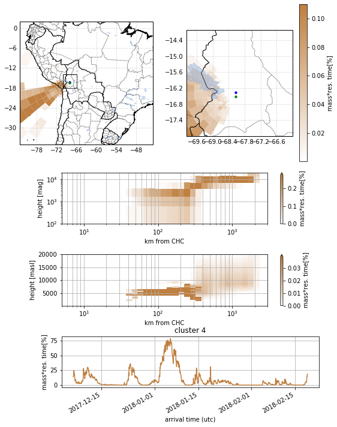


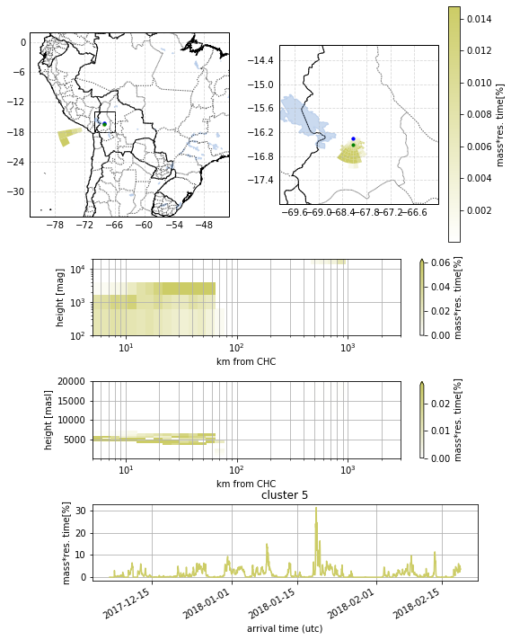


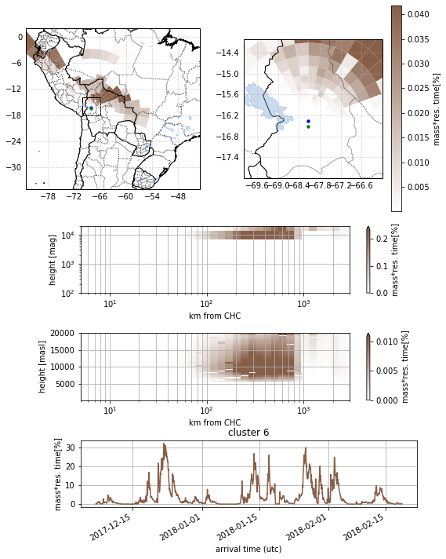


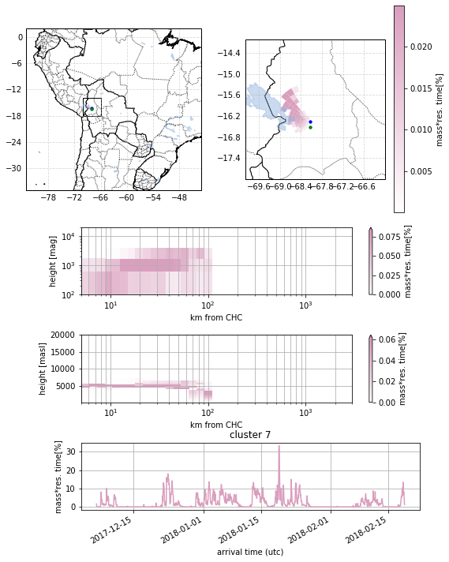


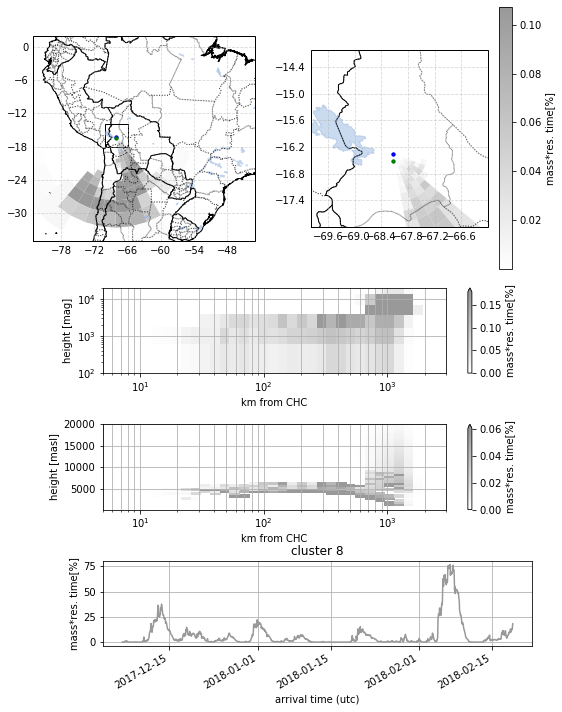


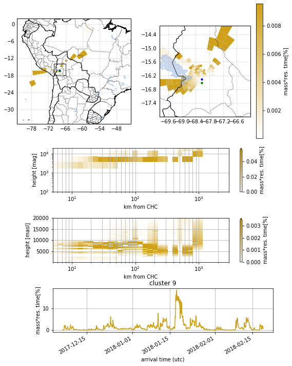


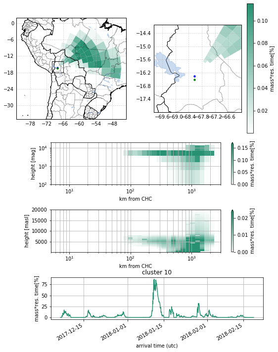


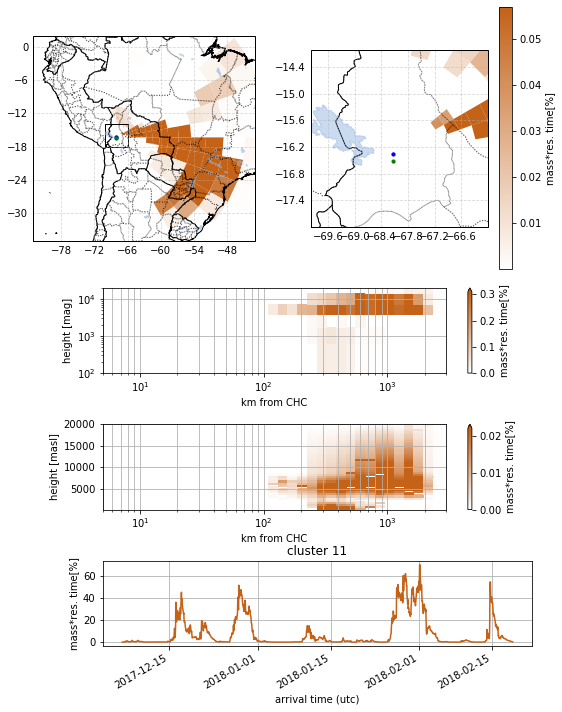


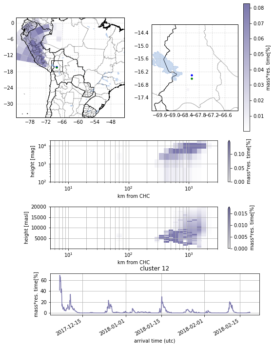


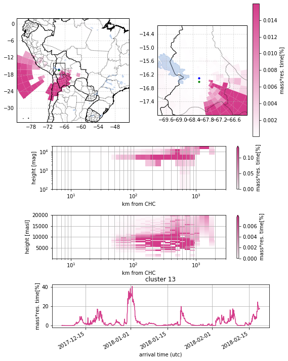


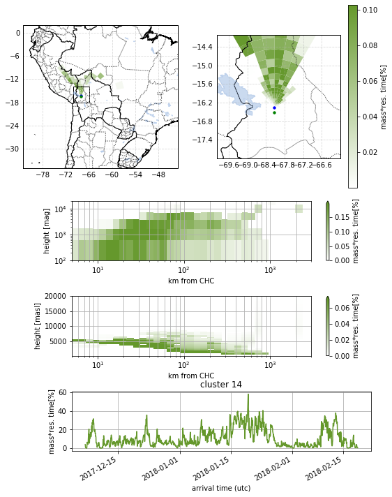


```python
self.plot_clusters_inlfuence(cols=3)
```


    <matplotlib.axes._subplots.AxesSubplot at 0x21d967320>


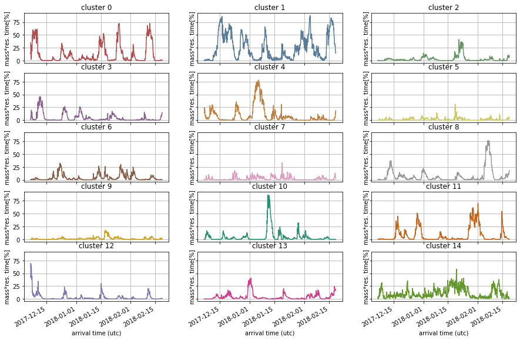


```python

```
