```python
%load_ext autoreload
%autoreload 2
```


```python
from useful_scit.imps import *
import flexpart_management.modules.FlexLogPol as FLP
import flexpart_management.modules.constants as co
import flexpart_management.modules.flx_array as fa
```

    reload


```python
path = '/Volumes/mbProD/Downloads/flx_log_coor/run_2019-06-05_18-42-11_'
path = '/Volumes/mbProD/Downloads/flx_log_coor/run_2019-06-10_11-10-03_'

# flp = FLP.FlexLogPol(path,concat=True)
# self = FLP.FlexLogPol(path,concat=False)
self = FLP.FlexLogPol(
    path,
#     concat=True,
    concat=False,
    get_clusters=False,
    open_merged=True,
    clusters_avail=False
)
```

    'using vol for conc'


```python
self.reset_z_levels()
```

    'using vol for conc'


```python
self.python_cluster(n_cluster=15)
```


```python

for i in range(len(self.cluster_flags)):
# for i in range(1):
    fig = self.plot_cluster_grid(i,co.CPer)
```


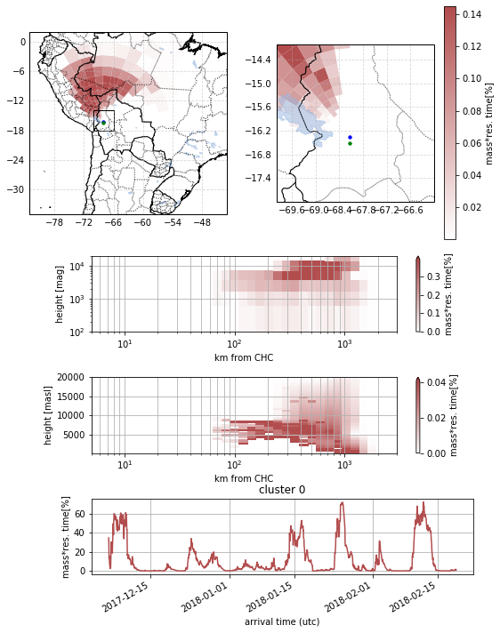


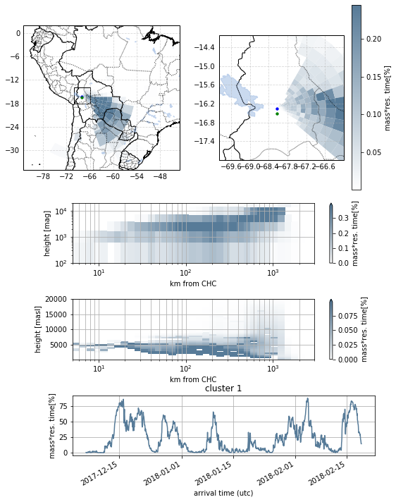


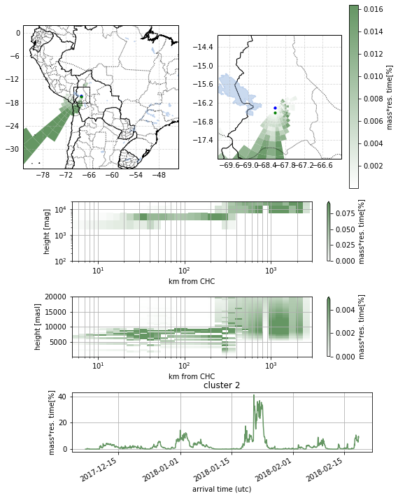


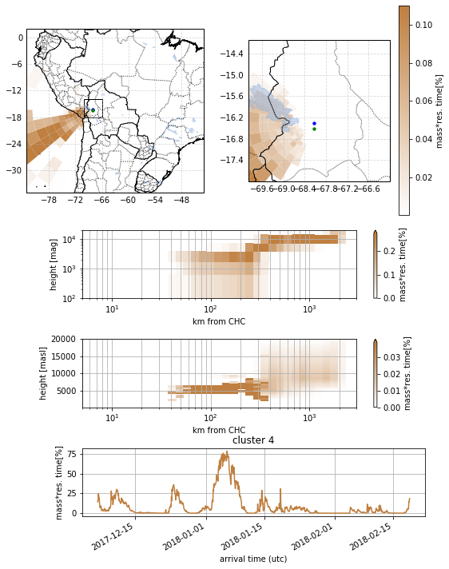


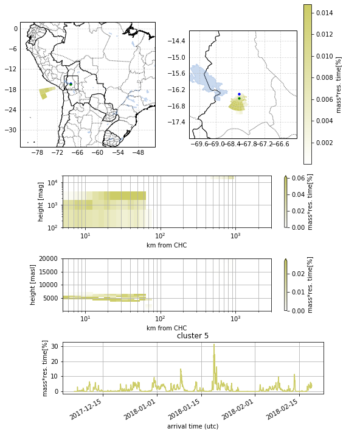


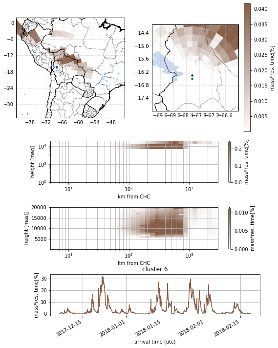


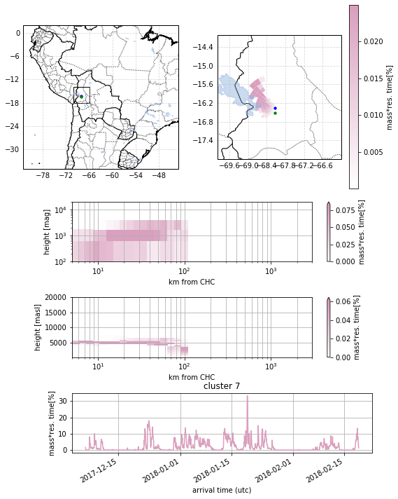


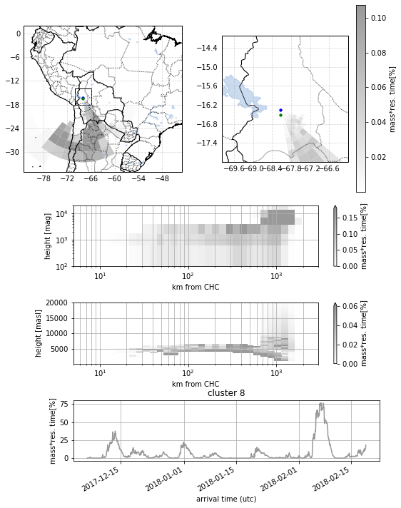


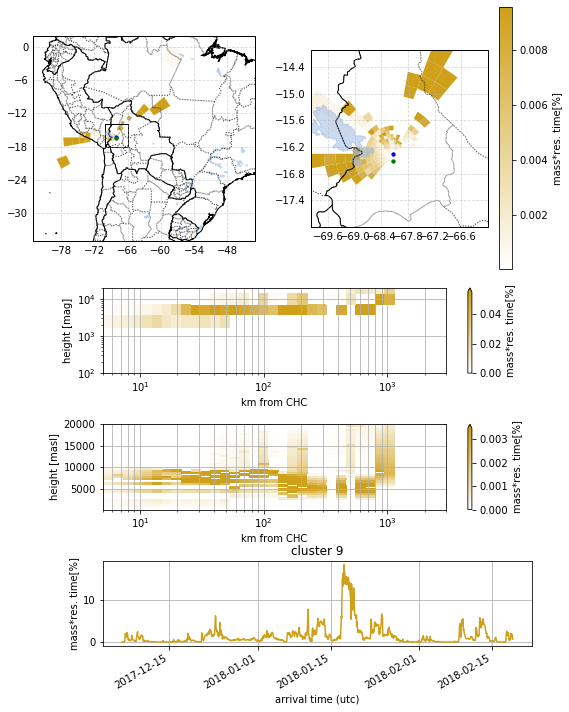


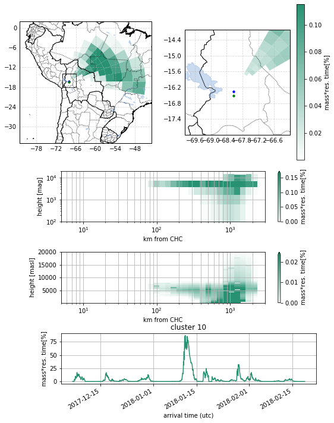


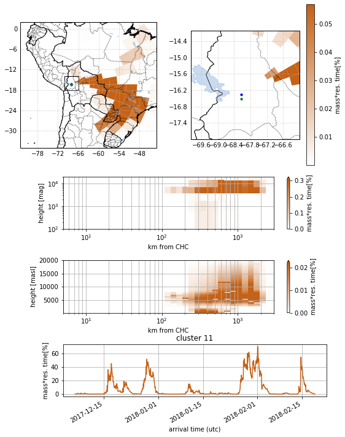


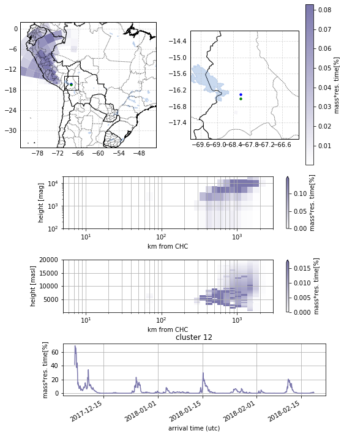


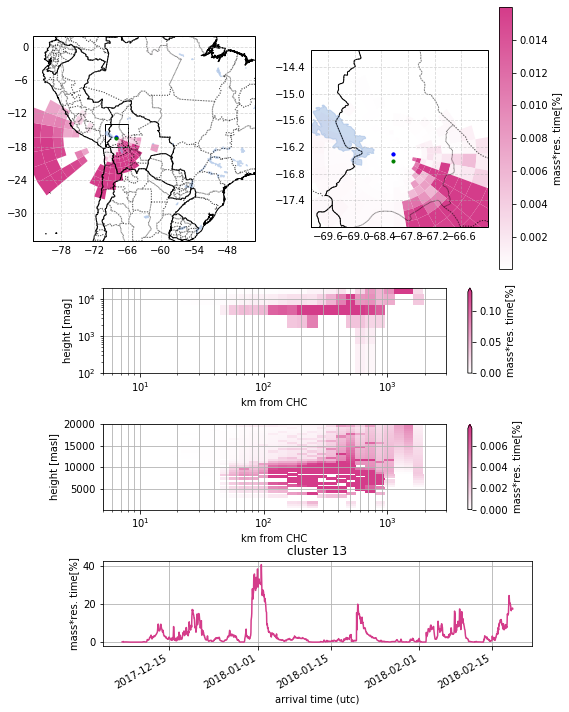


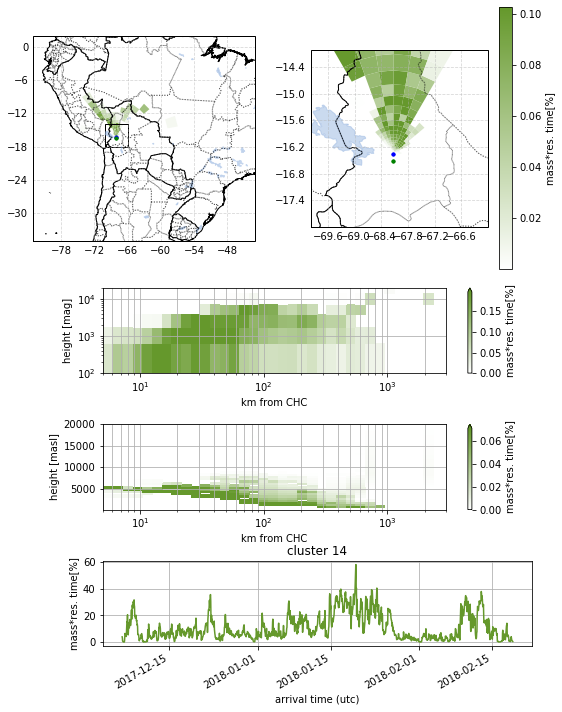


```python
self.plot_clusters_inlfuence(cols=3)
```


    <matplotlib.axes._subplots.AxesSubplot at 0x21d967320>


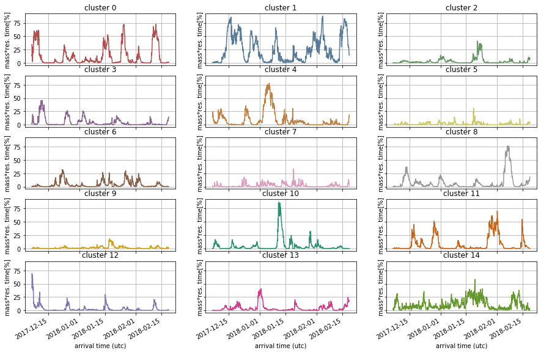


```python
# i = 5 
for i in range(len(self.cluster_flags)):
# for i in [i]:
    ax = self.plot_hout_influence(i,log=True)
```


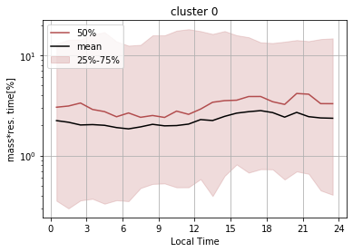


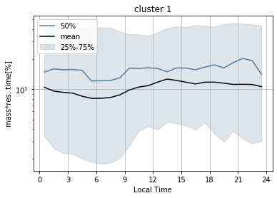


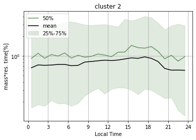


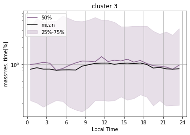


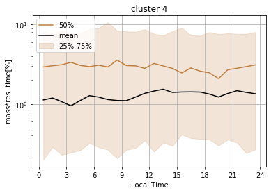


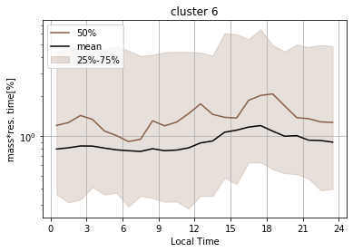


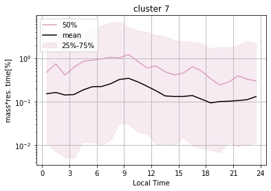


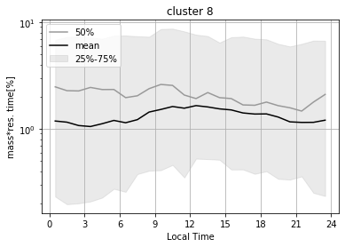


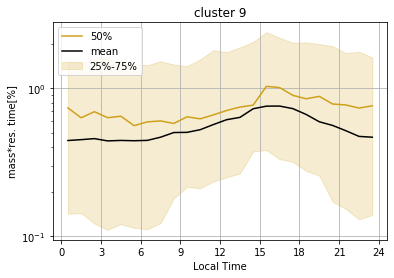


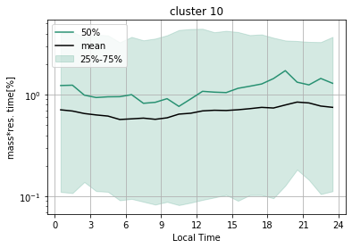


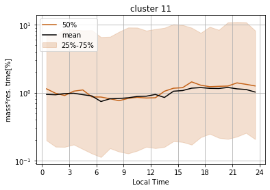


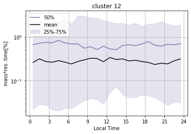


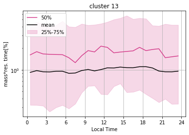


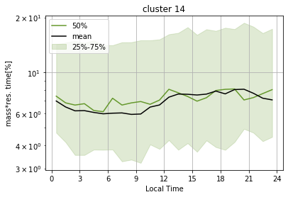


```python

```
