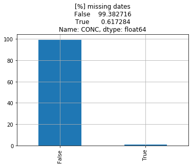
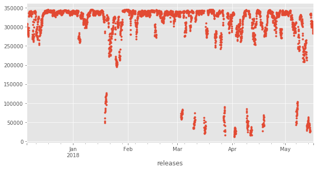
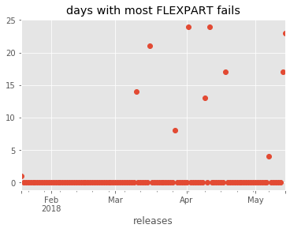

```python
from useful_scit.imps import *
```


```python
from useful_scit.imps import *
import flexpart_management.modules.FlexLogPol as FLP
import flexpart_management.modules.constants as co
import flexpart_management.modules.flx_array as fa

plt.style.use('ggplot')

from IPython.display import set_matplotlib_formats
set_matplotlib_formats('png')
```


```python
path = '/Volumes/mbProD/Downloads/flx_log_coor/run_2019-08-18_18-46-19_'
# flp = FLP.FlexLogPol(path,concat=True)
# self = FLP.FlexLogPol(path,concat=False)

self = FLP.FlexLogPol(
    path,
#     concat=True,
    concat=False,
    get_clusters=False,
    open_merged=True,
    clusters_avail=False
)
```

    'using vol for conc'


```python
ds = self.merged_ds
```


```python
ds
```


    <xarray.Dataset>
    Dimensions:        (R_CENTER: 36, TH_CENTER: 36, ZMID: 22, releases: 3864)
    Coordinates:
      * R_CENTER       (R_CENTER) float64 0.05613 0.06721 0.08046 ... 25.53 30.57
      * releases       (releases) datetime64[ns] 2017-12-06 ... 2018-05-16T23:00:00
      * TH_CENTER      (TH_CENTER) float64 0.08727 0.2618 0.4363 ... 6.021 6.196
        ZTOP           (ZMID) float64 50.0 100.0 200.0 300.0 ... 1e+04 2e+04 3e+04
        LAT            (R_CENTER, TH_CENTER) float64 ...
        LON            (R_CENTER, TH_CENTER) float64 ...
        LAT_00         (R_CENTER, TH_CENTER) float64 ...
        LON_00         (R_CENTER, TH_CENTER) float64 ...
        LAT_10         (R_CENTER, TH_CENTER) float64 ...
        LON_10         (R_CENTER, TH_CENTER) float64 ...
        LAT_11         (R_CENTER, TH_CENTER) float64 ...
        LON_11         (R_CENTER, TH_CENTER) float64 ...
        LAT_01         (R_CENTER, TH_CENTER) float64 ...
        LON_01         (R_CENTER, TH_CENTER) float64 ...
        GRIDAREA       (R_CENTER, TH_CENTER) float64 ...
        ZBOT           (ZMID) float64 0.0 50.0 100.0 200.0 ... 9e+03 1e+04 2e+04
      * ZMID           (ZMID) float64 25.0 75.0 150.0 ... 9.5e+03 1.5e+04 2.5e+04
        ZLEN_M         (ZMID) float64 50.0 50.0 100.0 100.0 ... 1e+03 1e+04 1e+04
        VOL            (R_CENTER, TH_CENTER, ZMID) float64 2.945e+07 ... 8.82e+15
    Data variables:
        CONC           (R_CENTER, TH_CENTER, releases, ZMID) float32 nan nan ... 0.0
        CONC_per       (R_CENTER, TH_CENTER, releases, ZMID) float32 nan nan ... 0.0
        CONC_conc      (R_CENTER, TH_CENTER, releases, ZMID) float64 nan nan ... 0.0
        CONC_conc_per  (R_CENTER, TH_CENTER, releases, ZMID) float64 nan nan ... 0.0
        TOPOGRAPHY     (R_CENTER, TH_CENTER) float32 4858.383 4967.62 ... 0.0 0.0


```python
_c = fa.get_dims_complement(ds,[co.RL])
ds_sum = ds.sum(_c)

_ds = ds_sum[co.CONC]

_ds = _ds.resample(**{co.RL:'1H'}).mean()

_n = _ds.isnull().to_dataframe()[co.CONC]

_vc = _n.value_counts()/_n.count() * 100

import pprint
_p = pprint.pformat(_vc,compact=True)

ax = _vc.plot.bar()
ax.set_title('[%] missing dates\n' + _p)
ax.grid(True)
# ax.figure
```





```python

```


```python
_pd = _ds.to_pandas()
ax = _pd.plot(
#     kind='',
    figsize=(10,5),
    linewidth=0,
    marker='.'
)
```





```python
ax = sns.distplot(_pd.dropna(),hist_kws=dict(cumulative=True),kde=False,norm_hist=True)
```


```python
pd1 = _pd[_pd<5e4]
```


```python
ind = pd1.index
```


```python
pd2 = pd1.resample('D').count()
ax = pd2.plot(marker='o',linewidth=0)
txt = ax.set_title('days with most FLEXPART fails')
```





```python
pd3 = pd2[pd2>0]
```


```python
pd3.sort_values(ascending=False)
```


    releases
    2018-04-11    24
    2018-04-02    24
    2018-05-14    23
    2018-03-16    21
    2018-05-13    17
    2018-04-18    17
    2018-03-10    14
    2018-04-09    13
    2018-03-27     8
    2018-05-07     4
    2018-01-19     1
    dtype: int64


```python
l = np.linspace(0,10,11)
```


```python
l
```


    array([ 0.,  1.,  2.,  3.,  4.,  5.,  6.,  7.,  8.,  9., 10.])


```python
l[None:None:None]
```


    array([ 0.,  1.,  2.,  3.,  4.,  5.,  6.,  7.,  8.,  9., 10.])


```python
sns.choose_colorbrewer_palette('q')
```


    interactive(children=(Dropdown(description='name', options=('Set1', 'Set2', 'Set3', 'Paired', 'Accent', 'Paste…


    [(0.8941176470588235, 0.10196078431372557, 0.10980392156862737),
     (0.21568627450980393, 0.4941176470588236, 0.7215686274509804),
     (0.3019607843137256, 0.6862745098039216, 0.29019607843137263),
     (0.5960784313725492, 0.3058823529411765, 0.6392156862745098),
     (1.0, 0.4980392156862745, 0.0),
     (0.9999999999999998, 1.0, 0.19999999999999996),
     (0.6509803921568629, 0.33725490196078434, 0.1568627450980391),
     (0.9686274509803922, 0.5058823529411766, 0.7490196078431374),
     (0.6, 0.6, 0.6)]


```python
sns.color_palette("Set2",3,as_cmap=True)
```


    ---------------------------------------------------------------------------

    TypeError                                 Traceback (most recent call last)

    <ipython-input-179-fa7e67fa2e10> in <module>
    ----> 1 sns.color_palette("Set2",3,as_cmap=True)
    

    TypeError: color_palette() got an unexpected keyword argument 'as_cmap'


```python
cmap = plt.cm.get_cmap('Set1',3)
```


```python
%connect_info
```

    {
      "shell_port": 51734,
      "iopub_port": 51735,
      "stdin_port": 51736,
      "control_port": 51737,
      "hb_port": 51738,
      "ip": "127.0.0.1",
      "key": "7732bc67-f69f2acd7b99565ab8890f3c",
      "transport": "tcp",
      "signature_scheme": "hmac-sha256",
      "kernel_name": ""
    }
    
    Paste the above JSON into a file, and connect with:
        $> jupyter <app> --existing <file>
    or, if you are local, you can connect with just:
        $> jupyter <app> --existing kernel-f7547e49-00c0-4733-a608-44de909b0974.json
    or even just:
        $> jupyter <app> --existing
    if this is the most recent Jupyter kernel you have started.


```python
from IPython import get_ipython
ipython = get_ipython()
```


```python
ipython.magic('load_ext autoreload')
```

    The autoreload extension is already loaded. To reload it, use:
      %reload_ext autoreload


```python

```
