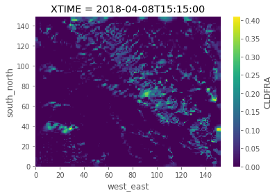
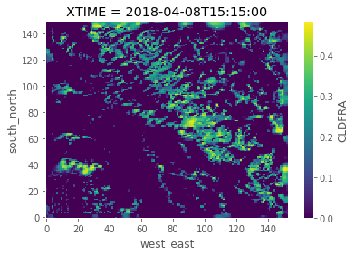
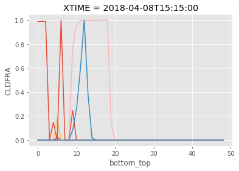
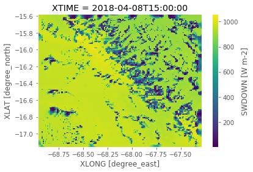

```python
%load_ext autoreload
%autoreload 2
from useful_scit.imps import *
import flexpart_management.modules.FlexLogPol as FLP
import flexpart_management.modules.constants as co
import flexpart_management.modules.flx_array as fa

plt.style.use('ggplot')

from IPython.display import set_matplotlib_formats
set_matplotlib_formats('png')
```

    reload


```python
import wrf
```


```python
file_path = '/private/tmp/wrfout_d04_2018-04-08_15:00:00'
```


```python
ds = xr.open_dataset(file_path)
```


```python
cf = 'CLDFRA'
bt = 'bottom_top'
sn = 'south_north'
we = 'west_east'
d1 = ds[cf].isel(Time=1)
d1
```


    <xarray.DataArray 'CLDFRA' (bottom_top: 49, south_north: 150, west_east: 153)>
    [1124550 values with dtype=float32]
    Coordinates:
        XLAT     (south_north, west_east) float32 ...
        XLONG    (south_north, west_east) float32 ...
        XTIME    datetime64[ns] ...
    Dimensions without coordinates: bottom_top, south_north, west_east
    Attributes:
        FieldType:    104
        MemoryOrder:  XYZ
        description:  CLOUD FRACTION
        units:        
        stagger:      


```python
d1.mean(bt).plot();
```





```python
d1.std(bt).plot();
```





```python
d2 = d1.stack(com=(sn,we))
```


```python
d2
```


    <xarray.DataArray 'CLDFRA' (bottom_top: 49, com: 22950)>
    array([[0., 0., 0., ..., 0., 0., 0.],
           [0., 0., 0., ..., 0., 0., 0.],
           [0., 0., 0., ..., 0., 0., 0.],
           ...,
           [0., 0., 0., ..., 0., 0., 0.],
           [0., 0., 0., ..., 0., 0., 0.],
           [0., 0., 0., ..., 0., 0., 0.]], dtype=float32)
    Coordinates:
        XLAT         (com) float32 -17.15197 -17.15197 ... -15.58474 -15.58474
        XLONG        (com) float32 -68.95856 -68.94759 ... -67.30312 -67.29216
        XTIME        datetime64[ns] ...
      * com          (com) MultiIndex
      - south_north  (com) int64 0 0 0 0 0 0 0 0 0 0 0 0 ... 0 0 0 0 0 0 0 0 0 0 0 0
      - west_east    (com) int64 0 1 2 3 4 5 6 7 8 9 ... 21 22 23 24 25 26 27 28 29
    Dimensions without coordinates: bottom_top
    Attributes:
        FieldType:    104
        MemoryOrder:  XYZ
        description:  CLOUD FRACTION
        units:        
        stagger:      


```python
d2[:,::1000].plot.line(hue='com',add_legend=False);
```





```python
ds['SWDOWN']
```


    <xarray.DataArray 'SWDOWN' (Time: 4, south_north: 150, west_east: 153)>
    array([[[ 955.3607 ,  955.39014, ...,  978.4422 ,  973.4342 ],
            [ 955.36786,  955.32587, ...,  975.87354,  978.859  ],
            ...,
            [ 960.0719 ,  962.4056 , ...,  884.2383 ,  883.88513],
            [ 959.25653,  960.474  , ...,  883.3915 ,  883.3026 ]],
    
           [[ 937.23016,  904.64404, ..., 1016.84686, 1011.5844 ],
            [ 936.82367,  965.8997 , ..., 1017.9973 , 1013.6499 ],
            ...,
            [ 990.8871 ,  993.1212 , ...,  910.5703 ,  910.15704],
            [ 990.0094 ,  991.11676, ...,  909.5668 ,  909.41815]],
    
           [[ 627.57227,  586.71185, ..., 1027.6101 , 1011.0773 ],
            [ 548.9021 ,  501.74792, ..., 1026.0366 , 1028.7985 ],
            ...,
            [1017.0129 , 1019.4899 , ...,  932.4488 ,  931.95996],
            [1015.9639 , 1017.29785, ...,  931.3257 ,  931.32007]],
    
           [[ 635.4135 ,  590.8062 , ..., 1058.1707 , 1042.2034 ],
            [ 598.28   ,  543.19086, ..., 1059.7262 , 1058.9124 ],
            ...,
            [1039.2703 , 1041.5455 , ...,  948.443  ,  948.10846],
            [1037.9103 , 1039.1282 , ...,  947.4946 ,  947.51654]]], dtype=float32)
    Coordinates:
        XLAT     (Time, south_north, west_east) float32 ...
        XLONG    (Time, south_north, west_east) float32 ...
        XTIME    (Time) datetime64[ns] ...
    Dimensions without coordinates: Time, south_north, west_east
    Attributes:
        FieldType:    104
        MemoryOrder:  XY 
        description:  DOWNWARD SHORT WAVE FLUX AT GROUND SURFACE
        units:        W m-2
        stagger:      


```python
ds['SWDOWN'][0].plot(x='XLONG',y='XLAT')
```


    <matplotlib.collections.QuadMesh at 0x126624fd0>





```python

```


```python

```
