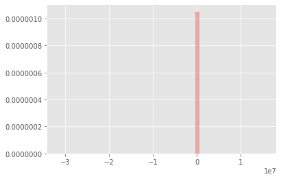

```python
%load_ext autoreload
%autoreload 2
from useful_scit.imps import *
import flexpart_management.modules.FlexLogPol as FLP
import flexpart_management.modules.constants as co
import flexpart_management.modules.flx_array as fa

plt.style.use('ggplot')

from IPython.display import set_matplotlib_formats
set_matplotlib_formats('png')
```

    reload


```python
from wrf_management.modules.pblh_recalc.wrf_variable_io import *
from wrf_management.modules.pblh_recalc.wrf_basic_analysis_vars import *
from wrf_management.modules.pblh_recalc.PBLH_recalc import *
from wrf_management.modules.pblh_recalc.PBLH_plot import *
import numpy as np
```


```python
# ~~~~~~~~~~~~~~~~ define important strings ~~~~~~~~~~~~~~~~~~~~~~~~
wrf_directory = './files' ##location of the wrf directory
file_name = 'wrfout_d02_2006-09-12_00:00:00' #wild card is supported if multiple wrf files are present

plot_richardson_direc = './richardson_plots/'
plot_temp_grad_direc = './temper_grad_plots/'
plot_real_wrf_pblh = './wrf_output_plots/'

##note to change this string for SINGLE FILE if wild card is used to extract across multiple files above^^
single_netcdf_file = wrf_directory+'/'+file_name ##location of a single wrfout file (needed for plotting)
```


```python

```


```python
wrf_directory = '/tmp'
file_name = 'wrfout_d04_2018-04-08_15:00:00'
```


```python
# ~~~~~~~~~~~~~~~~ define important lists ~~~~~~~~~~~~~~~~~~~~~~~~~~~

variables = ['theta','QVAPOR','ua','va','height','tv','PBLH']
static_variables = ['XLAT','XLONG']

# ~~~~~~~~~~~~~~~~~ extract variables ~~~~~~~~~~~~~~~~~~~~~~~~~~~~~~

##these values are extracted and saved in directories as described by 
## wrf_variable_io

tensor_directory = wrf_extract_var_tensor(wrf_directory, file_name,variables)

static_directory = wrf_extract_var_constants(wrf_directory,file_name,static_variables)

# ~~~~~~~~~~~~~~~~~~ load in variables needed for PBLH analysis ~~~~~~~~~~~~~~~~~~~~~~~
```

    /Users/diego/wrf_management/wrf_management/modules/pblh_recalc
    ------Extracting Variable theta------ 
    ------Extracting Variable QVAPOR------ 
    ------Extracting Variable ua------ 
    ------Extracting Variable va------ 
    ------Extracting Variable height------ 
    ------Extracting Variable tv------ 
    ------Extracting Variable PBLH------ 
    -----Extract Variables Finished----
    /Users/diego/wrf_management/wrf_management/modules/pblh_recalc
    /Users/diego/wrf_management/wrf_management/modules/pblh_recalc/exctracted_vars/ Directory Failed to Create. May be already present
    ------Extracting Variable XLAT------ 
    ------Extracting Variable XLONG------ 
    -----Extract Variables Finished----


```python
##Tensor variables
theta   = np.load(tensor_directory+'theta.npy')      #K
qvapor  = np.load(tensor_directory+'QVAPOR.npy')     #unitless
uwind   = np.load(tensor_directory+'ua.npy')         #m/s
vwind   = np.load(tensor_directory+'va.npy')         #m/s
height  = np.load(tensor_directory+'height.npy')     #m
tv      = np.load(tensor_directory+'tv.npy')         #k
PBLH    = np.load(tensor_directory+'PBLH.npy')       #m

## static variables
lats = np.load(static_directory+'XLAT.npy')                        #degrees
lons = np.load(static_directory+'XLONG.npy')                       #degrees

# ~~~~~~~~~~~~~~~~ Recalculation of important Variables ~~~~~~~~~~~~~~~~~~~~~~~~~~~~~~
##full descriptions found in wrf_basic_analysis_vars

##virtual potential temperature
theta_v = virtual_potential_temp(theta,qvapor)        #K
 
##richardson number, and corresponding heights of richardson number

# richardson_num,rich_num_height = richardson_number_surface(height,theta_v,uwind,vwind,tv,0)
richardson_num,rich_num_height = richardson_number_profiles(height,theta_v,uwind,vwind,tv,0)
```


```python
# ##temperature gradients 
# lapse_rate, lapse_rate_height = temperature_gradient(theta,height,2)

# # ~~~~~~~~~~~~~~~ Rediagnosing PBLH ~~~~~~~~~~~~~~~~~~~~~~~~~~~~~~~~
# ## Full descriptions can be found in PBLH_recalc

# PBLH_richardson_heights = PBLH_richardson(richardson_num, rich_num_height, 0.2)
# PBLH_temp_grad_heights = PBLH_temp_grad(lapse_rate, lapse_rate_height, 2)

# wrf_save_var(PBLH_richardson_heights, './recalculated_vars','PBLH_richardson')
# wrf_save_var(PBLH_temp_grad_heights, './recalculated_vars','PBLH_temp_grad')

# # ~~~~~~~~~~~~~~~~ Plotting Software ~~~~~~~~~~~~~~~~~~~~~~~~~~~~~~~

# PBLH_plot(PBLH_richardson_heights,lats,lons,single_netcdf_file,plot_richardson_direc)
# PBLH_plot(PBLH_temp_grad_heights,lats,lons,single_netcdf_file,plot_temp_grad_direc)
# PBLH_plot(PBLH,lats,lons,single_netcdf_file,plot_real_wrf_pblh)
```


```python
richardson_num.shape
```


    (4, 48, 150, 153)


```python
df = richardson_num.flatten()
df = pd.DataFrame(df).dropna()
```


```python
sns.distplot(df,kde=False,norm_hist=True)
```


    <matplotlib.axes._subplots.AxesSubplot at 0x12ada5f60>





```python
df.quantile([0,.01,.5,.99,1])
```


<div>
<style scoped>
    .dataframe tbody tr th:only-of-type {
        vertical-align: middle;
    }

    .dataframe tbody tr th {
        vertical-align: top;
    }

    .dataframe thead th {
        text-align: right;
    }
</style>
<table border="1" class="dataframe">
  <thead>
    <tr style="text-align: right;">
      <th></th>
      <th>0</th>
    </tr>
  </thead>
  <tbody>
    <tr>
      <th>0.00</th>
      <td>-3.181482e+07</td>
    </tr>
    <tr>
      <th>0.01</th>
      <td>-5.948875e+01</td>
    </tr>
    <tr>
      <th>0.50</th>
      <td>5.926604e+00</td>
    </tr>
    <tr>
      <th>0.99</th>
      <td>8.393899e+02</td>
    </tr>
    <tr>
      <th>1.00</th>
      <td>1.571791e+07</td>
    </tr>
  </tbody>
</table>
</div>


```python

```


```python
ds = xr.open_dataset(os.path.join(wrf_directory,file_name))
```


```python
ds[]
```


    <xarray.Dataset>
    Dimensions:                (Time: 4, bottom_top: 49, bottom_top_stag: 50, soil_layers_stag: 4, south_north: 150, south_north_stag: 151, west_east: 153, west_east_stag: 154)
    Coordinates:
        XLAT                   (Time, south_north, west_east) float32 ...
        XLONG                  (Time, south_north, west_east) float32 ...
        XTIME                  (Time) datetime64[ns] ...
        XLAT_U                 (Time, south_north, west_east_stag) float32 ...
        XLONG_U                (Time, south_north, west_east_stag) float32 ...
        XLAT_V                 (Time, south_north_stag, west_east) float32 ...
        XLONG_V                (Time, south_north_stag, west_east) float32 ...
    Dimensions without coordinates: Time, bottom_top, bottom_top_stag, soil_layers_stag, south_north, south_north_stag, west_east, west_east_stag
    Data variables:
        Times                  (Time) |S19 ...
        LU_INDEX               (Time, south_north, west_east) float32 ...
        ZNU                    (Time, bottom_top) float32 ...
        ZNW                    (Time, bottom_top_stag) float32 ...
        ZS                     (Time, soil_layers_stag) float32 ...
        DZS                    (Time, soil_layers_stag) float32 ...
        VAR_SSO                (Time, south_north, west_east) float32 ...
        U                      (Time, bottom_top, south_north, west_east_stag) float32 ...
        V                      (Time, bottom_top, south_north_stag, west_east) float32 ...
        W                      (Time, bottom_top_stag, south_north, west_east) float32 ...
        PH                     (Time, bottom_top_stag, south_north, west_east) float32 ...
        PHB                    (Time, bottom_top_stag, south_north, west_east) float32 ...
        T                      (Time, bottom_top, south_north, west_east) float32 ...
        THM                    (Time, bottom_top, south_north, west_east) float32 ...
        HFX_FORCE              (Time) float32 ...
        LH_FORCE               (Time) float32 ...
        TSK_FORCE              (Time) float32 ...
        HFX_FORCE_TEND         (Time) float32 ...
        LH_FORCE_TEND          (Time) float32 ...
        TSK_FORCE_TEND         (Time) float32 ...
        MU                     (Time, south_north, west_east) float32 ...
        MUB                    (Time, south_north, west_east) float32 ...
        NEST_POS               (Time, south_north, west_east) float32 ...
        P                      (Time, bottom_top, south_north, west_east) float32 ...
        PB                     (Time, bottom_top, south_north, west_east) float32 ...
        FNM                    (Time, bottom_top) float32 ...
        FNP                    (Time, bottom_top) float32 ...
        RDNW                   (Time, bottom_top) float32 ...
        RDN                    (Time, bottom_top) float32 ...
        DNW                    (Time, bottom_top) float32 ...
        DN                     (Time, bottom_top) float32 ...
        CFN                    (Time) float32 ...
        CFN1                   (Time) float32 ...
        THIS_IS_AN_IDEAL_RUN   (Time) int32 ...
        P_HYD                  (Time, bottom_top, south_north, west_east) float32 ...
        Q2                     (Time, south_north, west_east) float32 ...
        T2                     (Time, south_north, west_east) float32 ...
        TH2                    (Time, south_north, west_east) float32 ...
        PSFC                   (Time, south_north, west_east) float32 ...
        U10                    (Time, south_north, west_east) float32 ...
        V10                    (Time, south_north, west_east) float32 ...
        RDX                    (Time) float32 ...
        RDY                    (Time) float32 ...
        RESM                   (Time) float32 ...
        ZETATOP                (Time) float32 ...
        CF1                    (Time) float32 ...
        CF2                    (Time) float32 ...
        CF3                    (Time) float32 ...
        ITIMESTEP              (Time) int32 ...
        QVAPOR                 (Time, bottom_top, south_north, west_east) float32 ...
        QCLOUD                 (Time, bottom_top, south_north, west_east) float32 ...
        QRAIN                  (Time, bottom_top, south_north, west_east) float32 ...
        QICE                   (Time, bottom_top, south_north, west_east) float32 ...
        QSNOW                  (Time, bottom_top, south_north, west_east) float32 ...
        QGRAUP                 (Time, bottom_top, south_north, west_east) float32 ...
        SHDMAX                 (Time, south_north, west_east) float32 ...
        SHDMIN                 (Time, south_north, west_east) float32 ...
        SNOALB                 (Time, south_north, west_east) float32 ...
        TSLB                   (Time, soil_layers_stag, south_north, west_east) float32 ...
        SMOIS                  (Time, soil_layers_stag, south_north, west_east) float32 ...
        SH2O                   (Time, soil_layers_stag, south_north, west_east) float32 ...
        SMCREL                 (Time, soil_layers_stag, south_north, west_east) float32 ...
        SEAICE                 (Time, south_north, west_east) float32 ...
        XICEM                  (Time, south_north, west_east) float32 ...
        SFROFF                 (Time, south_north, west_east) float32 ...
        UDROFF                 (Time, south_north, west_east) float32 ...
        IVGTYP                 (Time, south_north, west_east) int32 ...
        ISLTYP                 (Time, south_north, west_east) int32 ...
        VEGFRA                 (Time, south_north, west_east) float32 ...
        GRDFLX                 (Time, south_north, west_east) float32 ...
        ACGRDFLX               (Time, south_north, west_east) float32 ...
        ACSNOM                 (Time, south_north, west_east) float32 ...
        SNOW                   (Time, south_north, west_east) float32 ...
        SNOWH                  (Time, south_north, west_east) float32 ...
        CANWAT                 (Time, south_north, west_east) float32 ...
        SSTSK                  (Time, south_north, west_east) float32 ...
        COSZEN                 (Time, south_north, west_east) float32 ...
        LAI                    (Time, south_north, west_east) float32 ...
        DTAUX3D                (Time, bottom_top, south_north, west_east) float32 ...
        DTAUY3D                (Time, bottom_top, south_north, west_east) float32 ...
        DUSFCG                 (Time, south_north, west_east) float32 ...
        DVSFCG                 (Time, south_north, west_east) float32 ...
        VAR                    (Time, south_north, west_east) float32 ...
        CON                    (Time, south_north, west_east) float32 ...
        OA1                    (Time, south_north, west_east) float32 ...
        OA2                    (Time, south_north, west_east) float32 ...
        OA3                    (Time, south_north, west_east) float32 ...
        OA4                    (Time, south_north, west_east) float32 ...
        OL1                    (Time, south_north, west_east) float32 ...
        OL2                    (Time, south_north, west_east) float32 ...
        OL3                    (Time, south_north, west_east) float32 ...
        OL4                    (Time, south_north, west_east) float32 ...
        TKE_PBL                (Time, bottom_top_stag, south_north, west_east) float32 ...
        EL_PBL                 (Time, bottom_top_stag, south_north, west_east) float32 ...
        MAPFAC_M               (Time, south_north, west_east) float32 ...
        MAPFAC_U               (Time, south_north, west_east_stag) float32 ...
        MAPFAC_V               (Time, south_north_stag, west_east) float32 ...
        MAPFAC_MX              (Time, south_north, west_east) float32 ...
        MAPFAC_MY              (Time, south_north, west_east) float32 ...
        MAPFAC_UX              (Time, south_north, west_east_stag) float32 ...
        MAPFAC_UY              (Time, south_north, west_east_stag) float32 ...
        MAPFAC_VX              (Time, south_north_stag, west_east) float32 ...
        MF_VX_INV              (Time, south_north_stag, west_east) float32 ...
        MAPFAC_VY              (Time, south_north_stag, west_east) float32 ...
        F                      (Time, south_north, west_east) float32 ...
        E                      (Time, south_north, west_east) float32 ...
        SINALPHA               (Time, south_north, west_east) float32 ...
        COSALPHA               (Time, south_north, west_east) float32 ...
        HGT                    (Time, south_north, west_east) float32 ...
        TSK                    (Time, south_north, west_east) float32 ...
        P_TOP                  (Time) float32 ...
        T00                    (Time) float32 ...
        P00                    (Time) float32 ...
        TLP                    (Time) float32 ...
        TISO                   (Time) float32 ...
        TLP_STRAT              (Time) float32 ...
        P_STRAT                (Time) float32 ...
        MAX_MSTFX              (Time) float32 ...
        MAX_MSTFY              (Time) float32 ...
        TLWDN                  (Time, south_north, west_east) float32 ...
        TLWUP                  (Time, south_north, west_east) float32 ...
        SLWDN                  (Time, south_north, west_east) float32 ...
        SLWUP                  (Time, south_north, west_east) float32 ...
        TSWDN                  (Time, south_north, west_east) float32 ...
        TSWUP                  (Time, south_north, west_east) float32 ...
        SSWDN                  (Time, south_north, west_east) float32 ...
        SSWUP                  (Time, south_north, west_east) float32 ...
        RAINC                  (Time, south_north, west_east) float32 ...
        RAINSH                 (Time, south_north, west_east) float32 ...
        RAINNC                 (Time, south_north, west_east) float32 ...
        SNOWNC                 (Time, south_north, west_east) float32 ...
        GRAUPELNC              (Time, south_north, west_east) float32 ...
        HAILNC                 (Time, south_north, west_east) float32 ...
        CLDFRA                 (Time, bottom_top, south_north, west_east) float32 ...
        SWDOWN                 (Time, south_north, west_east) float32 ...
        GLW                    (Time, south_north, west_east) float32 ...
        SWNORM                 (Time, south_north, west_east) float32 ...
        OLR                    (Time, south_north, west_east) float32 ...
        ALBEDO                 (Time, south_north, west_east) float32 ...
        CLAT                   (Time, south_north, west_east) float32 ...
        ALBBCK                 (Time, south_north, west_east) float32 ...
        EMISS                  (Time, south_north, west_east) float32 ...
        NOAHRES                (Time, south_north, west_east) float32 ...
        TMN                    (Time, south_north, west_east) float32 ...
        XLAND                  (Time, south_north, west_east) float32 ...
        UST                    (Time, south_north, west_east) float32 ...
        PBLH                   (Time, south_north, west_east) float32 ...
        HFX                    (Time, south_north, west_east) float32 ...
        QFX                    (Time, south_north, west_east) float32 ...
        LH                     (Time, south_north, west_east) float32 ...
        ACHFX                  (Time, south_north, west_east) float32 ...
        ACLHF                  (Time, south_north, west_east) float32 ...
        SNOWC                  (Time, south_north, west_east) float32 ...
        SR                     (Time, south_north, west_east) float32 ...
        SAVE_TOPO_FROM_REAL    (Time) int32 ...
        ISEEDARR_SPPT          (Time, bottom_top) int32 ...
        ISEEDARR_SKEBS         (Time, bottom_top) int32 ...
        ISEEDARR_RAND_PERTURB  (Time, bottom_top) int32 ...
        ISEEDARRAY_SPP_CONV    (Time, bottom_top) int32 ...
        ISEEDARRAY_SPP_PBL     (Time, bottom_top) int32 ...
        ISEEDARRAY_SPP_LSM     (Time, bottom_top) int32 ...
        C1H                    (Time, bottom_top) float32 ...
        C2H                    (Time, bottom_top) float32 ...
        C1F                    (Time, bottom_top_stag) float32 ...
        C2F                    (Time, bottom_top_stag) float32 ...
        C3H                    (Time, bottom_top) float32 ...
        C4H                    (Time, bottom_top) float32 ...
        C3F                    (Time, bottom_top_stag) float32 ...
        C4F                    (Time, bottom_top_stag) float32 ...
        PCB                    (Time, south_north, west_east) float32 ...
        PC                     (Time, south_north, west_east) float32 ...
        LANDMASK               (Time, south_north, west_east) float32 ...
        LAKEMASK               (Time, south_north, west_east) float32 ...
        SST                    (Time, south_north, west_east) float32 ...
        SST_INPUT              (Time, south_north, west_east) float32 ...
    Attributes:
        TITLE:                            OUTPUT FROM WRF V4.0.3 MODEL
        START_DATE:                      2018-04-08_15:00:00
        SIMULATION_START_DATE:           2017-12-02_00:00:00
        WEST-EAST_GRID_DIMENSION:        154
        SOUTH-NORTH_GRID_DIMENSION:      151
        BOTTOM-TOP_GRID_DIMENSION:       50
        DX:                              1055.5555
        DY:                              1055.5555
        AERCU_OPT:                       0
        AERCU_FCT:                       1.0
        IDEAL_CASE:                      0
        DIFF_6TH_SLOPEOPT:               0
        AUTO_LEVELS_OPT:                 2
        DIFF_6TH_THRESH:                 0.1
        DZBOT:                           50.0
        DZSTRETCH_S:                     1.3
        DZSTRETCH_U:                     1.1
        SKEBS_ON:                        0
        SPEC_BDY_FINAL_MU:               1
        USE_Q_DIABATIC:                  0
        GRIDTYPE:                        C
        DIFF_OPT:                        2
        KM_OPT:                          4
        DAMP_OPT:                        3
        DAMPCOEF:                        0.2
        KHDIF:                           0.0
        KVDIF:                           0.0
        MP_PHYSICS:                      7
        RA_LW_PHYSICS:                   5
        RA_SW_PHYSICS:                   5
        SF_SFCLAY_PHYSICS:               2
        SF_SURFACE_PHYSICS:              2
        BL_PBL_PHYSICS:                  2
        CU_PHYSICS:                      0
        SF_LAKE_PHYSICS:                 0
        SURFACE_INPUT_SOURCE:            1
        SST_UPDATE:                      1
        GRID_FDDA:                       0
        GFDDA_INTERVAL_M:                0
        GFDDA_END_H:                     0
        GRID_SFDDA:                      0
        SGFDDA_INTERVAL_M:               0
        SGFDDA_END_H:                    0
        HYPSOMETRIC_OPT:                 2
        USE_THETA_M:                     1
        GWD_OPT:                         1
        SF_URBAN_PHYSICS:                0
        SF_SURFACE_MOSAIC:               0
        SF_OCEAN_PHYSICS:                0
        SHCU_PHYSICS:                    0
        MFSHCONV:                        0
        FEEDBACK:                        0
        SMOOTH_OPTION:                   0
        SWRAD_SCAT:                      1.0
        W_DAMPING:                       1
        DT:                              2.5
        RADT:                            1.0
        BLDT:                            0.0
        CUDT:                            5.0
        AER_OPT:                         0
        SWINT_OPT:                       0
        AER_TYPE:                        1
        AER_AOD550_OPT:                  1
        AER_ANGEXP_OPT:                  1
        AER_SSA_OPT:                     1
        AER_ASY_OPT:                     1
        AER_AOD550_VAL:                  0.12
        AER_ANGEXP_VAL:                  1.3
        AER_SSA_VAL:                     0.85
        AER_ASY_VAL:                     0.9
        MOIST_ADV_OPT:                   1
        SCALAR_ADV_OPT:                  1
        TKE_ADV_OPT:                     1
        DIFF_6TH_OPT:                    0
        DIFF_6TH_FACTOR:                 0.12
        OBS_NUDGE_OPT:                   0
        BUCKET_MM:                       -1.0
        BUCKET_J:                        -1.0
        PREC_ACC_DT:                     0.0
        ISFTCFLX:                        0
        ISHALLOW:                        0
        ISFFLX:                          1
        ICLOUD:                          1
        ICLOUD_CU:                       0
        TRACER_PBLMIX:                   1
        SCALAR_PBLMIX:                   0
        YSU_TOPDOWN_PBLMIX:              0
        GRAV_SETTLING:                   0
        DFI_OPT:                         0
        SIMULATION_INITIALIZATION_TYPE:  REAL-DATA CASE
        WEST-EAST_PATCH_START_UNSTAG:    1
        WEST-EAST_PATCH_END_UNSTAG:      153
        WEST-EAST_PATCH_START_STAG:      1
        WEST-EAST_PATCH_END_STAG:        154
        SOUTH-NORTH_PATCH_START_UNSTAG:  1
        SOUTH-NORTH_PATCH_END_UNSTAG:    150
        SOUTH-NORTH_PATCH_START_STAG:    1
        SOUTH-NORTH_PATCH_END_STAG:      151
        BOTTOM-TOP_PATCH_START_UNSTAG:   1
        BOTTOM-TOP_PATCH_END_UNSTAG:     49
        BOTTOM-TOP_PATCH_START_STAG:     1
        BOTTOM-TOP_PATCH_END_STAG:       50
        GRID_ID:                         4
        PARENT_ID:                       3
        I_PARENT_START:                  61
        J_PARENT_START:                  110
        PARENT_GRID_RATIO:               3
        CEN_LAT:                         -16.369926
        CEN_LON:                         -68.12536
        TRUELAT1:                        30.0
        TRUELAT2:                        60.0
        MOAD_CEN_LAT:                    -17.000008
        STAND_LON:                       -66.3
        POLE_LAT:                        90.0
        POLE_LON:                        0.0
        GMT:                             0.0
        JULYR:                           2017
        JULDAY:                          336
        MAP_PROJ:                        3
        MAP_PROJ_CHAR:                   Mercator
        MMINLU:                          MODIFIED_IGBP_MODIS_NOAH
        NUM_LAND_CAT:                    21
        ISWATER:                         17
        ISLAKE:                          21
        ISICE:                           15
        ISURBAN:                         13
        ISOILWATER:                      14
        HYBRID_OPT:                      2
        ETAC:                            0.2


```python

```
