```python
%load_ext autoreload
%autoreload 2
```


```python
from useful_scit.imps import *
import flexpart_management.modules.FlexLogPol as FLP
import flexpart_management.modules.constants as co
import flexpart_management.modules.flx_array as fa
```

    reload


```python
path = '/Volumes/mbProD/Downloads/flx_log_coor/run_2019-08-18_18-46-19_'
# flp = FLP.FlexLogPol(path,concat=True)
# self = FLP.FlexLogPol(path,concat=False)
self = FLP.FlexLogPol(
    path,
#     concat=True,
    concat=False,
    get_clusters=False,
    open_merged=True,
    clusters_avail=False
)
```

    'using vol for conc'


```python
self.reset_z_levels()
```

    'using vol for conc'


```python
dsF= self.filter_hours_with_few_mea()
```


```python
dsSM = ds1 = FLP.smooth_merged_ds(dsF)
```

    (3888, 6, 35, 36)
    (3888, 6, 35, 36)
    (3888, 6, 35, 36)
    (3888, 6, 35, 36)


```python
cl = co.CPer
c1 =ds1[cl].sum([co.RL,co.ZM])
c2 = ds1[cl].sum([co.ZM,co.RL,co.TH_CENTER])
ar = c1/c2
# ar = c1
ar = ar.isel(**{co.R_CENTER:slice(0,-3)})
ax = fa.get_ax_bolivia(fig_args={'figsize':(5,5)})
fa.logpolar_plot(ar,name=co.CPer,ax=ax,perM=.95,perm=.01)
ax.set_xlim(-75,-60)
ax.set_ylim(-25,-7)
# ax = fa.get_ax_lapaz()
# fa.logpolar_plot(ar,name=co.CPer,ax=ax,perM=.95)
```


    (-25, -7)


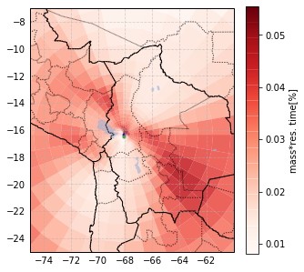


```python
ax.figure.savefig('/tmp/map.pdf')
```

# new part


```python
dsZ = dsSM
```


```python
dfcc = self.get_vector_df_for_clustering(self.coarsen_par,ar=dsZ[co.CONC])
```


```python
nc = 15
```


```python
dfres = self.python_cluster(n_cluster=nc,df=dfcc,return_df=True)
```


```python
dsZ[co.ClusFlag]=dfres[co.ClusFlag].to_xarray()
```


```python
dg = dsZ.assign_coords(**{co.ClusFlag:dsZ[co.ClusFlag],co.TOPO:dsZ[co.TOPO]})
dg = dg.groupby(co.ClusFlag)
dg = dg.sum('stacked_R_CENTER_TH_CENTER_ZMID')
```


```python
df = dg.to_dataframe()
```


```python
df1 = df[co.CPer]
```


```python
df2 = df1.unstack(co.ClusFlag)
```


```python
from IPython.display import set_matplotlib_formats
set_matplotlib_formats('svg')
```


```python
set_matplotlib_formats('png')
axs = df2.plot(subplots=True,sharex=True,sharey=True,color = FLP.COLORS,
              figsize=(10,5),layout=(int(np.ceil(nc/3)),3),grid=True,marker='.',linewidth=0,alpha=.1,
              legend=True)
df3= df2.rolling(45*24,center=True,min_periods=1,win_type='gaussian').mean(std=45*24)
axs = df3.plot(
    subplots=True,sharex=True,sharey=True,layout=(int(np.ceil(nc/3)), 3),color = FLP.COLORS,
    ylim = (0,50),grid=True,figsize=(10,5),linewidth=4,ax =axs,
    legend=False
              )
```

    /Users/diego/miniconda3/envs/b36/lib/python3.6/site-packages/pandas/plotting/_tools.py:203: UserWarning: When passing multiple axes, layout keyword is ignored
      "ignored", UserWarning)
    /Users/diego/miniconda3/envs/b36/lib/python3.6/site-packages/pandas/plotting/_core.py:1801: UserWarning: When passing multiple axes, sharex and sharey are ignored. These settings must be specified when creating axes
      plot_obj.generate()


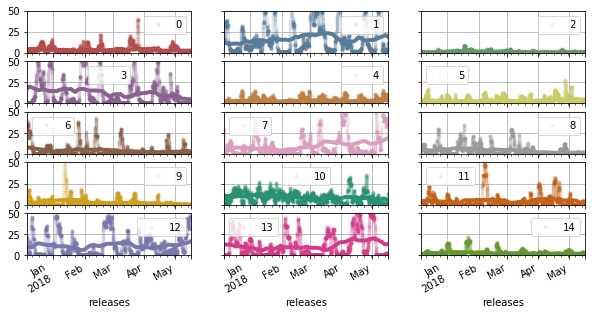


```python
axs = df2.plot.area(
    subplots=False,
    layout=(int(np.ceil(nc/3)), 3),color = FLP.COLORS,
    ylim = (0,100),grid=True,figsize=(20,10),linewidth=0,
    legend=False
              )

dd = df[bc]['2017-12':'2018-05']*10

dd.plot(
    marker=',',linewidth=0,
    figsize=(10,5),
    color='k'
)
std=24
res = dd.rolling(std,min_periods=int(std/4),center=True,win_type='gaussian').mean(std=.5*std)
ax=res.plot(figsize=(20,10),color='k',linewidth=2)
# ax.set_ylim(.1,8)
# ax.set_yscale('log')
std=24*30
res = dd.rolling(std,min_periods=int(std/4),center=True,win_type='gaussian').mean(std=.5*std)
ax=res.plot(figsize=(20,10),color='k',linewidth=2)
# ax.set_ylim(.1,8)
# ax.set_yscale('log')
```


    ---------------------------------------------------------------------------

    NameError                                 Traceback (most recent call last)

    <ipython-input-20-7413fc0cde68> in <module>
          6               )
          7 
    ----> 8 dd = df[bc]['2017-12':'2018-05']*10
          9 
         10 dd.plot(


    NameError: name 'bc' is not defined


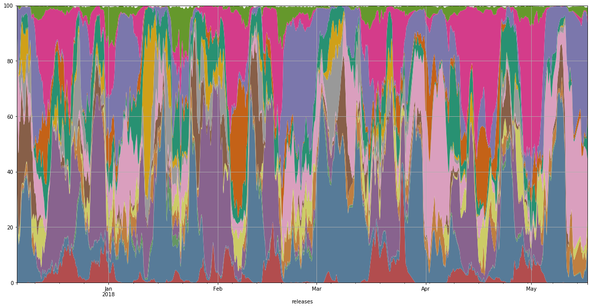


```python
# top = np.asscalar(
#     (dsZ[co.CPer]/c2).quantile(.9999)
# )
c2 = dsSM[co.CPer].sum([co.ZM,co.RL,co.TH_CENTER])
for ii in range(1):
    ax = fa.get_ax_bolivia(
        fig_args={'figsize':(5,5)})
    for i in range(nc):
        cmap = fa.get_custom_cmap(self.colors[i])
        ds1 = dsZ[co.CPer].where(dsZ[co.ClusFlag]==i)
        ds1 = ds1.isel(**{co.ZM:ii})
        ds2 = ds1.sum(co.RL)
        ex = ds2.sum().values > 0
        if ex:
            fa.logpolar_plot(
                ds2,name=co.CPer,ax=ax,perM=.99,perm=0,quantile=True,colorbar=False,
                patch_args={'cmap':cmap}
            )
    ax.set_xlim(-75,-60)
    ax.set_title(ii)
    yl=ax.set_ylim(-25,-7)
```


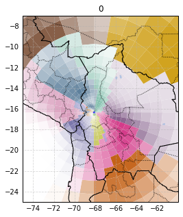


```python
ax.figure.savefig('/tmp/fig.pdf')
```


```python
ii=1
ds_fl = dsZ[co.CPer].where(dsZ[co.ClusFlag]==ii)
```


```python
ax = fa.get_ax_bolivia()
cmap = fa.get_custom_cmap(self.colors[ii])
fa.logpolar_plot(ds_fl.sum([co.RL,co.ZM]),
                 name=co.CPer,ax=ax,
                 patch_args={'cmap':cmap}
                )
ax.set_xlim(-75,-60)
yl=ax.set_ylim(-25,-7)
```


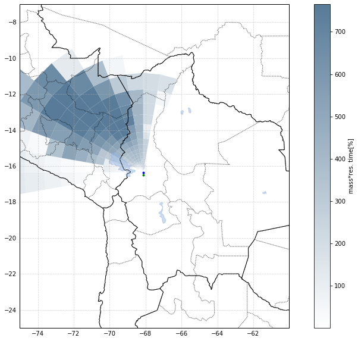


```python
import simplekml
```


```python
import simplekml
kml = simplekml.Kml()
```


```python
dsZ1 = dsZ.assign_coords(**{
    co.ClusFlag:dsZ[co.ClusFlag],
    co.TOPO:dsZ[co.TOPO].mean([co.RL,co.ZM])
})
```


```python
dsM = dsZ1.mean(co.RL)
```

    /Users/diego/miniconda3/envs/b36/lib/python3.6/site-packages/xarray/core/nanops.py:159: RuntimeWarning: Mean of empty slice
      return np.nanmean(a, axis=axis, dtype=dtype)


```python
dmm=dsM[co.CPer].mean([co.TH_CENTER,co.ZM])
dmmm = dmm.mean()
dsM1 = dsM.copy()
dsM1[co.CPer] = dsM[co.CPer]/(dmm+(.05*dmmm))
```


```python
dmm1=dsM1[co.CPer].mean([co.TH_CENTER,co.ZM])
dmm1.plot()
# (30*dmm).plot(ylim=(0,1))
```


    [<matplotlib.lines.Line2D at 0x1482bc390>]


```python
drop_coor_list = [co.LON,co.LAT,co.ZB,co.ZLM,co.ZT,co.VOL,co.GA]
```


```python
dfM = dsM1.drop(drop_coor_list)[co.CPer].to_dataframe().reset_index()
```


```python
r = dfM.iloc[100]
kml = simplekml.Kml()
sr =dfM[co.CPer]
max_col=sr[sr>0].quantile(.95)
low_thr=sr[sr>0].quantile(.4)
```


```python
max_col,low_thr
```


    (2.8530092092964714, 0.3537986185006874)


```python
def polygon_from_row(r,kml:simplekml.Kml, max_col,low_thr):
    col = 255*np.array(FLP.COLORS[int(r[co.ClusFlag])])
#     col = 255-col
    col = col.astype('int16')
    col = list(col)
    _z  = (r[co.ZM] ) + r[co.TOPO]
    _z = 0
    points1 = [
        (r[co.LON_00], r[co.LAT_00],_z),
        (r[co.LON_10], r[co.LAT_10],_z),
        (r[co.LON_11], r[co.LAT_11],_z),
        (r[co.LON_01], r[co.LAT_01],_z)
#         (r[co.LON_00], r[co.LAT_00],_z),
    ]
    points2 = [
        (r[co.LON_00], r[co.LAT_00],_z),
#         (r[co.LON_10], r[co.LAT_10],_z),
        (r[co.LON_11], r[co.LAT_11],_z),
        (r[co.LON_01], r[co.LAT_01],_z),
        (r[co.LON_00], r[co.LAT_00],_z),
    ]    
    def make_pol(points):
        pol = kml.newpolygon(
            name = str(r.name),
            outerboundaryis = points,
            altitudemode = simplekml.AltitudeMode.clamptoground
        )

#         alpha= (255/max_col) * r[co.CPer]
#         alpha = min(int(alpha),255)
#         alpha = 255


#         pol.style.polystyle.color = simplekml.Color.rgb(*col,alpha)
        pol.style.polystyle.color = simplekml.Color.white
        pol.style.polystyle.outline = 1
        pol.style.polystyle.fill = 0 
#     if r[co.CPer]>low_thr:
    if True:
        make_pol(points1)
#         make_pol(points2)
    
   
    
    return col
```


```python

```


```python
kmlT = simplekml.Kml()
for ii in range(1):
#     _df = dfM[dfM[co.ClusFlag]==ii]
    _df = dfM[dfM.ZMID == 250]
    kml = simplekml.Kml()
    sr =dfM[co.CPer]
    max_col=sr[sr>0].quantile(.95)
    res = _df.iloc[:].apply(lambda x: polygon_from_row(x,kml,max_col,low_thr),axis = 1)
    res = _df.iloc[:].apply(lambda x: polygon_from_row(x,kmlT,max_col,low_thr),axis = 1)
    kml.save('/tmp/clus'+'lines'+'.kml')
# kmlT.save('/tmp/clusT.kml')
```


```python

```


```python
dg=dsM1.groupby(co.ClusFlag)
dd = []
ll = []
for l,ds in dg:
    dd.append(ds.unstack().drop(co.ClusFlag))
    ll.append(l) 
dc = xr.concat(dd,pd.Index(ll,name=co.ClusFlag))
```


```python

```


```python
dsum = dc[co.CPer].sum([co.TH_CENTER,co.ZM])
```


```python
dres = (dc[co.CPer].sum([co.TH_CENTER])*dc[co.ZM]).sum(co.ZM)/dsum
```


```python
dr1 = dres.where(dsum>.5)
dr1.name = co.CPer
df1 = dr1.to_dataframe().unstack(co.ClusFlag)
```


```python
cols = df1.columns.levels[-1].values
```


```python
mks = ['o','1','v','8','s','p','P','*','h','+','x','D','X','o','1','v']
for c in cols:
    ax = df1[co.CPer][c].plot(
            color = FLP.COLORS[c],
        marker=mks[c],
    #               legend=False,
                  logy=True,
                linewidth=2,
                  logx=True,
                  figsize=(10,5),
        label=c
                 )
ax.set_xlim(.05,50)
ax.legend()
```


    <matplotlib.legend.Legend at 0x11cd0bf98>


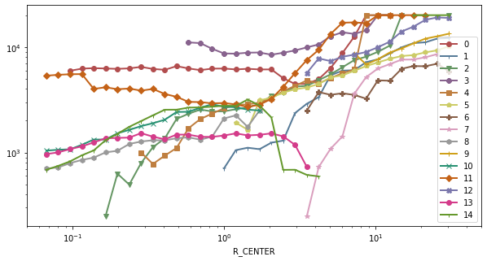


```python

```


```python
res = dsZ1[co.CPer].groupby(co.ClusFlag).sum()
res = 100*res /res.sum()
res = res.to_dataframe()
```

    /Users/diego/miniconda3/envs/b36/lib/python3.6/site-packages/xarray/core/groupby.py:639: FutureWarning: Default reduction dimension will be changed to the grouped dimension in a future version of xarray. To silence this warning, pass dim=xarray.ALL_DIMS explicitly.
      skipna=skipna, allow_lazy=True, **kwargs)


```python
res.reset_index().plot.bar(x=co.ClusFlag,y=co.CPer,color = FLP.COLORS)
```


    <matplotlib.axes._subplots.AxesSubplot at 0x131f6ef60>


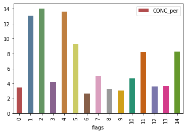


```python
hour = dsZ1[co.RL].to_dataframe()
hour['hour'] = (hour.index + pd.Timedelta(-4,'hour')).hour
hour = hour['hour'].to_xarray()
dsZ1 = dsZ1.assign_coords(**{'hours':hour})
```


```python

```


```python
for i in range(nc):
    bo = (dsZ1[co.ClusFlag]==i)
    res = dsZ1[co.CPer].where(bo).sel(
        **{co.R_CENTER:slice(0,.5),co.ZM:slice(0,100000)}
    ).sum([co.TH_CENTER,co.R_CENTER,co.ZM]).groupby('hours').median()
    res.plot(color=FLP.COLORS[i],linewidth=4)
```


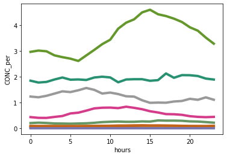


```python

```


```python
path_bc = '/Users/diego/JUP/co_bc/data/horiba_chc_corrected_diego.csv'
```


```python
bc,CO,h  = 'abs670','CO_ppbv','hour'
lh = 'Local Time'
dt = 'date'
df = pd.read_csv(path_bc)
df[lh]=np.mod(df[h]-4,24)
```


```python
df[dt] = pd.to_datetime(df[dt])
df = df.set_index(dt)
```


```python
desc = df.groupby(lh)[bc].describe()
```


```python
desc['50%'].plot()
```


    <matplotlib.axes._subplots.AxesSubplot at 0x15aab5240>


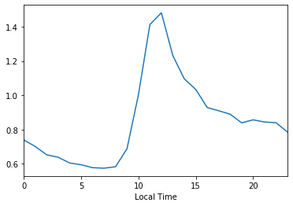


```python

```


    (0.1, 8)


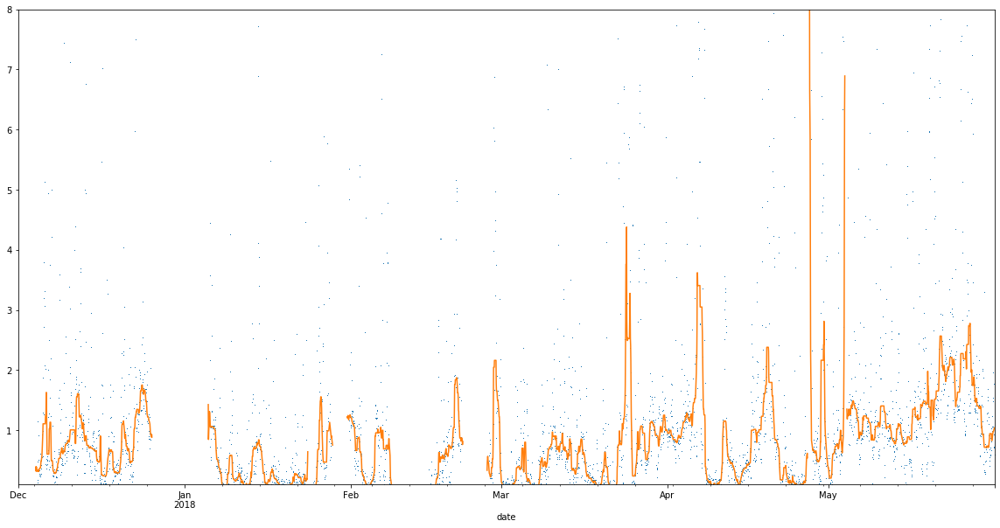


```python
dd = df[bc]['2017-12':'2018-05']

dd.plot(
    marker=',',linewidth=0,
    figsize=(10,5)
)
std=24
res = dd.rolling(std,min_periods=int(std/4),center=True).median()
ax=res.plot()
# ax.set_ylim(.1,12)
# ax.set_yscale('log')
```


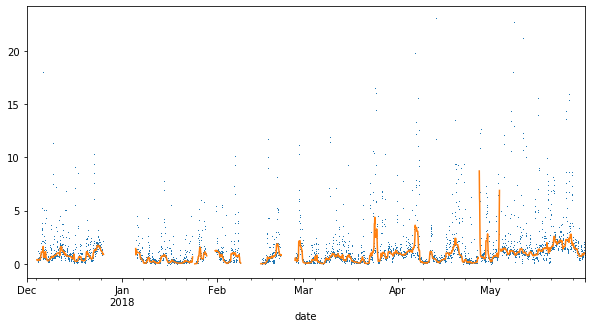


```python
axs = df2.plot.area(
    subplots=False,
    layout=(int(np.ceil(nc/3)), 3),color = FLP.COLORS,
    ylim = (0,100),grid=True,figsize=(20,10),linewidth=0,
    legend=False
              )

dd = df[bc]['2017-12':'2018-05']*10

dd.plot(
    marker=',',linewidth=0,
    figsize=(10,5),
    color='k'
)
std=24
resI = res = dd.rolling(std,min_periods=int(std/4),center=True,win_type='gaussian').mean(std=.5*std)
ax=res.plot(figsize=(20,10),color='k',linewidth=2)
# ax.set_ylim(.1,8)
# ax.set_yscale('log')
std=24*30
res = dd.rolling(std,min_periods=int(std/4),center=True,win_type='gaussian').mean(std=.5*std)
ax=res.plot(figsize=(20,10),color='k',linewidth=2)
# ax.set_ylim(.1,8)
```


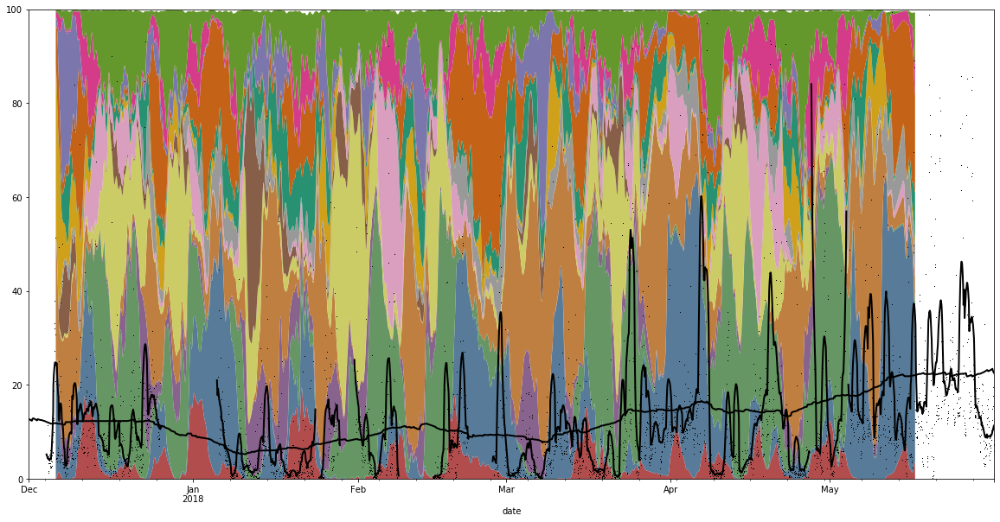


```python
aa = pd.DataFrame(df2.stack())
# aa.name=co.CPer
aa=aa.rename(index=str,columns={0:co.CPer})
# aa=aa.to_xarray()
```


```python
# aa[co.RL].values=pd.to_datetime(aa[co.RL].values)
```


```python
aa
```


    <xarray.Dataset>
    Dimensions:   (flags: 15, releases: 3888)
    Coordinates:
      * releases  (releases) datetime64[ns] 2017-12-06 ... 2018-05-16T23:00:00
      * flags     (flags) object '0' '1' '10' '11' '12' '13' ... '5' '6' '7' '8' '9'
    Data variables:
        CONC_per  (releases, flags) float32 0.15840915 18.477314 ... 0.96156096
        abs670    (releases) float64 nan nan nan nan nan nan ... nan nan nan nan nan


```python
dd.index.name=co.RL
```


```python
dd.name=bc
```


```python
aa[bc]=dd.to_xarray()
```


```python
dfa=aa.sel(**{co.ClusFlag:'0'}).to_dataframe()
dfa.plot(x=co.CPer,y=bc)
```


    <matplotlib.axes._subplots.AxesSubplot at 0x15c4cf940>


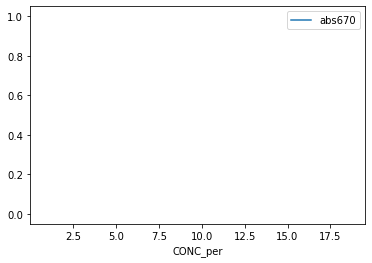


```python
resI.plot()
```


    <matplotlib.axes._subplots.AxesSubplot at 0x131317400>


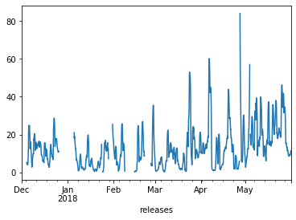


```python
resI.index.name = co.RL
res2 = pd.merge(resI,aa,left_index=True,right_index=True)
```


```python
for i in range(nc):
    f,a=plt.subplots()
    tr=res2[res2.index.get_level_values(co.ClusFlag) == str(i)]
    # tr.plot.scatter(x=co.CPer,y=bc,loglog=True,alpha=.01,xlim=(1,100),ylim=(.1,100))
    ax=sns.regplot(y=co.CPer,x=bc,data=tr,scatter_kws={'alpha':.1},
                   lowess=False)
#     ax.set_yscale('log')
#     ax.set_xscale('log')
    ax.set_ylim(1,100)
    ax.set_xlim(.1,50)
```


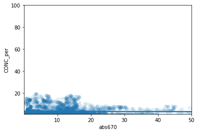


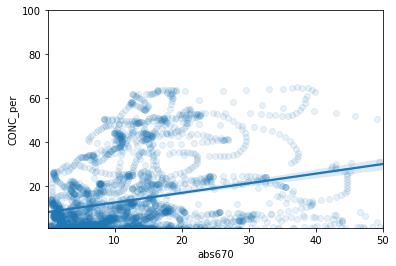


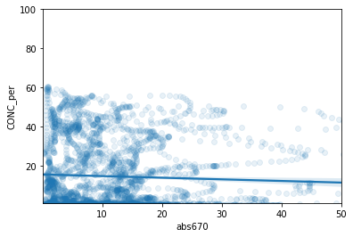


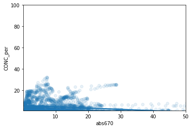


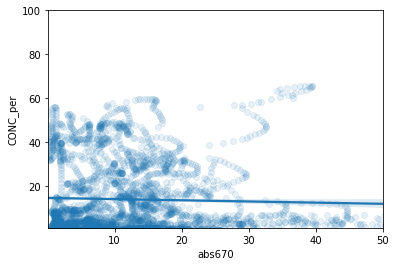


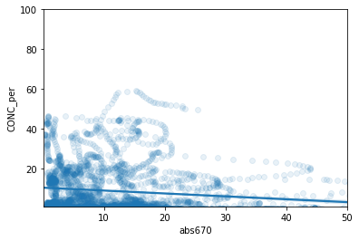


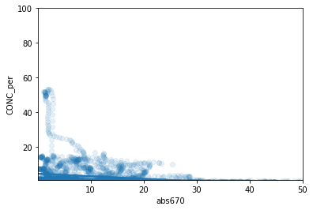


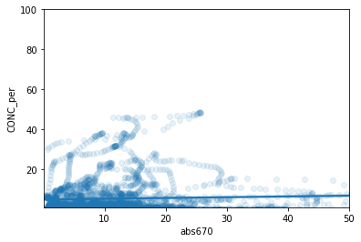


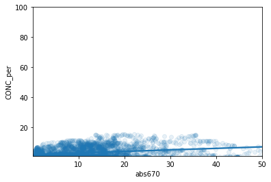


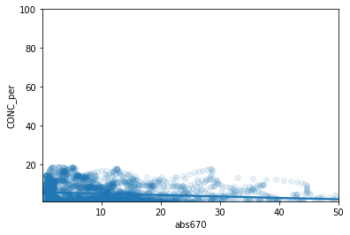


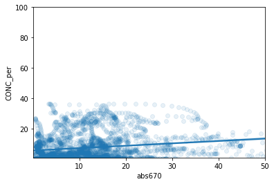


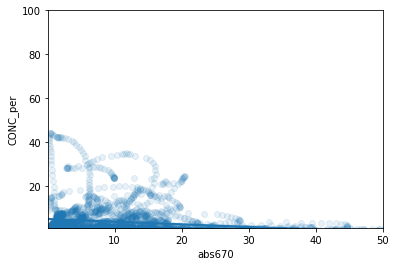


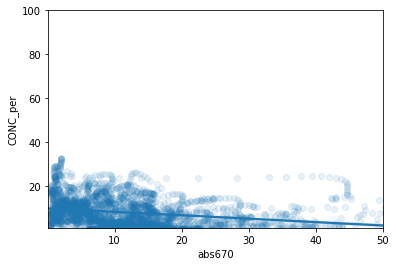


```python
import scipy.optimize.nnls as nnls
```


```python

```


```python
res2=res2.dropna()
```


```python
A = res2[co.CPer].unstack().values
```


```python
A = dsZ1[co.CPer].to_dataframe()[co.CPer]
```


```python
aa = A[co.CPer].dropna()
```


```python
at = A.unstack(co.RL).T
```


```python
aabb=pd.merge(at,dd,left_index=True,right_index=True)
aabb = aabb.dropna(axis=0,subset=[bc])
aabb = aabb.dropna(axis=0,subset=cl,how='all')
```

    /Users/diego/miniconda3/envs/b36/lib/python3.6/site-packages/pandas/core/reshape/merge.py:522: UserWarning: merging between different levels can give an unintended result (3 levels on the left, 1 on the right)
      warnings.warn(msg, UserWarning)


```python
aabb[aabb.isnull()]=0
```


```python
b = aabb[bc]
bv = b.values
```


```python
cl = aabb.columns[:-1]
A = aabb[cl]
Av = A.values
```


```python
b = res2[bc].unstack()['1'].values
```


```python
b
```


    Series([], Name: abs670, dtype: float64)


```python
# res = nnls(A,b)
res = nnls(Av[:],bv[:])
```


```python
r0 =res[0]
r1=r0[r0>20]
```


```python
sns.distplot(r1)
```


    <matplotlib.axes._subplots.AxesSubplot at 0x130fa8da0>


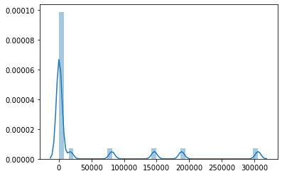


```python
cols =res2[co.CPer].unstack().columns.values
```


```python
r1 = pd.Series(res[0],index=cols)
```


```python
r1.plot.bar()
```


    <matplotlib.axes._subplots.AxesSubplot at 0x14ebc5630>


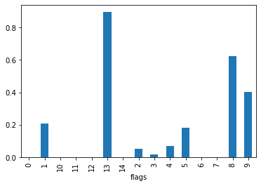


```python
r1.index.name=co.ClusFlag
```


```python
r2=(res2[co.CPer]*r1)
```


```python
r2.unstack()
```


<div>
<style scoped>
    .dataframe tbody tr th:only-of-type {
        vertical-align: middle;
    }

    .dataframe tbody tr th {
        vertical-align: top;
    }

    .dataframe thead th {
        text-align: right;
    }
</style>
<table border="1" class="dataframe">
  <thead>
    <tr style="text-align: right;">
      <th>flags</th>
      <th>0</th>
      <th>1</th>
      <th>10</th>
      <th>11</th>
      <th>12</th>
      <th>13</th>
      <th>14</th>
      <th>2</th>
      <th>3</th>
      <th>4</th>
      <th>5</th>
      <th>6</th>
      <th>7</th>
      <th>8</th>
      <th>9</th>
    </tr>
    <tr>
      <th>releases</th>
      <th></th>
      <th></th>
      <th></th>
      <th></th>
      <th></th>
      <th></th>
      <th></th>
      <th></th>
      <th></th>
      <th></th>
      <th></th>
      <th></th>
      <th></th>
      <th></th>
      <th></th>
    </tr>
  </thead>
  <tbody>
    <tr>
      <th>2017-12-06 00:00:00</th>
      <td>0.0</td>
      <td>3.819554</td>
      <td>0.0</td>
      <td>0.0</td>
      <td>0.0</td>
      <td>0.840128</td>
      <td>0.0</td>
      <td>0.005065</td>
      <td>0.004175</td>
      <td>2.100410</td>
      <td>0.012025</td>
      <td>0.0</td>
      <td>0.0</td>
      <td>0.717705</td>
      <td>14.484265</td>
    </tr>
    <tr>
      <th>2017-12-06 01:00:00</th>
      <td>0.0</td>
      <td>4.059379</td>
      <td>0.0</td>
      <td>0.0</td>
      <td>0.0</td>
      <td>0.921566</td>
      <td>0.0</td>
      <td>0.004605</td>
      <td>0.003760</td>
      <td>2.014088</td>
      <td>0.011071</td>
      <td>0.0</td>
      <td>0.0</td>
      <td>0.717758</td>
      <td>14.337210</td>
    </tr>
    <tr>
      <th>2017-12-06 02:00:00</th>
      <td>0.0</td>
      <td>4.325191</td>
      <td>0.0</td>
      <td>0.0</td>
      <td>0.0</td>
      <td>1.033765</td>
      <td>0.0</td>
      <td>0.004088</td>
      <td>0.003359</td>
      <td>1.907734</td>
      <td>0.010021</td>
      <td>0.0</td>
      <td>0.0</td>
      <td>0.705932</td>
      <td>14.161860</td>
    </tr>
    <tr>
      <th>2017-12-06 03:00:00</th>
      <td>0.0</td>
      <td>4.588842</td>
      <td>0.0</td>
      <td>0.0</td>
      <td>0.0</td>
      <td>1.178349</td>
      <td>0.0</td>
      <td>0.003579</td>
      <td>0.003094</td>
      <td>1.785348</td>
      <td>0.009069</td>
      <td>0.0</td>
      <td>0.0</td>
      <td>0.677927</td>
      <td>13.976564</td>
    </tr>
    <tr>
      <th>2017-12-06 04:00:00</th>
      <td>0.0</td>
      <td>4.817064</td>
      <td>0.0</td>
      <td>0.0</td>
      <td>0.0</td>
      <td>1.353830</td>
      <td>0.0</td>
      <td>0.003166</td>
      <td>0.003137</td>
      <td>1.653324</td>
      <td>0.008510</td>
      <td>0.0</td>
      <td>0.0</td>
      <td>0.632021</td>
      <td>13.806456</td>
    </tr>
    <tr>
      <th>2017-12-06 05:00:00</th>
      <td>0.0</td>
      <td>4.977661</td>
      <td>0.0</td>
      <td>0.0</td>
      <td>0.0</td>
      <td>1.555616</td>
      <td>0.0</td>
      <td>0.002947</td>
      <td>0.003719</td>
      <td>1.519490</td>
      <td>0.008724</td>
      <td>0.0</td>
      <td>0.0</td>
      <td>0.570044</td>
      <td>13.676783</td>
    </tr>
    <tr>
      <th>2017-12-06 06:00:00</th>
      <td>0.0</td>
      <td>5.045263</td>
      <td>0.0</td>
      <td>0.0</td>
      <td>0.0</td>
      <td>1.776277</td>
      <td>0.0</td>
      <td>0.003017</td>
      <td>0.005114</td>
      <td>1.391872</td>
      <td>0.010143</td>
      <td>0.0</td>
      <td>0.0</td>
      <td>0.497163</td>
      <td>13.605092</td>
    </tr>
    <tr>
      <th>2017-12-06 07:00:00</th>
      <td>0.0</td>
      <td>5.005558</td>
      <td>0.0</td>
      <td>0.0</td>
      <td>0.0</td>
      <td>2.005895</td>
      <td>0.0</td>
      <td>0.003444</td>
      <td>0.007615</td>
      <td>1.277438</td>
      <td>0.013175</td>
      <td>0.0</td>
      <td>0.0</td>
      <td>0.420515</td>
      <td>13.595205</td>
    </tr>
    <tr>
      <th>2017-12-06 08:00:00</th>
      <td>0.0</td>
      <td>4.857558</td>
      <td>0.0</td>
      <td>0.0</td>
      <td>0.0</td>
      <td>2.232706</td>
      <td>0.0</td>
      <td>0.004260</td>
      <td>0.011480</td>
      <td>1.181025</td>
      <td>0.018124</td>
      <td>0.0</td>
      <td>0.0</td>
      <td>0.347278</td>
      <td>13.635576</td>
    </tr>
    <tr>
      <th>2017-12-06 09:00:00</th>
      <td>0.0</td>
      <td>4.613850</td>
      <td>0.0</td>
      <td>0.0</td>
      <td>0.0</td>
      <td>2.444442</td>
      <td>0.0</td>
      <td>0.005445</td>
      <td>0.016862</td>
      <td>1.104696</td>
      <td>0.025080</td>
      <td>0.0</td>
      <td>0.0</td>
      <td>0.282942</td>
      <td>13.702232</td>
    </tr>
    <tr>
      <th>2017-12-06 10:00:00</th>
      <td>0.0</td>
      <td>4.298773</td>
      <td>0.0</td>
      <td>0.0</td>
      <td>0.0</td>
      <td>2.630367</td>
      <td>0.0</td>
      <td>0.006929</td>
      <td>0.023733</td>
      <td>1.047728</td>
      <td>0.033844</td>
      <td>0.0</td>
      <td>0.0</td>
      <td>0.230405</td>
      <td>13.765165</td>
    </tr>
    <tr>
      <th>2017-12-06 11:00:00</th>
      <td>0.0</td>
      <td>3.944439</td>
      <td>0.0</td>
      <td>0.0</td>
      <td>0.0</td>
      <td>2.783364</td>
      <td>0.0</td>
      <td>0.008596</td>
      <td>0.031853</td>
      <td>1.007260</td>
      <td>0.043922</td>
      <td>0.0</td>
      <td>0.0</td>
      <td>0.190029</td>
      <td>13.795674</td>
    </tr>
    <tr>
      <th>2017-12-06 12:00:00</th>
      <td>0.0</td>
      <td>3.584893</td>
      <td>0.0</td>
      <td>0.0</td>
      <td>0.0</td>
      <td>2.900933</td>
      <td>0.0</td>
      <td>0.010312</td>
      <td>0.040787</td>
      <td>0.979416</td>
      <td>0.054599</td>
      <td>0.0</td>
      <td>0.0</td>
      <td>0.160449</td>
      <td>13.771712</td>
    </tr>
    <tr>
      <th>2017-12-06 13:00:00</th>
      <td>0.0</td>
      <td>3.249647</td>
      <td>0.0</td>
      <td>0.0</td>
      <td>0.0</td>
      <td>2.984352</td>
      <td>0.0</td>
      <td>0.011945</td>
      <td>0.050004</td>
      <td>0.960526</td>
      <td>0.065117</td>
      <td>0.0</td>
      <td>0.0</td>
      <td>0.139664</td>
      <td>13.679644</td>
    </tr>
    <tr>
      <th>2017-12-06 14:00:00</th>
      <td>0.0</td>
      <td>2.958126</td>
      <td>0.0</td>
      <td>0.0</td>
      <td>0.0</td>
      <td>3.036283</td>
      <td>0.0</td>
      <td>0.013389</td>
      <td>0.059007</td>
      <td>0.948032</td>
      <td>0.074872</td>
      <td>0.0</td>
      <td>0.0</td>
      <td>0.126051</td>
      <td>13.511928</td>
    </tr>
    <tr>
      <th>2017-12-06 15:00:00</th>
      <td>0.0</td>
      <td>2.716845</td>
      <td>0.0</td>
      <td>0.0</td>
      <td>0.0</td>
      <td>3.058058</td>
      <td>0.0</td>
      <td>0.014573</td>
      <td>0.067460</td>
      <td>0.940840</td>
      <td>0.083575</td>
      <td>0.0</td>
      <td>0.0</td>
      <td>0.119117</td>
      <td>13.262768</td>
    </tr>
    <tr>
      <th>2017-12-06 16:00:00</th>
      <td>0.0</td>
      <td>2.520094</td>
      <td>0.0</td>
      <td>0.0</td>
      <td>0.0</td>
      <td>3.048222</td>
      <td>0.0</td>
      <td>0.015468</td>
      <td>0.075238</td>
      <td>0.939145</td>
      <td>0.091287</td>
      <td>0.0</td>
      <td>0.0</td>
      <td>0.120024</td>
      <td>12.924499</td>
    </tr>
    <tr>
      <th>2017-12-06 17:00:00</th>
      <td>0.0</td>
      <td>2.353838</td>
      <td>0.0</td>
      <td>0.0</td>
      <td>0.0</td>
      <td>3.003158</td>
      <td>0.0</td>
      <td>0.016069</td>
      <td>0.082371</td>
      <td>0.943897</td>
      <td>0.098309</td>
      <td>0.0</td>
      <td>0.0</td>
      <td>0.131958</td>
      <td>12.487501</td>
    </tr>
    <tr>
      <th>2017-12-06 18:00:00</th>
      <td>0.0</td>
      <td>2.201413</td>
      <td>0.0</td>
      <td>0.0</td>
      <td>0.0</td>
      <td>2.919390</td>
      <td>0.0</td>
      <td>0.016387</td>
      <td>0.088909</td>
      <td>0.956205</td>
      <td>0.104962</td>
      <td>0.0</td>
      <td>0.0</td>
      <td>0.160315</td>
      <td>11.944402</td>
    </tr>
    <tr>
      <th>2017-12-06 19:00:00</th>
      <td>0.0</td>
      <td>2.049074</td>
      <td>0.0</td>
      <td>0.0</td>
      <td>0.0</td>
      <td>2.796158</td>
      <td>0.0</td>
      <td>0.016436</td>
      <td>0.094774</td>
      <td>0.976848</td>
      <td>0.111354</td>
      <td>0.0</td>
      <td>0.0</td>
      <td>0.212438</td>
      <td>11.296693</td>
    </tr>
    <tr>
      <th>2017-12-06 20:00:00</th>
      <td>0.0</td>
      <td>1.889705</td>
      <td>0.0</td>
      <td>0.0</td>
      <td>0.0</td>
      <td>2.636739</td>
      <td>0.0</td>
      <td>0.016231</td>
      <td>0.099674</td>
      <td>1.006028</td>
      <td>0.117236</td>
      <td>0.0</td>
      <td>0.0</td>
      <td>0.296534</td>
      <td>10.560071</td>
    </tr>
    <tr>
      <th>2017-12-06 21:00:00</th>
      <td>0.0</td>
      <td>1.723777</td>
      <td>0.0</td>
      <td>0.0</td>
      <td>0.0</td>
      <td>2.447787</td>
      <td>0.0</td>
      <td>0.015779</td>
      <td>0.103129</td>
      <td>1.043311</td>
      <td>0.122026</td>
      <td>0.0</td>
      <td>0.0</td>
      <td>0.419523</td>
      <td>9.765368</td>
    </tr>
    <tr>
      <th>2017-12-06 22:00:00</th>
      <td>0.0</td>
      <td>1.557669</td>
      <td>0.0</td>
      <td>0.0</td>
      <td>0.0</td>
      <td>2.237260</td>
      <td>0.0</td>
      <td>0.015090</td>
      <td>0.104622</td>
      <td>1.087711</td>
      <td>0.124993</td>
      <td>0.0</td>
      <td>0.0</td>
      <td>0.584037</td>
      <td>8.953864</td>
    </tr>
    <tr>
      <th>2017-12-06 23:00:00</th>
      <td>0.0</td>
      <td>1.400346</td>
      <td>0.0</td>
      <td>0.0</td>
      <td>0.0</td>
      <td>2.012319</td>
      <td>0.0</td>
      <td>0.014176</td>
      <td>0.103789</td>
      <td>1.137792</td>
      <td>0.125540</td>
      <td>0.0</td>
      <td>0.0</td>
      <td>0.785425</td>
      <td>8.168510</td>
    </tr>
    <tr>
      <th>2017-12-07 00:00:00</th>
      <td>0.0</td>
      <td>1.259877</td>
      <td>0.0</td>
      <td>0.0</td>
      <td>0.0</td>
      <td>1.778581</td>
      <td>0.0</td>
      <td>0.013062</td>
      <td>0.100590</td>
      <td>1.191737</td>
      <td>0.123461</td>
      <td>0.0</td>
      <td>0.0</td>
      <td>1.010112</td>
      <td>7.444489</td>
    </tr>
    <tr>
      <th>2017-12-07 01:00:00</th>
      <td>0.0</td>
      <td>1.140996</td>
      <td>0.0</td>
      <td>0.0</td>
      <td>0.0</td>
      <td>1.540947</td>
      <td>0.0</td>
      <td>0.011795</td>
      <td>0.095374</td>
      <td>1.247369</td>
      <td>0.119068</td>
      <td>0.0</td>
      <td>0.0</td>
      <td>1.236512</td>
      <td>6.802655</td>
    </tr>
    <tr>
      <th>2017-12-07 02:00:00</th>
      <td>0.0</td>
      <td>1.044398</td>
      <td>0.0</td>
      <td>0.0</td>
      <td>0.0</td>
      <td>1.305221</td>
      <td>0.0</td>
      <td>0.010441</td>
      <td>0.088822</td>
      <td>1.302183</td>
      <td>0.113138</td>
      <td>0.0</td>
      <td>0.0</td>
      <td>1.438880</td>
      <td>6.247678</td>
    </tr>
    <tr>
      <th>2017-12-07 03:00:00</th>
      <td>0.0</td>
      <td>0.967603</td>
      <td>0.0</td>
      <td>0.0</td>
      <td>0.0</td>
      <td>1.079071</td>
      <td>0.0</td>
      <td>0.009081</td>
      <td>0.081784</td>
      <td>1.353508</td>
      <td>0.106703</td>
      <td>0.0</td>
      <td>0.0</td>
      <td>1.593167</td>
      <td>5.771075</td>
    </tr>
    <tr>
      <th>2017-12-07 04:00:00</th>
      <td>0.0</td>
      <td>0.906705</td>
      <td>0.0</td>
      <td>0.0</td>
      <td>0.0</td>
      <td>0.871512</td>
      <td>0.0</td>
      <td>0.007798</td>
      <td>0.075084</td>
      <td>1.398854</td>
      <td>0.100754</td>
      <td>0.0</td>
      <td>0.0</td>
      <td>1.682887</td>
      <td>5.357046</td>
    </tr>
    <tr>
      <th>2017-12-07 05:00:00</th>
      <td>0.0</td>
      <td>0.858160</td>
      <td>0.0</td>
      <td>0.0</td>
      <td>0.0</td>
      <td>0.691103</td>
      <td>0.0</td>
      <td>0.006655</td>
      <td>0.069349</td>
      <td>1.436383</td>
      <td>0.095988</td>
      <td>0.0</td>
      <td>0.0</td>
      <td>1.702872</td>
      <td>4.989081</td>
    </tr>
    <tr>
      <th>...</th>
      <td>...</td>
      <td>...</td>
      <td>...</td>
      <td>...</td>
      <td>...</td>
      <td>...</td>
      <td>...</td>
      <td>...</td>
      <td>...</td>
      <td>...</td>
      <td>...</td>
      <td>...</td>
      <td>...</td>
      <td>...</td>
      <td>...</td>
    </tr>
    <tr>
      <th>2018-05-15 18:00:00</th>
      <td>0.0</td>
      <td>10.394220</td>
      <td>0.0</td>
      <td>0.0</td>
      <td>0.0</td>
      <td>1.953603</td>
      <td>0.0</td>
      <td>0.004559</td>
      <td>0.000115</td>
      <td>0.187683</td>
      <td>0.002741</td>
      <td>0.0</td>
      <td>0.0</td>
      <td>4.723120</td>
      <td>0.408878</td>
    </tr>
    <tr>
      <th>2018-05-15 19:00:00</th>
      <td>0.0</td>
      <td>10.486057</td>
      <td>0.0</td>
      <td>0.0</td>
      <td>0.0</td>
      <td>1.807055</td>
      <td>0.0</td>
      <td>0.004421</td>
      <td>0.000155</td>
      <td>0.195207</td>
      <td>0.003602</td>
      <td>0.0</td>
      <td>0.0</td>
      <td>4.716990</td>
      <td>0.418497</td>
    </tr>
    <tr>
      <th>2018-05-15 20:00:00</th>
      <td>0.0</td>
      <td>10.529446</td>
      <td>0.0</td>
      <td>0.0</td>
      <td>0.0</td>
      <td>1.708257</td>
      <td>0.0</td>
      <td>0.004380</td>
      <td>0.000197</td>
      <td>0.202863</td>
      <td>0.004468</td>
      <td>0.0</td>
      <td>0.0</td>
      <td>4.697291</td>
      <td>0.421343</td>
    </tr>
    <tr>
      <th>2018-05-15 21:00:00</th>
      <td>0.0</td>
      <td>10.530597</td>
      <td>0.0</td>
      <td>0.0</td>
      <td>0.0</td>
      <td>1.673211</td>
      <td>0.0</td>
      <td>0.004436</td>
      <td>0.000235</td>
      <td>0.209856</td>
      <td>0.005220</td>
      <td>0.0</td>
      <td>0.0</td>
      <td>4.661592</td>
      <td>0.419978</td>
    </tr>
    <tr>
      <th>2018-05-15 22:00:00</th>
      <td>0.0</td>
      <td>10.500224</td>
      <td>0.0</td>
      <td>0.0</td>
      <td>0.0</td>
      <td>1.709147</td>
      <td>0.0</td>
      <td>0.004581</td>
      <td>0.000264</td>
      <td>0.215462</td>
      <td>0.005745</td>
      <td>0.0</td>
      <td>0.0</td>
      <td>4.608741</td>
      <td>0.417783</td>
    </tr>
    <tr>
      <th>2018-05-15 23:00:00</th>
      <td>0.0</td>
      <td>10.451196</td>
      <td>0.0</td>
      <td>0.0</td>
      <td>0.0</td>
      <td>1.816132</td>
      <td>0.0</td>
      <td>0.004808</td>
      <td>0.000280</td>
      <td>0.219083</td>
      <td>0.005960</td>
      <td>0.0</td>
      <td>0.0</td>
      <td>4.535536</td>
      <td>0.418453</td>
    </tr>
    <tr>
      <th>2018-05-16 00:00:00</th>
      <td>0.0</td>
      <td>10.395287</td>
      <td>0.0</td>
      <td>0.0</td>
      <td>0.0</td>
      <td>1.990149</td>
      <td>0.0</td>
      <td>0.005110</td>
      <td>0.000282</td>
      <td>0.220321</td>
      <td>0.005841</td>
      <td>0.0</td>
      <td>0.0</td>
      <td>4.435627</td>
      <td>0.425429</td>
    </tr>
    <tr>
      <th>2018-05-16 01:00:00</th>
      <td>0.0</td>
      <td>10.340546</td>
      <td>0.0</td>
      <td>0.0</td>
      <td>0.0</td>
      <td>2.225896</td>
      <td>0.0</td>
      <td>0.005486</td>
      <td>0.000269</td>
      <td>0.219055</td>
      <td>0.005428</td>
      <td>0.0</td>
      <td>0.0</td>
      <td>4.300982</td>
      <td>0.441319</td>
    </tr>
    <tr>
      <th>2018-05-16 02:00:00</th>
      <td>0.0</td>
      <td>10.290221</td>
      <td>0.0</td>
      <td>0.0</td>
      <td>0.0</td>
      <td>2.517482</td>
      <td>0.0</td>
      <td>0.005941</td>
      <td>0.000247</td>
      <td>0.215483</td>
      <td>0.004808</td>
      <td>0.0</td>
      <td>0.0</td>
      <td>4.125098</td>
      <td>0.467432</td>
    </tr>
    <tr>
      <th>2018-05-16 03:00:00</th>
      <td>0.0</td>
      <td>10.243360</td>
      <td>0.0</td>
      <td>0.0</td>
      <td>0.0</td>
      <td>2.856352</td>
      <td>0.0</td>
      <td>0.006481</td>
      <td>0.000220</td>
      <td>0.210115</td>
      <td>0.004088</td>
      <td>0.0</td>
      <td>0.0</td>
      <td>3.906607</td>
      <td>0.503543</td>
    </tr>
    <tr>
      <th>2018-05-16 04:00:00</th>
      <td>0.0</td>
      <td>10.196757</td>
      <td>0.0</td>
      <td>0.0</td>
      <td>0.0</td>
      <td>3.227369</td>
      <td>0.0</td>
      <td>0.007103</td>
      <td>0.000191</td>
      <td>0.203706</td>
      <td>0.003367</td>
      <td>0.0</td>
      <td>0.0</td>
      <td>3.651768</td>
      <td>0.547964</td>
    </tr>
    <tr>
      <th>2018-05-16 05:00:00</th>
      <td>0.0</td>
      <td>10.147037</td>
      <td>0.0</td>
      <td>0.0</td>
      <td>0.0</td>
      <td>3.605556</td>
      <td>0.0</td>
      <td>0.007790</td>
      <td>0.000166</td>
      <td>0.197159</td>
      <td>0.002715</td>
      <td>0.0</td>
      <td>0.0</td>
      <td>3.374959</td>
      <td>0.597887</td>
    </tr>
    <tr>
      <th>2018-05-16 06:00:00</th>
      <td>0.0</td>
      <td>10.092015</td>
      <td>0.0</td>
      <td>0.0</td>
      <td>0.0</td>
      <td>3.956254</td>
      <td>0.0</td>
      <td>0.008516</td>
      <td>0.000147</td>
      <td>0.191411</td>
      <td>0.002172</td>
      <td>0.0</td>
      <td>0.0</td>
      <td>3.096900</td>
      <td>0.649892</td>
    </tr>
    <tr>
      <th>2018-05-16 07:00:00</th>
      <td>0.0</td>
      <td>10.030705</td>
      <td>0.0</td>
      <td>0.0</td>
      <td>0.0</td>
      <td>4.240259</td>
      <td>0.0</td>
      <td>0.009276</td>
      <td>0.000136</td>
      <td>0.187326</td>
      <td>0.001745</td>
      <td>0.0</td>
      <td>0.0</td>
      <td>2.841166</td>
      <td>0.700407</td>
    </tr>
    <tr>
      <th>2018-05-16 08:00:00</th>
      <td>0.0</td>
      <td>9.962044</td>
      <td>0.0</td>
      <td>0.0</td>
      <td>0.0</td>
      <td>4.422973</td>
      <td>0.0</td>
      <td>0.010114</td>
      <td>0.000135</td>
      <td>0.185620</td>
      <td>0.001429</td>
      <td>0.0</td>
      <td>0.0</td>
      <td>2.629961</td>
      <td>0.745991</td>
    </tr>
    <tr>
      <th>2018-05-16 09:00:00</th>
      <td>0.0</td>
      <td>9.883080</td>
      <td>0.0</td>
      <td>0.0</td>
      <td>0.0</td>
      <td>4.484430</td>
      <td>0.0</td>
      <td>0.011172</td>
      <td>0.000147</td>
      <td>0.186805</td>
      <td>0.001209</td>
      <td>0.0</td>
      <td>0.0</td>
      <td>2.480163</td>
      <td>0.783429</td>
    </tr>
    <tr>
      <th>2018-05-16 10:00:00</th>
      <td>0.0</td>
      <td>9.787527</td>
      <td>0.0</td>
      <td>0.0</td>
      <td>0.0</td>
      <td>4.426302</td>
      <td>0.0</td>
      <td>0.012721</td>
      <td>0.000176</td>
      <td>0.191179</td>
      <td>0.001077</td>
      <td>0.0</td>
      <td>0.0</td>
      <td>2.400397</td>
      <td>0.809753</td>
    </tr>
    <tr>
      <th>2018-05-16 11:00:00</th>
      <td>0.0</td>
      <td>9.665725</td>
      <td>0.0</td>
      <td>0.0</td>
      <td>0.0</td>
      <td>4.273003</td>
      <td>0.0</td>
      <td>0.015165</td>
      <td>0.000228</td>
      <td>0.198820</td>
      <td>0.001026</td>
      <td>0.0</td>
      <td>0.0</td>
      <td>2.389672</td>
      <td>0.822389</td>
    </tr>
    <tr>
      <th>2018-05-16 12:00:00</th>
      <td>0.0</td>
      <td>9.506155</td>
      <td>0.0</td>
      <td>0.0</td>
      <td>0.0</td>
      <td>4.066751</td>
      <td>0.0</td>
      <td>0.019020</td>
      <td>0.000307</td>
      <td>0.209597</td>
      <td>0.001058</td>
      <td>0.0</td>
      <td>0.0</td>
      <td>2.437837</td>
      <td>0.819500</td>
    </tr>
    <tr>
      <th>2018-05-16 13:00:00</th>
      <td>0.0</td>
      <td>9.298545</td>
      <td>0.0</td>
      <td>0.0</td>
      <td>0.0</td>
      <td>3.858433</td>
      <td>0.0</td>
      <td>0.024846</td>
      <td>0.000418</td>
      <td>0.223174</td>
      <td>0.001173</td>
      <td>0.0</td>
      <td>0.0</td>
      <td>2.527893</td>
      <td>0.800483</td>
    </tr>
    <tr>
      <th>2018-05-16 14:00:00</th>
      <td>0.0</td>
      <td>9.037362</td>
      <td>0.0</td>
      <td>0.0</td>
      <td>0.0</td>
      <td>3.697449</td>
      <td>0.0</td>
      <td>0.033143</td>
      <td>0.000562</td>
      <td>0.239018</td>
      <td>0.001366</td>
      <td>0.0</td>
      <td>0.0</td>
      <td>2.639808</td>
      <td>0.766382</td>
    </tr>
    <tr>
      <th>2018-05-16 15:00:00</th>
      <td>0.0</td>
      <td>8.724665</td>
      <td>0.0</td>
      <td>0.0</td>
      <td>0.0</td>
      <td>3.623154</td>
      <td>0.0</td>
      <td>0.044224</td>
      <td>0.000738</td>
      <td>0.256416</td>
      <td>0.001627</td>
      <td>0.0</td>
      <td>0.0</td>
      <td>2.754958</td>
      <td>0.720004</td>
    </tr>
    <tr>
      <th>2018-05-16 16:00:00</th>
      <td>0.0</td>
      <td>8.371216</td>
      <td>0.0</td>
      <td>0.0</td>
      <td>0.0</td>
      <td>3.659221</td>
      <td>0.0</td>
      <td>0.058079</td>
      <td>0.000936</td>
      <td>0.274518</td>
      <td>0.001935</td>
      <td>0.0</td>
      <td>0.0</td>
      <td>2.859976</td>
      <td>0.665595</td>
    </tr>
    <tr>
      <th>2018-05-16 17:00:00</th>
      <td>0.0</td>
      <td>7.995215</td>
      <td>0.0</td>
      <td>0.0</td>
      <td>0.0</td>
      <td>3.811156</td>
      <td>0.0</td>
      <td>0.074288</td>
      <td>0.001144</td>
      <td>0.292425</td>
      <td>0.002261</td>
      <td>0.0</td>
      <td>0.0</td>
      <td>2.948813</td>
      <td>0.608122</td>
    </tr>
    <tr>
      <th>2018-05-16 18:00:00</th>
      <td>0.0</td>
      <td>7.619153</td>
      <td>0.0</td>
      <td>0.0</td>
      <td>0.0</td>
      <td>4.066609</td>
      <td>0.0</td>
      <td>0.092003</td>
      <td>0.001348</td>
      <td>0.309307</td>
      <td>0.002573</td>
      <td>0.0</td>
      <td>0.0</td>
      <td>3.022351</td>
      <td>0.552393</td>
    </tr>
    <tr>
      <th>2018-05-16 19:00:00</th>
      <td>0.0</td>
      <td>7.265557</td>
      <td>0.0</td>
      <td>0.0</td>
      <td>0.0</td>
      <td>4.398250</td>
      <td>0.0</td>
      <td>0.110057</td>
      <td>0.001535</td>
      <td>0.324504</td>
      <td>0.002845</td>
      <td>0.0</td>
      <td>0.0</td>
      <td>3.085852</td>
      <td>0.502267</td>
    </tr>
    <tr>
      <th>2018-05-16 20:00:00</th>
      <td>0.0</td>
      <td>6.953011</td>
      <td>0.0</td>
      <td>0.0</td>
      <td>0.0</td>
      <td>4.769079</td>
      <td>0.0</td>
      <td>0.127170</td>
      <td>0.001694</td>
      <td>0.337603</td>
      <td>0.003056</td>
      <td>0.0</td>
      <td>0.0</td>
      <td>3.145362</td>
      <td>0.460186</td>
    </tr>
    <tr>
      <th>2018-05-16 21:00:00</th>
      <td>0.0</td>
      <td>6.693374</td>
      <td>0.0</td>
      <td>0.0</td>
      <td>0.0</td>
      <td>5.139569</td>
      <td>0.0</td>
      <td>0.142217</td>
      <td>0.001821</td>
      <td>0.348434</td>
      <td>0.003201</td>
      <td>0.0</td>
      <td>0.0</td>
      <td>3.204617</td>
      <td>0.427084</td>
    </tr>
    <tr>
      <th>2018-05-16 22:00:00</th>
      <td>0.0</td>
      <td>6.490860</td>
      <td>0.0</td>
      <td>0.0</td>
      <td>0.0</td>
      <td>5.475265</td>
      <td>0.0</td>
      <td>0.154457</td>
      <td>0.001915</td>
      <td>0.357029</td>
      <td>0.003286</td>
      <td>0.0</td>
      <td>0.0</td>
      <td>3.263689</td>
      <td>0.402633</td>
    </tr>
    <tr>
      <th>2018-05-16 23:00:00</th>
      <td>0.0</td>
      <td>6.342812</td>
      <td>0.0</td>
      <td>0.0</td>
      <td>0.0</td>
      <td>5.752817</td>
      <td>0.0</td>
      <td>0.163641</td>
      <td>0.001980</td>
      <td>0.363558</td>
      <td>0.003325</td>
      <td>0.0</td>
      <td>0.0</td>
      <td>3.319621</td>
      <td>0.385662</td>
    </tr>
  </tbody>
</table>
<p>3274 rows × 15 columns</p>
</div>


```python

```
