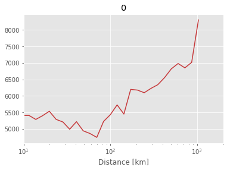
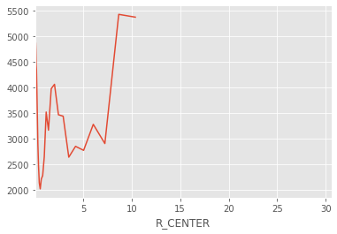

```python
v1 = np.array([10,20,30])
v2 = np.array([3,4,5])
```


```python
def f1(v1,v2):
    print(v1)
    print(v2)
#     return v1*v2
    return 0
```


```python
f1v = np.vectorize(f1)
```


```python
f1v1 = np.vectorize(f1,excluded=['v1'])
```


```python
f1v(v1,v2)
```

    10
    3
    10
    3
    20
    4
    30
    5


    array([0, 0, 0])


```python
np.zeros()
```


    <function numpy.zeros>


```python
f1v1(v1,v2)
```

    10
    3
    10
    3
    20
    4
    30
    5


    array([0, 0, 0])


```python
f1v1(v1=v1,v2=v2)
```

    [10 20 30]
    3
    [10 20 30]
    3
    [10 20 30]
    4
    [10 20 30]
    5


    array([0, 0, 0])


```python
_dm
```


    <xarray.DataArray 'CONC_NORMALIZED' (releases: 972, dum: 4)>
    array([[0., 0., 0., 0.],
           [0., 0., 0., 0.],
           [0., 0., 0., 0.],
           ...,
           [0., 0., 0., 0.],
           [0., 0., 0., 0.],
           [0., 0., 0., 0.]], dtype=float32)
    Coordinates:
      * releases   (releases) datetime64[ns] 2017-12-06T01:30:00 ... 2018-05-16T21:30:00
      * dum        (dum) MultiIndex
      - R_CENTER   (dum) float64 0.05613 0.05613 0.05613 0.05613
      - TH_CENTER  (dum) float64 0.08727 0.08727 0.08727 0.08727
      - ZMID       (dum) float64 250.0 1e+03 2.5e+03 5.25e+03


```python
k.reshape(-1,1).T
```


    array([[19, 19, 19, 19]], dtype=int32)


```python

```


```python
_sil_sc.sel(**{CLUS_LENGTH_DIM:3}) = 3
```


      File "<ipython-input-1331-23134f8c3240>", line 1
        _sil_sc.sel(**{CLUS_LENGTH_DIM:3}) = 3
                                              ^
    SyntaxError: can't assign to function call


```python
=4
```


    ---------------------------------------------------------------------------

    KeyError                                  Traceback (most recent call last)

    ~/miniconda3/envs/b36/lib/python3.6/site-packages/pandas/core/indexes/base.py in get_loc(self, key, method, tolerance)
       2896             try:
    -> 2897                 return self._engine.get_loc(key)
       2898             except KeyError:


    pandas/_libs/index.pyx in pandas._libs.index.IndexEngine.get_loc()


    pandas/_libs/index.pyx in pandas._libs.index.IndexEngine.get_loc()


    pandas/_libs/hashtable_class_helper.pxi in pandas._libs.hashtable.Int64HashTable.get_item()


    pandas/_libs/hashtable_class_helper.pxi in pandas._libs.hashtable.Int64HashTable.get_item()


    KeyError: 1

    
    During handling of the above exception, another exception occurred:


    KeyError                                  Traceback (most recent call last)

    <ipython-input-1341-224148b5b60a> in <module>
    ----> 1 _sil_sc.loc[{CLUS_LENGTH_DIM:1}]=4
    

    ~/miniconda3/envs/b36/lib/python3.6/site-packages/xarray/core/dataarray.py in __setitem__(self, key, value)
        132             key = dict(zip(self.data_array.dims, labels))
        133 
    --> 134         pos_indexers, _ = remap_label_indexers(self.data_array, **key)
        135         self.data_array[pos_indexers] = value
        136 


    ~/miniconda3/envs/b36/lib/python3.6/site-packages/xarray/core/coordinates.py in remap_label_indexers(obj, indexers, method, tolerance, **indexers_kwargs)
        323 
        324     pos_indexers, new_indexes = indexing.remap_label_indexers(
    --> 325         obj, v_indexers, method=method, tolerance=tolerance
        326     )
        327     # attach indexer's coordinate to pos_indexers


    ~/miniconda3/envs/b36/lib/python3.6/site-packages/xarray/core/indexing.py in remap_label_indexers(data_obj, indexers, method, tolerance)
        250         else:
        251             idxr, new_idx = convert_label_indexer(index, label,
    --> 252                                                   dim, method, tolerance)
        253             pos_indexers[dim] = idxr
        254             if new_idx is not None:


    ~/miniconda3/envs/b36/lib/python3.6/site-packages/xarray/core/indexing.py in convert_label_indexer(index, label, index_name, method, tolerance)
        179                 indexer, new_index = index.get_loc_level(label.item(), level=0)
        180             else:
    --> 181                 indexer = get_loc(index, label.item(), method, tolerance)
        182         elif label.dtype.kind == 'b':
        183             indexer = label


    ~/miniconda3/envs/b36/lib/python3.6/site-packages/xarray/core/indexing.py in get_loc(index, label, method, tolerance)
        106 def get_loc(index, label, method=None, tolerance=None):
        107     kwargs = _index_method_kwargs(method, tolerance)
    --> 108     return index.get_loc(label, **kwargs)
        109 
        110 


    ~/miniconda3/envs/b36/lib/python3.6/site-packages/pandas/core/indexes/base.py in get_loc(self, key, method, tolerance)
       2897                 return self._engine.get_loc(key)
       2898             except KeyError:
    -> 2899                 return self._engine.get_loc(self._maybe_cast_indexer(key))
       2900         indexer = self.get_indexer([key], method=method, tolerance=tolerance)
       2901         if indexer.ndim > 1 or indexer.size > 1:


    pandas/_libs/index.pyx in pandas._libs.index.IndexEngine.get_loc()


    pandas/_libs/index.pyx in pandas._libs.index.IndexEngine.get_loc()


    pandas/_libs/hashtable_class_helper.pxi in pandas._libs.hashtable.Int64HashTable.get_item()


    pandas/_libs/hashtable_class_helper.pxi in pandas._libs.hashtable.Int64HashTable.get_item()


    KeyError: 1


```python
_sil_sc
```


    <xarray.DataArray 'SIL_SC' (CLUS_LENGTH_DIM: 23)>
    array([nan,  4., nan, nan, nan, nan, nan, nan, nan, nan, nan, nan, nan, nan,
           nan, nan, nan, nan, nan, nan, nan, nan, nan])
    Coordinates:
      * CLUS_LENGTH_DIM  (CLUS_LENGTH_DIM) int64 2 3 4 5 6 7 8 ... 19 20 21 22 23 24


```python
_ss['m']=_ss.set_index(co.RL).index.month
```


```python
_ss=_s.groupby(co.RL).sum()

_ss1 = _ss.resample('4H').mean()
# _ss1.index = _ss1.index+pd.Timedelta(hours=1.5)

_ss1
```


    releases
    2017-12-06 00:00:00    115.090439
    2017-12-06 04:00:00    124.756516
    2017-12-06 08:00:00    124.570076
    2017-12-06 12:00:00    112.096207
    2017-12-06 16:00:00    100.607407
                              ...    
    2018-05-16 04:00:00     95.759247
    2018-05-16 08:00:00     98.548256
    2018-05-16 12:00:00     98.628670
    2018-05-16 16:00:00    102.765991
    2018-05-16 20:00:00    111.185577
    Freq: 4H, Name: CONC_NORMALIZED, Length: 972, dtype: float32


```python
_ss1.index = _ss1.index+pd.Timedelta(hours=1.5)
```


```python
_ss1.index
```


    DatetimeIndex(['2017-12-06 01:30:00', '2017-12-06 05:30:00',
                   '2017-12-06 09:30:00', '2017-12-06 13:30:00',
                   '2017-12-06 17:30:00', '2017-12-06 21:30:00',
                   '2017-12-07 01:30:00', '2017-12-07 05:30:00',
                   '2017-12-07 09:30:00', '2017-12-07 13:30:00',
                   ...
                   '2018-05-15 09:30:00', '2018-05-15 13:30:00',
                   '2018-05-15 17:30:00', '2018-05-15 21:30:00',
                   '2018-05-16 01:30:00', '2018-05-16 05:30:00',
                   '2018-05-16 09:30:00', '2018-05-16 13:30:00',
                   '2018-05-16 17:30:00', '2018-05-16 21:30:00'],
                  dtype='datetime64[ns]', name='releases', length=972, freq='4H')


```python
_ss=_s.groupby([co.RL,FLAG]).sum()
```


```python
_ss1.T.sum()
```


    releases
    2017-12-06 00:00:00    1163160.000
    2017-12-06 04:00:00    1183681.125
    2017-12-06 08:00:00    1165872.875
    2017-12-06 12:00:00    1140446.750
    2017-12-06 16:00:00    1133189.750
                              ...     
    2018-05-16 04:00:00    1218196.875
    2018-05-16 08:00:00    1190629.625
    2018-05-16 12:00:00    1162780.500
    2018-05-16 16:00:00    1155520.500
    2018-05-16 20:00:00    1160928.000
    Freq: 4H, Length: 972, dtype: float32


```python

```


<div>
<style scoped>
    .dataframe tbody tr th:only-of-type {
        vertical-align: middle;
    }

    .dataframe tbody tr th {
        vertical-align: top;
    }

    .dataframe thead th {
        text-align: right;
    }
</style>
<table border="1" class="dataframe">
  <thead>
    <tr style="text-align: right;">
      <th>FLAG</th>
      <th>0</th>
      <th>1</th>
      <th>2</th>
      <th>3</th>
    </tr>
    <tr>
      <th>releases</th>
      <th></th>
      <th></th>
      <th></th>
      <th></th>
    </tr>
  </thead>
  <tbody>
    <tr>
      <td>2017-12-06 00:00:00</td>
      <td>67.080063</td>
      <td>1.107536</td>
      <td>0.478345</td>
      <td>31.334049</td>
    </tr>
    <tr>
      <td>2017-12-06 04:00:00</td>
      <td>55.759872</td>
      <td>2.127027</td>
      <td>0.238362</td>
      <td>41.874737</td>
    </tr>
    <tr>
      <td>2017-12-06 08:00:00</td>
      <td>54.586044</td>
      <td>3.660066</td>
      <td>0.707027</td>
      <td>41.046860</td>
    </tr>
    <tr>
      <td>2017-12-06 12:00:00</td>
      <td>63.323002</td>
      <td>4.568666</td>
      <td>2.024078</td>
      <td>30.084253</td>
    </tr>
    <tr>
      <td>2017-12-06 16:00:00</td>
      <td>68.655212</td>
      <td>4.610296</td>
      <td>3.084455</td>
      <td>23.650034</td>
    </tr>
    <tr>
      <td>...</td>
      <td>...</td>
      <td>...</td>
      <td>...</td>
      <td>...</td>
    </tr>
    <tr>
      <td>2018-05-16 04:00:00</td>
      <td>7.056922</td>
      <td>5.449931</td>
      <td>1.421618</td>
      <td>86.071533</td>
    </tr>
    <tr>
      <td>2018-05-16 08:00:00</td>
      <td>8.056033</td>
      <td>6.027965</td>
      <td>1.470926</td>
      <td>84.445076</td>
    </tr>
    <tr>
      <td>2018-05-16 12:00:00</td>
      <td>10.990602</td>
      <td>5.656886</td>
      <td>2.557094</td>
      <td>80.795410</td>
    </tr>
    <tr>
      <td>2018-05-16 16:00:00</td>
      <td>15.469702</td>
      <td>8.418975</td>
      <td>5.891901</td>
      <td>70.219421</td>
    </tr>
    <tr>
      <td>2018-05-16 20:00:00</td>
      <td>17.624662</td>
      <td>12.804130</td>
      <td>8.295924</td>
      <td>61.275276</td>
    </tr>
  </tbody>
</table>
<p>972 rows × 4 columns</p>
</div>


```python

```


    <xarray.Dataset>
    Dimensions:                (CLUS_LENGTH_DIM: 23, R_CENTER: 36, TH_CENTER: 36, ZMID: 6)
    Coordinates:
      * R_CENTER               (R_CENTER) float64 0.05613 0.06721 ... 25.53 30.57
      * TH_CENTER              (TH_CENTER) float64 0.08727 0.2618 ... 6.021 6.196
      * ZMID                   (ZMID) float64 250.0 1e+03 2.5e+03 ... 8.5e+03 2e+04
      * CLUS_LENGTH_DIM        (CLUS_LENGTH_DIM) int64 2 3 4 5 6 ... 20 21 22 23 24
    Data variables:
        CONC                   (R_CENTER, TH_CENTER, ZMID) float32 0.0 ... 19.452196
        CONC_SUM               (R_CENTER, TH_CENTER, ZMID) float32 0.0 ... 19.452196
        LAB_CLUSTER_THRESHOLD  (R_CENTER, TH_CENTER, ZMID) int64 0 0 0 0 ... 0 0 0 0
        CONC_NORMALIZED        (R_CENTER, TH_CENTER, ZMID) float32 0.0 ... 5.8444667
        CONC_NORMS             (R_CENTER, TH_CENTER, ZMID) float32 1.0 ... 3.3283105
        FLAG                   (CLUS_LENGTH_DIM, R_CENTER, TH_CENTER, ZMID) int64 1 ... 19
        SIL_SC                 (CLUS_LENGTH_DIM) float64 0.1219 0.1336 ... 0.1694
        SIL_SAMPLE             (CLUS_LENGTH_DIM, R_CENTER, TH_CENTER, ZMID) float64 0.0 ... 0.0


```python
_ds = dsF[[co.LAT_00,co.LON_00,co.LAT_10,co.LON_10,co.LAT_11,co.LON_11,co.LAT_01,co.LON_01]]
```


```python


```


    <xarray.Dataset>
    Dimensions:                (CLUS_LENGTH_DIM: 23, R_CENTER: 36, TH_CENTER: 36, ZMID: 6, releases: 972)
    Coordinates:
      * R_CENTER               (R_CENTER) float64 0.05613 0.06721 ... 25.53 30.57
      * TH_CENTER              (TH_CENTER) float64 0.08727 0.2618 ... 6.021 6.196
      * ZMID                   (ZMID) float64 250.0 1e+03 2.5e+03 ... 8.5e+03 2e+04
      * releases               (releases) datetime64[ns] 2017-12-06T01:30:00 ... 2018-05-16T21:30:00
      * CLUS_LENGTH_DIM        (CLUS_LENGTH_DIM) int64 2 3 4 5 6 ... 20 21 22 23 24
        LAT_00                 (R_CENTER, TH_CENTER) float64 -16.3 -16.3 ... 11.16
        LON_00                 (R_CENTER, TH_CENTER) float64 -68.13 ... -72.98
        LAT_10                 (R_CENTER, TH_CENTER) float64 -16.29 -16.29 ... 16.59
        LON_10                 (R_CENTER, TH_CENTER) float64 -68.13 ... -73.94
        LAT_11                 (R_CENTER, TH_CENTER) float64 -16.29 -16.29 ... 17.1
        LON_11                 (R_CENTER, TH_CENTER) float64 -68.12 ... -68.13
        LAT_01                 (R_CENTER, TH_CENTER) float64 -16.3 -16.3 ... 11.59
        LON_01                 (R_CENTER, TH_CENTER) float64 -68.12 ... -68.13
        LON                    (R_CENTER, TH_CENTER) float64 -68.08 ... -37.68
        GRIDAREA               (R_CENTER, TH_CENTER) float64 1.178e+06 ... 3.528e+11
        LAT                    (R_CENTER, TH_CENTER) float64 -16.29 -16.3 ... 14.1
    Data variables:
        CONC                   (R_CENTER, TH_CENTER, ZMID, releases) float32 0.0 ... 0.0
        CONC_SUM               (R_CENTER, TH_CENTER, ZMID) float32 0.0 ... 19.452196
        LAB_CLUSTER_THRESHOLD  (R_CENTER, TH_CENTER, ZMID) bool False ... False
        CONC_NORMALIZED        (releases, R_CENTER, TH_CENTER, ZMID) float32 0.0 ... 0.0
        CONC_NORMS             (R_CENTER, TH_CENTER, ZMID) float32 1.0 ... 3.3283105
        KMEAN_LAB              (CLUS_LENGTH_DIM) object KMeans(algorithm='auto', copy_x=True, init='k-means++', max_iter=300,
           n_clusters=2, n_init=10, n_jobs=None, precompute_distances='auto',
           random_state=388345, tol=0.0001, verbose=0) ... KMeans(algorithm='auto', copy_x=True, init='k-means++', max_iter=300,
           n_clusters=24, n_init=10, n_jobs=None, precompute_distances='auto',
           random_state=388345, tol=0.0001, verbose=0)
        FLAG                   (CLUS_LENGTH_DIM, R_CENTER, TH_CENTER, ZMID) int32 1 ... 19
        SIL_SC                 (CLUS_LENGTH_DIM) float64 0.1219 0.1336 ... 0.1694
        SIL_SAMPLE             (CLUS_LENGTH_DIM, R_CENTER, TH_CENTER, ZMID) float64 nan ... nan


```python
_f = 0
_ds = dscc.loc[{CLUS_LENGTH_DIM:_n}]
_km = _ds[co.R_CENTER]*100

DIS = 'Distance [km]'
_km.name=DIS

_ds = _ds.assign_coords(**{DIS:_km})
```


```python
# _ds = dscc.loc[{CLUS_LENGTH_DIM:_n}]
_ds = _ds.drop(KMEAN_OBJ)
_ds = _ds.where(_ds[FLAG]==_f)
_ds = _ds.sum([co.RL])
```


```python
_ds1 = xr.merge([_ds,dsF[co.TOPO].mean(co.RL)]).where(_ds[FLAG]==_f)
```


```python
_dh = (_ds1[co.CONC]*(_ds1[co.TOPO]+_ds1[co.ZM])).mean([co.TH_CENTER,co.ZM])
_dh = _dh/(_ds1[co.CONC].mean([co.TH_CENTER,co.ZM]))

_,ax = plt.subplots()
_dh.plot(x=DIS,color = [*ucp.cc,*ucp.cc][_f],ax=ax)
ax.set_xscale('log')
# ax.set_yscale('log')
ax.set_xlim(10,2e3)
# ax.set_ylim(25e1,2e4)
ax.set_title(str(_f));
```





```python
_dh = (_ds1[co.CONC]*(_ds1[co.TOPO])).mean([co.TH_CENTER,co.ZM])
_dh = _dh/(_ds1[co.CONC].mean([co.TH_CENTER,co.ZM]))

# _,ax = plt.subplots()
_dh.plot(x=DIS,color = 'k',ax=ax)
ax.set_xscale('log')
# ax.set_yscale('log')
ax.set_xlim(10,2e3)
# ax.set_ylim(25e1,2e4)
ax.set_title(str(_f));
```


```python
ax.figure
```


```python

```


```python

```


```python
_ds1
```


    <xarray.Dataset>
    Dimensions:                (R_CENTER: 36, TH_CENTER: 36, ZMID: 6)
    Coordinates:
      * R_CENTER               (R_CENTER) float64 0.05613 0.06721 ... 25.53 30.57
      * TH_CENTER              (TH_CENTER) float64 0.08727 0.2618 ... 6.021 6.196
      * ZMID                   (ZMID) float64 250.0 1e+03 2.5e+03 ... 8.5e+03 2e+04
        CLUS_LENGTH_DIM        int64 18
        LAT_00                 (R_CENTER, TH_CENTER) float64 -16.3 -16.3 ... 11.16
        LON_00                 (R_CENTER, TH_CENTER) float64 -68.13 ... -72.98
        LAT_10                 (R_CENTER, TH_CENTER) float64 -16.29 -16.29 ... 16.59
        LON_10                 (R_CENTER, TH_CENTER) float64 -68.13 ... -73.94
        LAT_11                 (R_CENTER, TH_CENTER) float64 -16.29 -16.29 ... 17.1
        LON_11                 (R_CENTER, TH_CENTER) float64 -68.12 ... -68.13
        LAT_01                 (R_CENTER, TH_CENTER) float64 -16.3 -16.3 ... 11.59
        LON_01                 (R_CENTER, TH_CENTER) float64 -68.12 ... -68.13
        LON                    (R_CENTER, TH_CENTER) float64 -68.08 ... -37.68
        GRIDAREA               (R_CENTER, TH_CENTER) float64 1.178e+06 ... 3.528e+11
        LAT                    (R_CENTER, TH_CENTER) float64 -16.29 -16.3 ... 14.1
        Distance [km]          (R_CENTER) float64 5.613 6.721 ... 3.057e+03
        ZBOT                   (ZMID) float64 0.0 500.0 1.5e+03 3.5e+03 7e+03 1e+04
        ZLEN_M                 (ZMID) float64 500.0 1e+03 2e+03 3.5e+03 3e+03 2e+04
        ZTOP                   (ZMID) float64 500.0 1.5e+03 3.5e+03 ... 1e+04 3e+04
        VOL                    (R_CENTER, TH_CENTER, ZMID) float64 2.945e+08 ... 7.056e+15
    Data variables:
        CONC                   (R_CENTER, TH_CENTER, ZMID) float32 0.0 0.0 ... 0.0
        CONC_SUM               (R_CENTER, TH_CENTER, ZMID) float32 0.0 0.0 ... 0.0
        LAB_CLUSTER_THRESHOLD  (R_CENTER, TH_CENTER, ZMID) float64 0.0 0.0 ... 0.0
        CONC_NORMALIZED        (R_CENTER, TH_CENTER, ZMID) float32 0.0 0.0 ... 0.0
        CONC_NORMS             (R_CENTER, TH_CENTER, ZMID) float32 0.0 0.0 ... 0.0
        FLAG                   (R_CENTER, TH_CENTER, ZMID) float64 0.0 0.0 ... 0.0
        SIL_SC                 (R_CENTER, TH_CENTER, ZMID) float64 0.0 0.0 ... 0.0
        SIL_SAMPLE             (R_CENTER, TH_CENTER, ZMID) float64 0.0 0.0 ... 0.0
        TOPOGRAPHY             (ZMID, R_CENTER, TH_CENTER) float32 4858.3833 ... 0.0
        HEIGHT                 (ZMID, R_CENTER, TH_CENTER) float64 5.108e+03 ... 2e+04


```python
.groupby(co.R_CENTER)
```


```python

funs

```


    <module 'funs' from '/Users/diego/flexpart_management/flexpart_management/notebooks/run_2019-08-18_18-46-19_/release_v01/funs.py'>


```python
_dg.plot()
```


    <matplotlib.axes._subplots.AxesSubplot at 0x260b0cb38>





```python

```


```python

```


    True


```python

```


```python

```

    /Users/diego/miniconda3/envs/b36/lib/python3.6/site-packages/ipykernel_launcher.py:33: RuntimeWarning: invalid value encountered in true_divide


    250.0


```python
_df
```


    <xarray.Dataset>
    Dimensions:          (TH_CENTER: 36, ZMID: 6)
    Coordinates:
        CLUS_LENGTH_DIM  int64 18
        LON              (TH_CENTER) float64 -68.08 -68.08 -68.08 ... -68.08 -68.08
        LON_00           (TH_CENTER) float64 -68.13 -68.12 -68.11 ... -68.15 -68.14
        LON_11           (TH_CENTER) float64 -68.12 -68.11 -68.1 ... -68.14 -68.13
        LAT_01           (TH_CENTER) float64 -16.3 -16.3 -16.31 ... -16.3 -16.3
        Distance [km]    float64 5.613
        ZLEN_M           (ZMID) float64 500.0 1e+03 2e+03 3.5e+03 3e+03 2e+04
        R_CENTER         float64 0.05613
      * TH_CENTER        (TH_CENTER) float64 0.08727 0.2618 0.4363 ... 6.021 6.196
        ZBOT             (ZMID) float64 0.0 500.0 1.5e+03 3.5e+03 7e+03 1e+04
      * ZMID             (ZMID) float64 250.0 1e+03 2.5e+03 5.25e+03 8.5e+03 2e+04
        LON_10           (TH_CENTER) float64 -68.13 -68.12 -68.11 ... -68.15 -68.14
        LON_01           (TH_CENTER) float64 -68.12 -68.11 -68.11 ... -68.14 -68.13
        GRIDAREA         (TH_CENTER) float64 1.178e+06 1.178e+06 ... 1.178e+06
        LAT_11           (TH_CENTER) float64 -16.29 -16.29 -16.3 ... -16.29 -16.29
        VOL              (TH_CENTER, ZMID) float64 2.945e+08 1.178e+09 ... 2.356e+10
        LAT              (TH_CENTER) float64 -16.29 -16.3 -16.3 ... -16.3 -16.29
        ZTOP             (ZMID) float64 500.0 1.5e+03 3.5e+03 7e+03 1e+04 3e+04
        LAT_10           (TH_CENTER) float64 -16.29 -16.29 -16.29 ... -16.29 -16.29
        LAT_00           (TH_CENTER) float64 -16.3 -16.3 -16.3 ... -16.3 -16.3
    Data variables:
        HEIGHT           (ZMID, TH_CENTER) float64 nan nan nan nan ... nan nan nan
        CONC             (TH_CENTER, ZMID) float32 nan nan nan nan ... nan nan nan


```python

```
