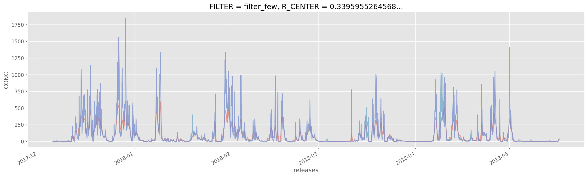
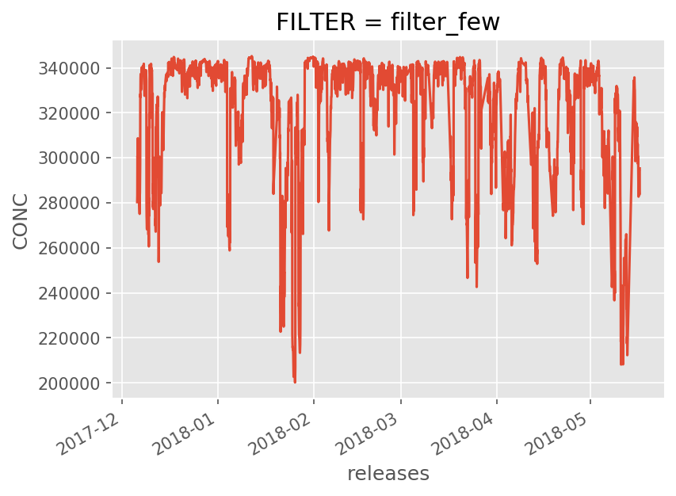
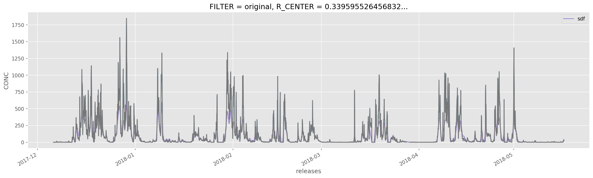

## imports


```python
from useful_scit.imps import *
import flexpart_management.modules.FlexLogPol as FlexLogPol
import flexpart_management.modules.constants as co
import flexpart_management.modules.flx_array as fa
import funs
mpl.rcParams['figure.dpi'] = 150
```


```python
log.ger.setLevel(log.log.ERROR)
```

# Code


```python
path = '/Volumes/mbProD/Downloads/flx_log_coor/run_2019-08-18_18-46-19_'
# flp = FLP.FlexLogPol(path,concat=True)
# selfFLP = FLP.FlexLogPol(path,concat=False)
selfFLP = FlexLogPol.FlexLogPol(
    path,
    #concat=True,
    concat=False,
    get_clusters=False,
    open_merged=True,
    clusters_avail=False
)
```

    'using vol for conc'


```python
selfFLP.reset_z_levels()
```

    'using vol for conc'


```python
selfFLP.add_topo_to_merge_ds()
```

    2019-09-13 12:29:35,435 root         DEBUG    heads got
    2019-09-13 12:29:35,451 root         DEBUG    merge pol heads got


```python
selfFLP.merged_ds
```


    <xarray.Dataset>
    Dimensions:        (R_CENTER: 36, TH_CENTER: 36, ZMID: 6, releases: 3864)
    Coordinates:
      * R_CENTER       (R_CENTER) float64 0.05613 0.06721 0.08046 ... 25.53 30.57
      * releases       (releases) datetime64[ns] 2017-12-06 ... 2018-05-16T23:00:00
      * TH_CENTER      (TH_CENTER) float64 0.08727 0.2618 0.4363 ... 6.021 6.196
        LAT            (R_CENTER, TH_CENTER) float64 -16.29 -16.3 ... 13.18 14.1
        LON            (R_CENTER, TH_CENTER) float64 -68.08 -68.08 ... -38.6 -37.68
        LAT_00         (R_CENTER, TH_CENTER) float64 -16.3 -16.3 ... 9.903 11.16
        LON_00         (R_CENTER, TH_CENTER) float64 -68.13 -68.12 ... -77.69 -72.98
        LAT_10         (R_CENTER, TH_CENTER) float64 -16.29 -16.29 ... 15.08 16.59
        LON_10         (R_CENTER, TH_CENTER) float64 -68.13 -68.12 ... -79.57 -73.94
        LAT_11         (R_CENTER, TH_CENTER) float64 -16.29 -16.29 ... 16.59 17.1
        LON_11         (R_CENTER, TH_CENTER) float64 -68.12 -68.11 ... -73.94 -68.13
        LAT_01         (R_CENTER, TH_CENTER) float64 -16.3 -16.3 ... 11.16 11.59
        LON_01         (R_CENTER, TH_CENTER) float64 -68.12 -68.11 ... -72.98 -68.13
        GRIDAREA       (R_CENTER, TH_CENTER) float64 1.178e+06 ... 3.528e+11
        TOPOGRAPHY     (R_CENTER, TH_CENTER) float32 4858.383 4967.62 ... 0.0 0.0
        ZTOP           (ZMID) float64 500.0 1.5e+03 3.5e+03 7e+03 1e+04 3e+04
        ZBOT           (ZMID) float64 0.0 500.0 1.5e+03 3.5e+03 7e+03 1e+04
      * ZMID           (ZMID) float64 250.0 1e+03 2.5e+03 5.25e+03 8.5e+03 2e+04
        ZLEN_M         (ZMID) float64 500.0 1e+03 2e+03 3.5e+03 3e+03 2e+04
        VOL            (R_CENTER, TH_CENTER, ZMID) float64 2.945e+08 ... 7.056e+15
    Data variables:
        CONC           (ZMID, R_CENTER, TH_CENTER, releases) float32 0.0 0.0 ... 0.0
        CONC_per       (ZMID, R_CENTER, TH_CENTER, releases) float32 0.0 0.0 ... 0.0
        CONC_conc      (ZMID, R_CENTER, TH_CENTER, releases) float64 0.0 0.0 ... 0.0
        CONC_conc_per  (ZMID, R_CENTER, TH_CENTER, releases) float64 0.0 0.0 ... 0.0


```python
merged_ds = selfFLP.merged_ds
```


```python
dsF= selfFLP.filter_hours_with_few_mea()
```

    /Users/diego/miniconda3/envs/b36/lib/python3.6/site-packages/xarray/core/missing.py:207: FutureWarning: This DataArray contains multi-dimensional coordinates. In the future, these coordinates will be transposed as well unless you specify transpose_coords=False.
      keep_attrs=True).transpose(*self.dims)
    /Users/diego/miniconda3/envs/b36/lib/python3.6/site-packages/xarray/core/missing.py:207: FutureWarning: This DataArray contains multi-dimensional coordinates. In the future, these coordinates will be transposed as well unless you specify transpose_coords=False.
      keep_attrs=True).transpose(*self.dims)
    /Users/diego/miniconda3/envs/b36/lib/python3.6/site-packages/xarray/core/missing.py:207: FutureWarning: This DataArray contains multi-dimensional coordinates. In the future, these coordinates will be transposed as well unless you specify transpose_coords=False.
      keep_attrs=True).transpose(*self.dims)
    /Users/diego/miniconda3/envs/b36/lib/python3.6/site-packages/xarray/core/missing.py:207: FutureWarning: This DataArray contains multi-dimensional coordinates. In the future, these coordinates will be transposed as well unless you specify transpose_coords=False.
      keep_attrs=True).transpose(*self.dims)


```python
co.FILTER = 'FILTER'
_ds1 = dsF.expand_dims(dim={co.FILTER:['filter_few']})
```


```python
co.FILTER = 'FILTER'
_ds2 = merged_ds.expand_dims(dim={co.FILTER:['original']})
```


```python
_ds3 = xr.merge([_ds1,_ds2])
```


```python
_ds3
```


    <xarray.Dataset>
    Dimensions:        (FILTER: 2, R_CENTER: 36, TH_CENTER: 36, ZMID: 6, releases: 3888)
    Coordinates:
      * FILTER         (FILTER) object 'filter_few' 'original'
      * releases       (releases) datetime64[ns] 2017-12-06 ... 2018-05-16T23:00:00
      * R_CENTER       (R_CENTER) float64 0.05613 0.06721 0.08046 ... 25.53 30.57
      * TH_CENTER      (TH_CENTER) float64 0.08727 0.2618 0.4363 ... 6.021 6.196
        LON            (R_CENTER, TH_CENTER) float64 -68.08 -68.08 ... -38.6 -37.68
        LAT_00         (R_CENTER, TH_CENTER) float64 -16.3 -16.3 ... 9.903 11.16
        LON_00         (R_CENTER, TH_CENTER) float64 -68.13 -68.12 ... -77.69 -72.98
        LAT_10         (R_CENTER, TH_CENTER) float64 -16.29 -16.29 ... 15.08 16.59
        LON_10         (R_CENTER, TH_CENTER) float64 -68.13 -68.12 ... -79.57 -73.94
        LAT_11         (R_CENTER, TH_CENTER) float64 -16.29 -16.29 ... 16.59 17.1
        LON_11         (R_CENTER, TH_CENTER) float64 -68.12 -68.11 ... -73.94 -68.13
        LAT_01         (R_CENTER, TH_CENTER) float64 -16.3 -16.3 ... 11.16 11.59
        LON_01         (R_CENTER, TH_CENTER) float64 -68.12 -68.11 ... -72.98 -68.13
        GRIDAREA       (R_CENTER, TH_CENTER) float64 1.178e+06 ... 3.528e+11
        TOPOGRAPHY     (R_CENTER, TH_CENTER) float32 4858.383 4967.62 ... 0.0 0.0
        LAT            (R_CENTER, TH_CENTER) float64 -16.29 -16.3 ... 13.18 14.1
        ZBOT           (ZMID) float64 0.0 500.0 1.5e+03 3.5e+03 7e+03 1e+04
      * ZMID           (ZMID) float64 250.0 1e+03 2.5e+03 5.25e+03 8.5e+03 2e+04
        ZLEN_M         (ZMID) float64 500.0 1e+03 2e+03 3.5e+03 3e+03 2e+04
        ZTOP           (ZMID) float64 500.0 1.5e+03 3.5e+03 7e+03 1e+04 3e+04
        VOL            (R_CENTER, TH_CENTER, ZMID) float64 2.945e+08 ... 7.056e+15
    Data variables:
        CONC           (FILTER, releases, ZMID, R_CENTER, TH_CENTER) float32 0.0 ... 0.0
        CONC_per       (FILTER, releases, ZMID, R_CENTER, TH_CENTER) float32 0.0 ... 0.0
        CONC_conc      (FILTER, releases, ZMID, R_CENTER, TH_CENTER) float64 0.0 ... 0.0
        CONC_conc_per  (FILTER, releases, ZMID, R_CENTER, TH_CENTER) float64 0.0 ... 0.0


```python
_dsSM = FlexLogPol.smooth_merged_ds(_ds3.sel(**{co.FILTER:'filter_few'}))
```

    (3888, 6, 35, 36)
    (3888, 6, 35, 36)
    (3888, 6, 35, 36)
    (3888, 6, 35, 36)


```python
_dsSM1 = _dsSM.drop(co.FILTER).expand_dims(dim={co.FILTER:['filter_few_smooth']})
```


```python
_ds4 = xr.concat([_ds3,_dsSM1],dim=co.FILTER)
```


```python
_cp = selfFLP.coarsen_par
```


```python
_da = _ds4[co.CONC].loc[{co.FILTER:'filter_few_smooth'}]
```


```python
_da1 = _da.coarsen(**{co.RL:_cp}).mean()
```


```python
co.RLC = 'releases_coarsen'
co.CONC_COARS = 'CONC_COARSEN'
_da2 = _da1.rename({co.RL:co.RLC}).drop(co.FILTER).expand_dims(dim={co.FILTER:['filter_few_smooth_coarse']})
_da2.name = co.CONC_COARS
```


```python
_da3 = _da2.dropna(co.RLC,how='all').dropna(co.ZM,how='all').dropna(co.R_CENTER,how='all').dropna(co.TH_CENTER,how='all')
```


```python
_dst = _ds4[{co.R_CENTER:slice(None,3),co.TH_CENTER:slice(None,4),co.ZM:slice(None,5),co.RL:slice(None,10)}]
```


```python
_dat = _da3[{co.R_CENTER:slice(None,3),co.TH_CENTER:slice(None,4),co.ZM:slice(None,5),co.RLC:slice(None,9)}]
```


```python
# xr.merge([_dst,_dat]).sel(**{co.FILTER:'filter_few_smooth_coarse'})
_dsm=xr.merge([_ds4,_da3])
```


```python
fig,ax = plt.subplots(figsize=(20,5))

_dsm[co.CONC_COARS].sel(**{co.FILTER:'filter_few_smooth_coarse'})[:,2,10,8].plot(ax=ax,label=co.CONC_COARS,alpha=.5)

_dsm[co.CONC].sel(**{co.FILTER:'original'})[:,2,10,8].plot(ax=ax,label=co.CONC,alpha=.5)
_dsm[co.CONC].sel(**{co.FILTER:'filter_few'})[:,2,10,8].plot(ax=ax,label=co.CONC,alpha=.5)
```


    [<matplotlib.lines.Line2D at 0x14c42ff28>]





```python
_dsm[co.CONC].sel(**{co.FILTER:'filter_few'}).sum([co.ZM,co.R_CENTER,co.TH_CENTER]).plot()
```


    [<matplotlib.lines.Line2D at 0x142bcfb70>]





```python
ax.legend()
```


    <matplotlib.legend.Legend at 0x14b3314a8>


```python
ax.figure
```





```python

```
