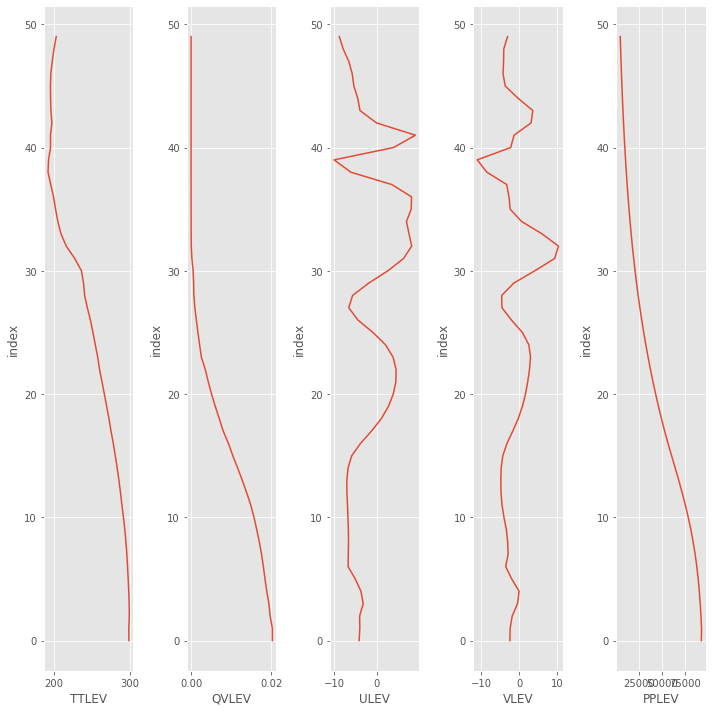

```python
from useful_scit.imps import (pd,np,xr,za,mpl,plt,sns, pjoin,
                               os,glob,dt,sys,ucp,log, splot)
```


```python
import data_failure as df
```


```python

```


```python
f.add_subplot
```


    <bound method Figure.add_subplot of <Figure size 432x288 with 0 Axes>>


```python
f = plt.Figure(figsize=(10,10))
for i,(p,v) in enumerate(df.pars.items()):
    ax = f.add_subplot(1,len(df.pars),i+1)
    y = range(0,len(v))
    _l = ax.plot(v,y)
    ax.set_ylabel('index'); ax.set_xlabel(p)
f.tight_layout()
f
```

    /homeappl/home/aliagadi/appl_taito/miniconda3/envs/b36backup/lib/python3.6/site-packages/ipykernel_launcher.py:7: UserWarning: tight_layout : falling back to Agg renderer
      import sys





```python

```
