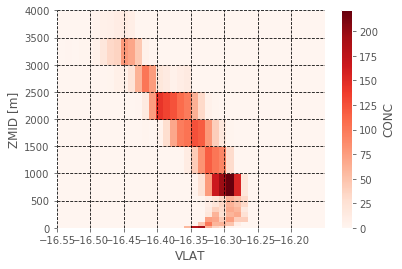
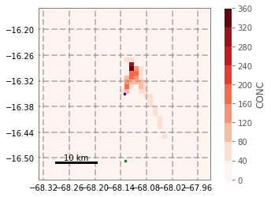
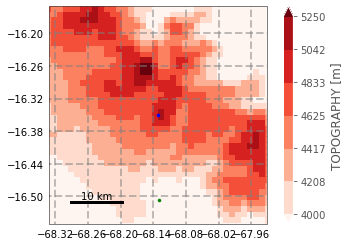
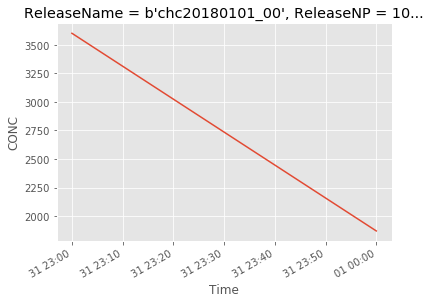
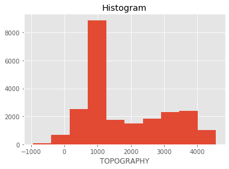
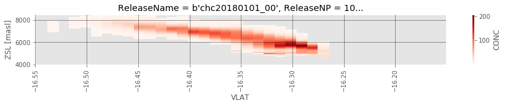

```python
from useful_scit.imps import (pd,np,xr,za,mpl,plt,sns, pjoin,
                               os,glob,dt,sys,ucp,log, splot)
import flexpart_management.modules.flx_array as fa
import flexpart_management.modules.constants as co
mpl.rcParams['figure.dpi'] = 100
# %matplotlib notebook
```

    reload


```python
dir_path = '/homeappl/home/aliagadi/wrk/DONOTREMOVE/flexpart_management_data/runs/run_2019-09-14_08-43-03_/2018-01-01'
```


```python
DD = co.D2
nds = fa.euristic_import_flexpart(dir_path, DD)
```


```python
_da = nds[co.CONC].squeeze()
```


```python

```


```python
_da1 = _da.sum([co.TIME,co.VLONG]).loc[{co.ZM:slice(0,4e3)}]
f,ax = splot()
_da1.plot.pcolormesh(ax=ax,cmap=plt.get_cmap('Reds'));
ax.grid(True,color='k',linestyle='--')
ax.set_title('');
ax.set_axisbelow(False)
ax.set_xlim((co.CHC_LAT-.2,co.CHC_LAT+.2))
```


    (-16.550427, -16.150427)





```python
from cartopy import crs
_da1 = _da.sum([co.TIME,co.ZM])
f,ax = splot(subplot_kw={'projection':crs.PlateCarree()})
_da1.plot.pcolormesh(ax=ax,cmap=plt.get_cmap('Reds'),levels=10);

ax.set_title('');
ax.set_xlim((co.CHC_LON-.2,co.CHC_LON+.2))
ax.set_ylim((co.CHC_LAT-.2,co.CHC_LAT+.2))
# ax.set_yticks([co.CHC_LAT], crs=crs.PlateCarree())
gl = ax.gridlines(crs=crs.PlateCarree(), draw_labels=True,
                  linewidth=2, color='gray', alpha=0.5, linestyle='--')
gl.xlabels_top = False
gl.ylabels_right = False
fa.add_chc_lpb(ax)
ucp.scale_bar(ax,(.1,.1),10)


```





```python
from cartopy import crs
# _da1 = _da.sum([co.TIME,co.ZM])
_da1 = _da[co.TOPO]
f,ax = splot(subplot_kw={'projection':crs.PlateCarree()})
_da1.plot.pcolormesh(ax=ax,cmap=plt.get_cmap('Reds'),robust=True,vmin=4e3,vmax=5250,levels=7);

ax.set_title('');
ax.set_xlim((co.CHC_LON-.2,co.CHC_LON+.2))
ax.set_ylim((co.CHC_LAT-.2,co.CHC_LAT+.2))
# ax.set_yticks([co.CHC_LAT], crs=crs.PlateCarree())
gl = ax.gridlines(crs=crs.PlateCarree(), draw_labels=True,
                  linewidth=2, color='gray', alpha=0.5, linestyle='--')
gl.xlabels_top = False
gl.ylabels_right = False
fa.add_chc_lpb(ax)
ucp.scale_bar(ax,(.1,.1),10)


```





```python

_da.sum(fa.get_dims_complement(_da,co.TIME)).plot()
```


    [<matplotlib.lines.Line2D at 0x7fdb6878c7b8>]





```python
i7 = (5000-_da[co.TOPO])
i7.plot.hist();
i7.name='i7'
```





```python
ZSL ='ZSL'
```


```python
zr = np.arange(0,1e4,1e2)
zr = xr.DataArray(zr,coords=[(ZSL,zr)])
```


```python
zr[ZSL]=zr[ZSL].assign_attrs(units='masl')
```


```python
_zr = (zr-_da[co.TOPO])
```


```python
_int=_da.interp(**{co.ZM:_zr,co.VLAT:i7[co.VLAT],co.VLONG:i7[co.VLONG]})
```


```python
_int.sum().load().item()
```


    18302.453125


```python
_da.sum().load().item()
```


    5470.19921875


```python
_int2 = _int.where(_zr>0)
```


```python
_is = _int2.sum([co.VLONG,co.TIME])
_is = _is.where(_is>0)
res = _is.plot(cmap=plt.get_cmap('Reds'),figsize=(15,1.5))
ax=plt.gca()
ax.set_xlim((co.CHC_LAT-.2,co.CHC_LAT+.2))
ax.set_ylim((4e3,8.5e3))
ax.tick_params(axis='x', rotation=90)
ax.grid(color='k',alpha=.5)
ax.set_axisbelow(False)
```





```python
path_wrf = '2018-01-01'
```
