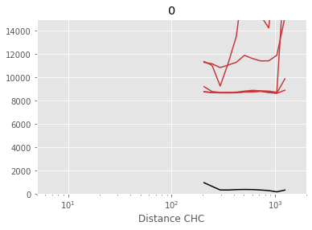
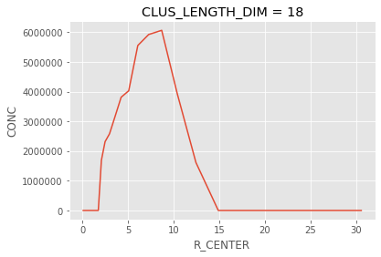
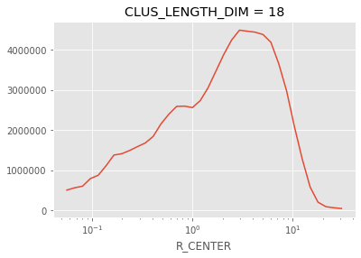
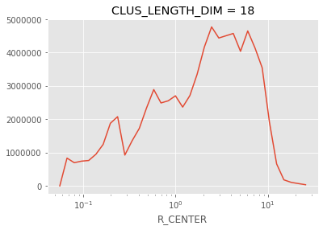
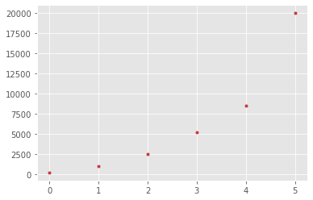
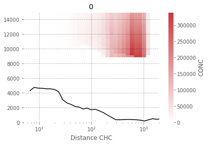

```python
_f=0
_n=18
funs.plot_dis_height_quantiles_chc_single(_f,_n, dsF, dscc,axs=False)
```

    /homeappl/home/aliagadi/appl_taito/miniconda3/envs/b36backup/lib/python3.6/site-packages/xarray/core/nanops.py:160: RuntimeWarning: Mean of empty slice
      return np.nanmean(a, axis=axis, dtype=dtype)
    /homeappl/home/aliagadi/appl_taito/miniconda3/envs/b36backup/lib/python3.6/site-packages/xarray/core/nanops.py:160: RuntimeWarning: Mean of empty slice
      return np.nanmean(a, axis=axis, dtype=dtype)





```python
_ds = dscc.loc[{co.CLUS_LENGTH_DIM: _n}]
# _ds = dscc.loc[{CLUS_LENGTH_DIM:_n}]
_ds = _ds.drop(co.KMEAN_OBJ)
# _ds = _ds.where(_ds[FLAG]==_f)
_ds = _ds.sum([co.RL])
#         return _ds
_ds1 = xr.merge([_ds, dsF[[co.TOPO]]]).where(
    _ds[co.FLAG] == _f)
_dsum=_ds1.sum([co.TH_CENTER,co.ZM])[co.CONC]
lens=dsum[co.R_CENTER].shift(**{co.R_CENTER:-1})-_dsum[co.R_CENTER]

_slb = _sl = _dsum/lens
_sl = _sl.rolling(**{co.R_CENTER:5},min_periods=1,center=True).mean()

r1,r2 =_sl[co.R_CENTER].quantile([0,1])
rs = np.linspace(r1,r2,30)

_sl1 = _sl.interp(**{co.R_CENTER:rs})

rmin,rmax = weighted_quantile([.1,.9],_sl1[co.R_CENTER].values,_sl1.values)

_ds1 = _ds1.where(_ds1[co.R_CENTER]>rmin).where(_ds1[co.R_CENTER]<rmax)
```


```python
_ds1.sum([co.TH_CENTER,co.ZM])[co.CONC].plot()
```


    [<matplotlib.lines.Line2D at 0x7fae8c31fe10>]





```python
from flexpart_management.modules.flx_array import weighted_quantile
```


```python

```


    array([ 1.80714801, 10.63464699])


```python

```


```python
_sl.plot(xscale='log')
axsplot()
_sl.plot()
```


    [<matplotlib.lines.Line2D at 0x7fae477e2860>]





```python
_slb.plot(xscale='log')
```


    [<matplotlib.lines.Line2D at 0x7fae47d2feb8>]





```python
plt.plot(dscc[co.ZM].values,marker='.',linestyle='',color = ucp.cc[0])
# plt.plot(dscc[co.ZT].values,marker='.',linestyle='',color = ucp.cc[1])
```


    [<matplotlib.lines.Line2D at 0x7fae4574b5c0>]





```python
dscc
```


    <xarray.Dataset>
    Dimensions:                (CLUS_LENGTH_DIM: 23, R_CENTER: 36, TH_CENTER: 36, ZMID: 6, releases: 1062)
    Coordinates:
      * R_CENTER               (R_CENTER) float64 0.05613 0.06721 ... 25.53 30.57
      * TH_CENTER              (TH_CENTER) float64 0.08727 0.2618 ... 6.021 6.196
      * ZMID                   (ZMID) float64 250.0 1e+03 2.5e+03 ... 8.5e+03 2e+04
      * releases               (releases) datetime64[ns] 2017-12-06T01:30:00 ... 2018-05-31T21:30:00
      * CLUS_LENGTH_DIM        (CLUS_LENGTH_DIM) int64 2 3 4 5 6 ... 20 21 22 23 24
        LAT_00                 (R_CENTER, TH_CENTER) float64 -16.3 -16.3 ... 11.16
        LAT_10                 (R_CENTER, TH_CENTER) float64 -16.29 -16.29 ... 16.59
        LAT_11                 (R_CENTER, TH_CENTER) float64 -16.29 -16.29 ... 17.1
        LAT_01                 (R_CENTER, TH_CENTER) float64 -16.3 -16.3 ... 11.59
        LON_00                 (R_CENTER, TH_CENTER) float64 -68.13 ... -72.98
        LON_10                 (R_CENTER, TH_CENTER) float64 -68.13 ... -73.94
        LON_11                 (R_CENTER, TH_CENTER) float64 -68.12 ... -68.13
        LON_01                 (R_CENTER, TH_CENTER) float64 -68.12 ... -68.13
        LON                    (R_CENTER, TH_CENTER) float64 -68.08 ... -37.68
        LAT                    (R_CENTER, TH_CENTER) float64 -16.29 -16.3 ... 14.1
        TOPOGRAPHY             (R_CENTER, TH_CENTER) float32 4858.383 ... 0.0
        GRIDAREA               (R_CENTER, TH_CENTER) float64 1.178e+06 ... 3.528e+11
        Distance CHC           (R_CENTER) float64 5.613 6.721 ... 3.057e+03
    Data variables:
        CONC                   (R_CENTER, TH_CENTER, ZMID, releases) float32 0.0 ... 0.0
        CONC_SUM               (R_CENTER, TH_CENTER, ZMID) float32 0.0 ... 19.822586
        LAB_CLUSTER_THRESHOLD  (R_CENTER, TH_CENTER, ZMID) bool False ... False
        CONC_NORMALIZED        (releases, R_CENTER, TH_CENTER, ZMID) float32 0.0 ... 0.0
        CONC_NORMS             (R_CENTER, TH_CENTER, ZMID) float32 1.0 ... 3.4963744
        KMEAN_LAB              (CLUS_LENGTH_DIM) object KMeans(algorithm='auto', copy_x=True, init='k-means++', max_iter=300,
           n_clusters=2, n_init=10, n_jobs=None, precompute_distances='auto',
           random_state=388345, tol=0.0001, verbose=0) ... KMeans(algorithm='auto', copy_x=True, init='k-means++', max_iter=300,
           n_clusters=24, n_init=10, n_jobs=None, precompute_distances='auto',
           random_state=388345, tol=0.0001, verbose=0)
        FLAG                   (CLUS_LENGTH_DIM, R_CENTER, TH_CENTER, ZMID) int32 1 ... 11
        SIL_SCORE              (CLUS_LENGTH_DIM) float64 0.1246 0.1374 ... 0.1661
        SIL_SAMPLE             (CLUS_LENGTH_DIM, R_CENTER, TH_CENTER, ZMID) float64 nan ... nan


```python
dsF
```


    <xarray.Dataset>
    Dimensions:        (R_CENTER: 36, TH_CENTER: 36, ZMID: 6, releases: 4248)
    Coordinates:
      * R_CENTER       (R_CENTER) float64 0.05613 0.06721 0.08046 ... 25.53 30.57
      * TH_CENTER      (TH_CENTER) float64 0.08727 0.2618 0.4363 ... 6.021 6.196
        LON            (R_CENTER, TH_CENTER) float64 -68.08 -68.08 ... -38.6 -37.68
        LAT_00         (R_CENTER, TH_CENTER) float64 -16.3 -16.3 ... 9.903 11.16
        LON_00         (R_CENTER, TH_CENTER) float64 -68.13 -68.12 ... -77.69 -72.98
        LAT_10         (R_CENTER, TH_CENTER) float64 -16.29 -16.29 ... 15.08 16.59
        LON_10         (R_CENTER, TH_CENTER) float64 -68.13 -68.12 ... -79.57 -73.94
        LAT_11         (R_CENTER, TH_CENTER) float64 -16.29 -16.29 ... 16.59 17.1
        LON_11         (R_CENTER, TH_CENTER) float64 -68.12 -68.11 ... -73.94 -68.13
        LAT_01         (R_CENTER, TH_CENTER) float64 -16.3 -16.3 ... 11.16 11.59
        LON_01         (R_CENTER, TH_CENTER) float64 -68.12 -68.11 ... -72.98 -68.13
        GRIDAREA       (R_CENTER, TH_CENTER) float64 1.178e+06 ... 3.528e+11
        TOPOGRAPHY     (R_CENTER, TH_CENTER) float32 4858.383 4967.62 ... 0.0 0.0
        LAT            (R_CENTER, TH_CENTER) float64 -16.29 -16.3 ... 13.18 14.1
        ZBOT           (ZMID) float64 0.0 500.0 1.5e+03 3.5e+03 7e+03 1e+04
      * ZMID           (ZMID) float64 250.0 1e+03 2.5e+03 5.25e+03 8.5e+03 2e+04
        ZLEN_M         (ZMID) float64 500.0 1e+03 2e+03 3.5e+03 3e+03 2e+04
        ZTOP           (ZMID) float64 500.0 1.5e+03 3.5e+03 7e+03 1e+04 3e+04
      * releases       (releases) datetime64[ns] 2017-12-06 ... 2018-05-31T23:00:00
        VOL            (R_CENTER, TH_CENTER, ZMID) float64 2.945e+08 ... 7.056e+15
    Data variables:
        CONC           (releases, ZMID, R_CENTER, TH_CENTER) float32 nan nan ... 0.0
        CONC_per       (releases, ZMID, R_CENTER, TH_CENTER) float32 nan nan ... 0.0
        CONC_conc      (releases, ZMID, R_CENTER, TH_CENTER) float64 nan nan ... 0.0
        CONC_conc_per  (releases, ZMID, R_CENTER, TH_CENTER) float64 nan nan ... 0.0


```python
_f=17
_ds = dscc.loc[{co.CLUS_LENGTH_DIM: _n}]
# _ds = dscc.loc[{CLUS_LENGTH_DIM:_n}]
_ds = _ds.drop(co.KMEAN_OBJ)
# _ds = _ds.where(_ds[FLAG]==_f)
_ds = _ds.sum([co.RL])
#         return _ds
_ds1 = xr.merge([_ds, dsF[[co.TOPO]]]).where(_ds[co.FLAG] == _f,0)


```


```python
_f=0
axs = False
# def plot_dis_height_quantiles_chc_single(_f, _n, dsF, dscc,axs=False):
if axs is False:
    _, ax = plt.subplots()
else:
    ax = axs[_f]
    
_cm = fa.get_custom_cmap([*ucp.cc, *ucp.cc, *ucp.cc][_f][:3])

_ds = dscc.loc[{co.CLUS_LENGTH_DIM: _n}]

_ds = _ds.drop(co.KMEAN_OBJ)

_ds = _ds.sum([co.RL])

_ds1 = xr.merge([_ds, dsF[[co.TOPO]]]).where(_ds[co.FLAG] == _f)
_ds1 = _ds1.swap_dims({co.R_CENTER: co.DIS})

_ds2 = _ds1/dsF[co.ZLM]

_ds3 = _ds2[co.CONC]
zmin,zmax = _ds2[co.ZM].quantile([0,1])
zz = np.arange(zmin,zmax,zmin)

zl = zz[1]-zz[0]

_ds4 = _ds3.interp(**{co.ZM:zz})*zl

ZREAL = 'ZREAL'
_ds4[ZREAL]=_ds4*0+_ds4[co.ZM]+((_ds4[co.TOPO]/zl).round()*zl)

_dims = set(_ds4.dims)

_keep = _dims.union(set([ZREAL]))

_coor = set(_ds4.coords)

_drop = list(_coor-_keep)

_ds5=_ds4.drop(_drop).to_dataframe()

_ds6 = _ds5.reset_index().groupby([ZREAL,co.DIS,co.TH_CENTER]).sum()[[co.CONC]].to_xarray()

_ds6.sum(co.TH_CENTER)[co.CONC].plot(xscale='log',vmin=0,ax=ax,cmap=_cm)

HEIGHT = 'HEIGHT'
_ds1[HEIGHT] = (_ds1[co.TOPO] + _ds1[co.ZM])

_dg = _ds1[[HEIGHT, co.CONC]].to_dataframe()[[HEIGHT, co.CONC]]
_dg = _dg.groupby(co.DIS)

_dh = (_ds1[co.CONC] * (_ds1[co.TOPO] + _ds1[co.ZM])).mean(
    [co.TH_CENTER, co.ZM])
_dh = _dh / (_ds1[co.CONC].mean([co.TH_CENTER, co.ZM]))

ax.set_xlim(10, 2e3)

_dh = (_ds1[co.CONC] * (_ds1[co.TOPO])).mean([co.TH_CENTER, co.ZM])
_dh = _dh / (_ds1[co.CONC].mean([co.TH_CENTER, co.ZM]))

_dh.plot(x=co.DIS, color='k', ax=ax)
ax.set_xscale('log')

ax.set_xlim(5, 2e3)
ax.set_ylim(0, 1.5e4)
ax.set_title(str(_f))
ax.grid(color='k',alpha=.3,linestyle='--')
ax.set_axisbelow(False)
ax.set_facecolor('white')
```

    /homeappl/home/aliagadi/appl_taito/miniconda3/envs/b36backup/lib/python3.6/site-packages/xarray/core/nanops.py:160: RuntimeWarning: Mean of empty slice
      return np.nanmean(a, axis=axis, dtype=dtype)
    /homeappl/home/aliagadi/appl_taito/miniconda3/envs/b36backup/lib/python3.6/site-packages/xarray/core/nanops.py:160: RuntimeWarning: Mean of empty slice
      return np.nanmean(a, axis=axis, dtype=dtype)





```python
fig.tight_layout()
fig
```


```python

```
