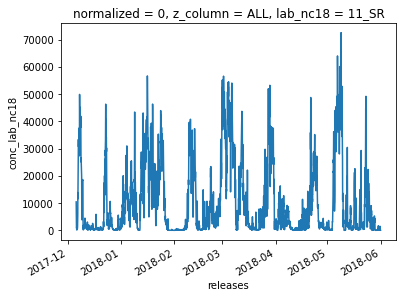
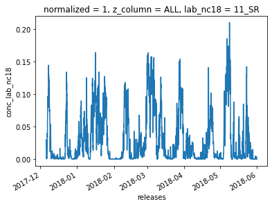
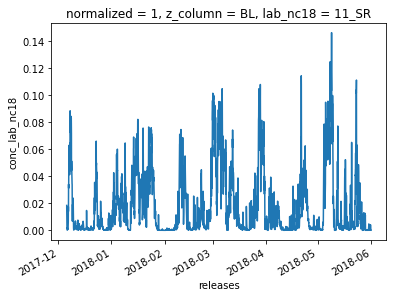
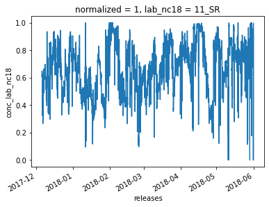
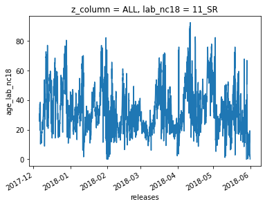
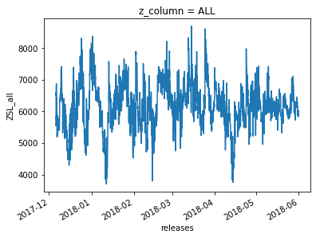
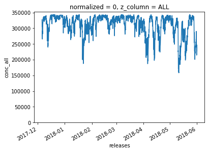
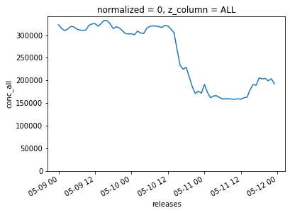

This notebook contains information regarding the release v03 of the timeseries for the cluster analysis performed at CHC station during the SALTENA campaign

- the data folder contains the following files:
  - description_cluster_series_v3.csv  
  description of all dimensions variables contained in cluster_series_v3.nc
  - cluster_series_v3.nc  
  dataset for the cluster timeseries and pathway series
  - pol6.kml  
  google earth polygones for the 6 pathways
  - pol18.kml  
  google earth polygones for the 18 clusters
  - csv folder  
    - a csv "version" of the nc (netCDF) file.
    - for metadata please refer to the description_cluster_series_v3.csv file. 

below are some examples on how to use the dataset

open the dataset


```python
import xarray as xr
```


```python
ds = xr.open_dataset('./data/cluster_series_v3.nc')
ds
```


<pre>&lt;xarray.Dataset&gt;
Dimensions:         (lab_nc06: 6, lab_nc18: 18, normalized: 2, releases: 4248, z_column: 2)
Coordinates:
  * normalized      (normalized) int64 0 1
  * z_column        (z_column) object &#x27;ALL&#x27; &#x27;SURF&#x27;
  * releases        (releases) datetime64[ns] 2017-12-06 ... 2018-05-31T23:00:00
  * lab_nc18        (lab_nc18) object &#x27;11_SR&#x27; &#x27;10_LR&#x27; ... &#x27;08_LR&#x27; &#x27;03_SM&#x27;
  * lab_nc06        (lab_nc06) object &#x27;07_PW&#x27; &#x27;05_PW&#x27; ... &#x27;03_PW&#x27; &#x27;12_PW&#x27;
Data variables:
    conc_all        (normalized, z_column, releases) float64 ...
    age_all         (z_column, releases) float64 ...
    R_DIS_all       (z_column, releases) float64 ...
    ZSL_all         (z_column, releases) float64 ...
    ZGL_all         (z_column, releases) float64 ...
    clock_dir_all   (z_column, releases) float64 ...
    conc_lab_nc18   (lab_nc18, normalized, z_column, releases) float64 ...
    conc_lab_nc06   (lab_nc06, normalized, z_column, releases) float64 ...
    age_lab_nc18    (lab_nc18, z_column, releases) float64 ...
    age_lab_nc06    (lab_nc06, z_column, releases) float64 ...
    r_dis_lab_nc18  (lab_nc18, z_column, releases) float64 ...
    r_dis_lab_nc06  (lab_nc06, z_column, releases) float64 ...
    zsl_lab_nc18    (lab_nc18, z_column, releases) float64 ...
    zsl_lab_nc06    (lab_nc06, z_column, releases) float64 ...
    zgl_lab_nc18    (lab_nc18, z_column, releases) float64 ...
    zgl_lab_nc06    (lab_nc06, z_column, releases) float64 ...
    clk_lab_nc18    (lab_nc18, z_column, releases) float64 ...
    clk_lab_nc06    (lab_nc06, z_column, releases) float64 ...</pre>


plot all column not normalized SRR timeseries for cluster '11_SR'


```python
ds['conc_lab_nc18'].loc[
    {'z_column':'ALL','lab_nc18':'11_SR','normalized':0}
].plot()
```


    [<matplotlib.lines.Line2D at 0x11bffb898>]





plot all column normalized SRR timeseries for cluster '11_SR'


```python
ds['conc_lab_nc18'].loc[
    {'z_column':'ALL','lab_nc18':'11_SR','normalized':1}
].plot()
```


    [<matplotlib.lines.Line2D at 0x11b9f6710>]





plot surface normalized SRR timeseries for cluster '11_SR'


```python
ds['conc_lab_nc18'].loc[
    {'z_column':'SURF','lab_nc18':'11_SR','normalized':1}
].plot()
```


    [<matplotlib.lines.Line2D at 0x11c35fb00>]





plot ratio column normalized SRR timeseries for cluster '11_SR'


```python
dall = ds['conc_lab_nc18'].loc[
    {'z_column':'ALL','lab_nc18':'11_SR','normalized':1}
]
dsurf = ds['conc_lab_nc18'].loc[
    {'z_column':'SURF','lab_nc18':'11_SR','normalized':1}
]
(dsurf/dall).plot()
```


    [<matplotlib.lines.Line2D at 0x11cf524e0>]





plot age [hours] all column timeseries for cluster '11_SR'


```python
ds['age_lab_nc18'].loc[
    {'z_column':'ALL','lab_nc18':'11_SR',}
].plot()
```


    [<matplotlib.lines.Line2D at 0x11cdc8d30>]





plot all column mean height above sea level timeseries for all domain


```python
ds['ZSL_all'].loc[
    {'z_column':'ALL'}
].plot()
```


    [<matplotlib.lines.Line2D at 0x11bfe24a8>]





plot all column not normalized SRR timeseries for all domain
- Notice that the SRR is not consants (as it should be) since there are times where fast moving particles leave the modeling domain before 4 days have passed. 


```python
ds['conc_all'].loc[
    {'z_column':'ALL','normalized':0}
].plot(ylim=(0,None))
```


    [<matplotlib.lines.Line2D at 0x11e628ac8>]





```python
ds['conc_all'].loc[
    {'z_column':'ALL','normalized':0,'releases':slice('2018-05-09','2018-05-11')}
].plot(ylim=(0,None))
```


    [<matplotlib.lines.Line2D at 0x11ea86908>]





```python

```
